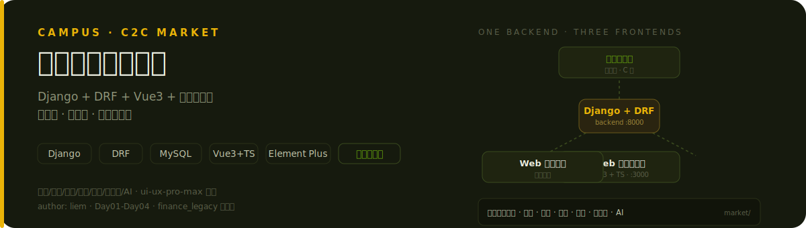
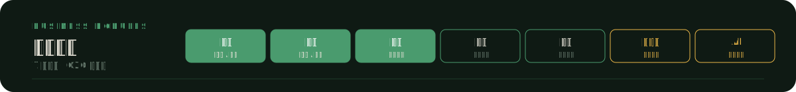
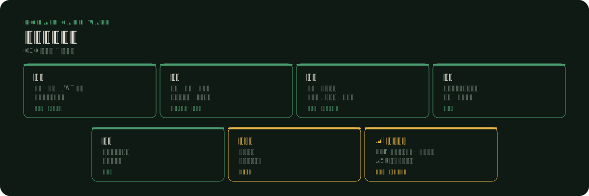
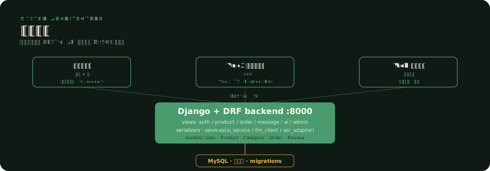
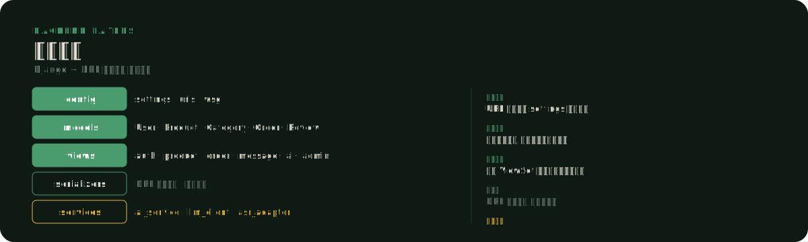
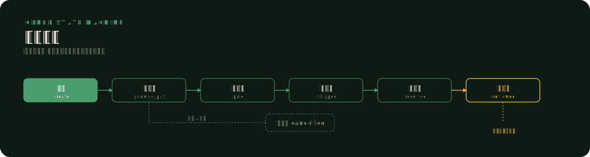
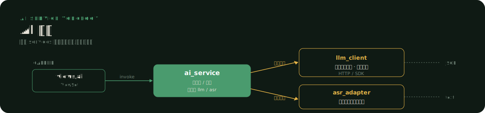
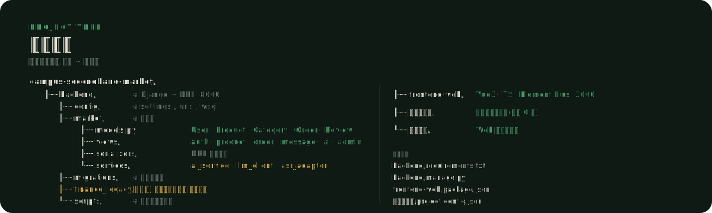
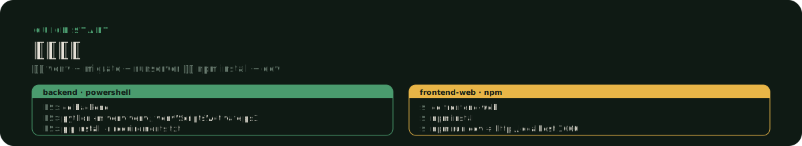
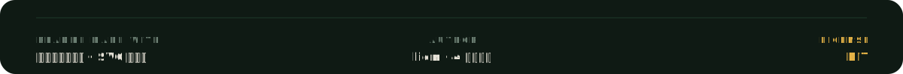

# 校园二手交易平台

一个基于 Django + DRF + MySQL + Vue3 + 微信小程序 的 C2C 校园二手交易平台,整合 4 次实训,支持"一后端 + 三前端"端到端联调。学生通过微信小程序发布、浏览、下单、私聊、评价二手商品,卖家在 Web 工作台管理商品与订单,平台运营方在 Web 管理后台监控信用与交易。

---

## 业务模块概览





| 模块 | 核心能力 | 主要前端入口 |
|------|----------|--------------|
| 用户 | 注册、登录、JWT 鉴权、信用分初始与历史 | 小程序 · 管理后台 |
| 商品 | 发布、分类、上下架、关键词搜索、图片上传 | 卖家工作台 · 小程序 |
| 订单 | 下单、状态流转(待支付 / 待发货 / 已完成 / 已取消) | 小程序 · 卖家工作台 |
| 私聊 | 买卖双方交易前即时沟通,支持文本与图片消息 | 小程序 |
| 评价 | 交易完成后双向评价,影响信用分 | 小程序 |
| 信用分 | 综合评价与交易历史的信任度量,作为平台风控信号 | 管理后台 |
| AI | LLM 智能辅助(商品描述生成 / 客服问答)+ ASR 语音输入适配 | 小程序 · 卖家工作台 |

---

## 系统架构



- **一后端三前端**:微信小程序、Vue3 卖家工作台、Web 管理后台共用同一套 Django + DRF 后端,RESTful API + JWT 鉴权统一对接。
- **后端职责**:models 定义领域实体,views 暴露六大业务域 ViewSet,serializers 处理序列化,services 承载 AI 与外部适配。
- **MySQL 持久化**:用户、商品、订单、评价等核心实体落库,迁移文件随版本演进。
- **旧代码隔离**:`finance_legacy/` 已下线但不删除,保留实训演进轨迹。

---

## 后端分层



- `config/`:项目配置,settings / urls / wsgi。
- `market/models.py`:领域实体 User / Product / Category / Order / Review。
- `market/views/`:六大 ViewSet 模块,auth / product / order / message / ai / admin。
- `market/serializers/`:DRF 序列化器,字段级校验。
- `market/services/`:外部适配层,ai_service / llm_client / asr_adapter。
- `migrations/`:数据库迁移文件,随版本演进。

---

## 订单流程



订单从下单到已评价共六个状态:下单 → 待付款 → 已付款 → 已发货 → 已收货 → 已评价。已收货后触发双向评价,评价结果写入信用分。任意未付款状态可分出"已取消"分支(取消或超时)。

---

## AI 服务



AI 作为后端 services 层的一等公民,而非外挂脚本:

- **ai_service**:编排层入口,路由请求到对应适配器。
- **llm_client**:文本路径,负责商品描述生成与客服问答。
- **asr_adapter**:语音路径,适配小程序语音输入。

---

## 项目结构



```
campus-secondhand-market/
├── backend/                       # Django + DRF 后端(:8000)
│   ├── config/                    # settings / urls / wsgi
│   ├── market/
│   │   ├── models.py              # User / Product / Category / Order / Review
│   │   ├── views/                 # auth / product / order / message / ai / admin
│   │   ├── serializers/           # DRF 序列化器
│   │   └── services/              # ai_service / llm_client / asr_adapter
│   ├── migrations/                # 数据库迁移
│   ├── finance_legacy/            # [已下线] 家庭记账旧代码,保留以备追溯
│   └── scripts/                   # 运维与种子脚本
├── frontend-web/                  # Vue3 + TS + Element Plus(:3000)卖家工作台
├── 小程序前端/                     # 原生微信小程序(买家 C 端)
└── 管理后台/                       # Web 管理后台(平台运营)
```

### 关于 `finance_legacy/`

早期"家庭记账"业务代码,已下线但保留在仓库中,用于教学追溯与实训演进对比。新业务请勿依赖该目录。

---

## 如何使用



### 后端(Django + DRF,:8000)

```bash
cd backend

# 创建并激活虚拟环境
python -m venv venv
# Windows PowerShell
venv\Scripts\Activate.ps1
# macOS / Linux
source venv/bin/activate

# 安装依赖
pip install -r requirements.txt

# 配置环境变量(数据库连接、密钥等),按 .env.example 填写 .env

# 数据库迁移
python manage.py migrate

# 启动开发服务器(监听所有网卡,便于真机调试小程序)
python manage.py runserver 0.0.0.0:8000
```

### 前端卖家工作台(Vue3 + TS,:3000)

```bash
cd frontend-web

npm install

npm run dev
# 浏览器访问 http://localhost:3000
```

### 微信小程序与管理后台

- **小程序前端**:用微信开发者工具打开 `小程序前端/` 目录,在 `project.config.json` 中将后端地址指向 `http://<本机IP>:8000`。
- **管理后台**:按 `管理后台/` 内的说明文档启动,默认对接同一后端。

---

## 技术栈

| 层 | 技术 |
|----|------|
| 后端 | Django · Django REST Framework · MySQL |
| 卖家工作台 | Vue3 · TypeScript · Element Plus(:3000) |
| 买家端 | 原生微信小程序 |
| 管理后台 | Web 管理后台(平台运营) |
| AI 服务 | LLM 客户端 · ASR 适配器 |

---

## License



MIT License · 作者 liem · 4 实训整合
