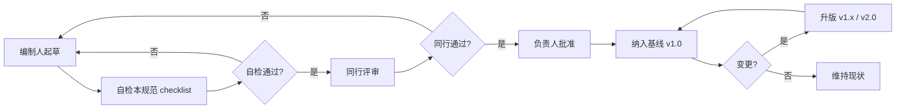

# 文档编写与评审规范

| 属性 | 内容 |
|------|------|
| **文档编号** | CM-STD-001 |
| **文档名称** | 校园二手交易平台 · 文档编写与评审规范 |
| **版本** | v1.0 |
| **密级** | 内部公开 |
| **编制人** | 课程组（Trae IDE 协助） |
| **审核人** | 课程负责人 |
| **批准人** | 课程负责人 |
| **编制日期** | 2026-06-15 |
| **生效日期** | 2026-06-15 |
| **替代版本** | FF-STD-001 v3.0（家庭资产管理版本，已废止） |

---

## 目录

- [1. 目的与适用范围](#1-目的与适用范围)
- [2. 文档编号体系](#2-文档编号体系)
- [3. 标准页眉与目录](#3-标准页眉与目录)
- [4. 必备章节（按文档类型）](#4-必备章节按文档类型)
- [5. 需求与对象编号规则](#5-需求与对象编号规则)
- [6. 评审流程](#6-评审流程)
- [7. 版本与变更管理](#7-版本与变更管理)
- [8. 图表与代码规范](#8-图表与代码规范)
- [9. 图标与表情禁令](#9-图标与表情禁令)
- [10. 跨文档引用规范](#10-跨文档引用规范)
- [11. 文档评审 checklist](#11-文档评审-checklist)
- [12. 关联文档](#12-关联文档)
- [13. 修订记录](#13-修订记录)

---

## 1. 目的与适用范围

### 1.1 目的

本规范规定校园二手交易平台（Campus Market）所有设计文档的**命名、编号、结构、评审、变更、引用**规则，使 `docs/` 目录下全部交付物达到大型企业软件工程文档体系的可审计、可追溯、可验收标准。

**核心目标**：

1. **统一性**：14 份文档有共同的页眉、目录、章节模板、编号格式；
2. **可追溯**：每条需求（FR）可被定位到具体的设计章节、API、测试点；
3. **可评审**：评审人按本规范 checklist 逐项检查；
4. **可演进**：版本与变更管理明确，重大变更与小幅修订分离；
5. **可读性**：图表统一 Mermaid，代码统一带注释，禁止 emoji 作为 UI 图标。

### 1.2 适用范围

- 本项目 `docs/` 目录下全部 Markdown 设计文档（CM-IDX-001 / CM-STD-001 / CM-GUIDE-001 / CM-SRS-001 / CM-HLD-001 / CM-LLD-001 / CM-DB-001 / CM-MP-001 / CM-WEB-001 / CM-API-SVC-001 / CM-API-001 / CM-AI-001 / CM-UI-001 / CM-RTM-001 / CM-RUN-MP-001）
- 三端代码评审、API 文档生成、CI 校验脚本均应引用本规范

### 1.3 不适用范围

- `.trae/specs/pivot-to-secondhand-market/` 下的业务 Spec（按其自有模板）
- 实操类文档 `QUICKSTART.md` / `部署说明.md` / `联调检查清单.md` / `实验指导书.md`（轻量级，重操作步骤而非设计）
- README.md / 设计 Token 文档（已有独立模板）

---

## 2. 文档编号体系

### 2.1 编号规则

```
CM - {类型缩写} - {序号}

CM     = Campus Market 项目前缀
类型   = 见 2.2 类型缩写表
序号   = 001, 002 ...
```

**示例**：

- `CM-SRS-001` — 需求规格说明书（首版）
- `CM-API-001` — 接口设计说明书（首版）
- `CM-RTM-001` — 需求追溯矩阵（首版）

### 2.2 类型缩写表

| 缩写 | 中文名称 | 文件名 | 对应编号 |
|------|----------|--------|----------|
| IDX | 设计文档总索引 | `00_设计文档索引.md` | CM-IDX-001 |
| STD | 文档编写与评审规范 | `00A_文档编写与评审规范.md` | CM-STD-001 |
| GUIDE | 文档体系教学指南 | `00B_企业级软件开发文档体系教学指南.md` | CM-GUIDE-001 |
| SRS | 需求规格说明书 | `01_需求规格说明书_SRS.md` | CM-SRS-001 |
| HLD | 概要设计说明书 | `02_概要设计说明书.md` | CM-HLD-001 |
| LLD | 详细设计说明书 | `03_详细设计说明书.md` | CM-LLD-001 |
| DB | 数据库设计说明书 | `04_数据库设计说明书.md` | CM-DB-001 |
| MP | 微信小程序功能说明书 | `05_微信小程序功能说明书.md` | CM-MP-001 |
| WEB | Web 卖家工作台功能说明书 | `06_Web管理后台功能说明书.md` | CM-WEB-001 |
| API-SVC | 后端服务功能说明书 | `07_后端服务功能说明书.md` | CM-API-SVC-001 |
| API | 接口设计说明书 | `08_接口设计说明书.md` | CM-API-001 |
| AI | AI 智能发布与议价模块设计 | `09_语音智能记账模块设计说明书.md` | CM-AI-001 |
| UI | UI 与交互设计规范 | `10_UI与交互设计规范.md` | CM-UI-001 |
| RTM | 需求追溯矩阵 | `14_需求追溯矩阵.md` | CM-RTM-001 |
| RUN-MP | 微信小程序编译与运行指南 | `15_微信小程序编译与运行指南.md` | CM-RUN-MP-001 |

### 2.3 旧版编号对照

| 旧编号（FF-*） | 新编号（CM-*） | 文档名称 |
|----------------|----------------|----------|
| FF-IDX-001 | CM-IDX-001 | 设计文档总索引 |
| FF-STD-001 | CM-STD-001 | 文档编写与评审规范 |
| FF-GUIDE-001 | CM-GUIDE-001 | 文档体系教学指南 |
| FF-SRS-001 | CM-SRS-001 | 需求规格说明书 |
| FF-HLD-001 | CM-HLD-001 | 概要设计说明书 |
| FF-LLD-001 | CM-LLD-001 | 详细设计说明书 |
| FF-DB-001 | CM-DB-001 | 数据库设计说明书 |
| FF-MP-001 | CM-MP-001 | 微信小程序功能说明书 |
| FF-WEB-001 | CM-WEB-001 | Web 卖家工作台功能说明书 |
| FF-API-SVC-001 | CM-API-SVC-001 | 后端服务功能说明书 |
| FF-API-001 | CM-API-001 | 接口设计说明书 |
| FF-VOICE-001 | CM-AI-001 | AI 智能发布与议价模块设计（**文档主题变更**） |
| FF-UI-001 | CM-UI-001 | UI 与交互设计规范 |
| FF-RTM-001 | CM-RTM-001 | 需求追溯矩阵 |
| FF-RUN-MP-001 | CM-RUN-MP-001 | 微信小程序编译与运行指南 |

> **说明**：09 文档除编号变更外，**主题**从"语音智能记账模块"变更为"AI 智能发布与议价模块"，贴合 `backend/market/services/ai_service.py` 的 7 个 AI 端点。

---

## 3. 标准页眉与目录

### 3.1 标准页眉

每份正式文档文首**必须**包含以下表格（CM-STD-001 / CM-GUIDE-001 / CM-SRS-001 / CM-HLD-001 / CM-LLD-001 / CM-DB-001 / CM-MP-001 / CM-WEB-001 / CM-API-SVC-001 / CM-API-001 / CM-AI-001 / CM-UI-001 / CM-RTM-001 / CM-RUN-MP-001 / CM-IDX-001）：

```markdown
| 属性 | 内容 |
|------|------|
| **文档编号** | CM-XXX-001 |
| **文档名称** | ×××说明书 |
| **版本** | v1.0 |
| **密级** | 内部公开 / 机密 |
| **编制人** | ××× |
| **审核人** | ××× |
| **批准人** | ××× |
| **编制日期** | YYYY-MM-DD |
| **生效日期** | YYYY-MM-DD |
| **替代版本** | （如有旧版）FF-XXX-001 v?.?（已废止） |
```

### 3.2 目录

- 紧随页眉后，使用 Markdown 锚点链接形式（GitHub 风格）
- 至少 3 级（一级章节 → 二级 → 三级）
- 若文档 > 1000 行，可加 4 级
- 长文档应包含 1-2 段"导读"或"使用说明"

### 3.3 修订记录

每份文档末尾**必须**包含修订记录表：

```markdown
## 13. 修订记录

| 版本 | 日期 | 修订人 | 修订说明 |
|------|------|--------|----------|
| v1.0 | 2026-06-15 | 课程组 | 基于校园二手交易平台业务整体重写，编号由 FF-* 切换为 CM-* |
```

---

## 4. 必备章节（按文档类型）

### 4.1 通用必备章节（全部 14 份）

| 章节 | 必含 | 说明 |
|------|------|------|
| 文档页眉表 | ✅ | 见 3.1 |
| 目录 | ✅ | 见 3.2 |
| 引言 / 概述 | ✅ | 文档目的、读者、范围 |
| 关联文档 | ✅ | 文档末尾列出"上游 / 下游 / 同级"文档 |
| 修订记录 | ✅ | 文档末尾，见 3.3 |

### 4.2 SRS 必备章节（CM-SRS-001）

| 章节 | 内容 |
|------|------|
| 项目背景与目标 | 业务背景、用户痛点、差异化能力、对标产品（闲鱼 / 得物 / 转转） |
| 用户角色与场景 | 买家 / 卖家 / 平台管理员三类角色的核心场景 |
| 业务范围与边界 | 在范围内（FR-xxx）/ 不在范围（NFR-xxx） |
| 功能需求 | FR-AUTH / FR-USER / FR-CAT / FR-PROD / FR-MSG / FR-ORD / FR-REV / FR-REPORT / FR-AI / FR-MP / FR-WEB / FR-ADMIN |
| 非功能需求 | NFR-PERF / NFR-SEC / NFR-AVAIL / NFR-MAINT / NFR-COMPAT |
| 业务规则 | BR-xxx（数据约束、状态机、计算公式） |
| 验收标准 | 性能指标 / 数据一致性 / 三端联调通过率 |
| 风险与缓解 | 已知风险 + 应对策略 |

### 4.3 HLD 必备章节（CM-HLD-001）

| 章节 | 内容 |
|------|------|
| 系统目标与设计原则 | 5-8 条设计原则（如"一后端 + 三前端"、REST、单一职责） |
| 总体架构 | Mermaid C4 Context + Container 图 |
| 技术栈选型 | Python 3.13 / Django 4.2 / DRF / SimpleJWT / MySQL 9.4 / Vue 3.5 / Element Plus / 微信小程序原生 |
| 模块划分 | 后端 12 个 model / 11 个 views 子模块 / 前端 3 端目录结构 |
| 数据流 | 关键端到端流程（注册 → 发布 → 浏览 → 私聊 → 下单 → 完成 → 评价 → 信用分） |
| 接口边界 | REST 风格、HTTP 状态码、JWT 鉴权、统一响应格式 |
| 部署拓扑 | 本地 / 课堂演示 / 生产 Nginx + Waitress + Gunicorn（Linux） |
| 安全设计总览 | 认证 / 授权 / 输入校验 / XSS / CSRF / 文件上传 |
| 第三方依赖 | LLM（OpenAI 兼容） / RabbitMQ（可选） / 媒体存储 |
| 性能与扩展性 | 缓存策略、读写分离、水平扩展点 |

### 4.4 LLD 必备章节（CM-LLD-001）

| 章节 | 内容 |
|------|------|
| 模块详细逻辑 | 关键模块的类图、时序图（Mermaid） |
| 关键算法与流程 | 商品状态机 / 订单状态机 / 信用分算法 / AI 一键发布流程 / 会话未读数维护 / 瀑布流分页 |
| 异常处理矩阵 | 业务异常 → HTTP 状态码 + 业务码（4xxxx 系列） |
| 配置项清单 | `.env` 中所有可配置项的语义、范围、默认值 |
| 缓存策略 | 哪些数据可缓存、TTL、失效时机 |
| 并发与幂等性 | 关键接口的幂等保证、并发场景（unique_together 冲突） |

### 4.5 DB 必备章节（CM-DB-001）

| 章节 | 内容 |
|------|------|
| 设计原则 | 命名规范、自定义表名、复合索引、字符集 |
| ER 图 | Mermaid `erDiagram` 覆盖全部 12 个模型 |
| 数据字典 | 12 张表 × 字段级说明（类型 / 约束 / 索引 / 外键） |
| DDL 全文 | 从 `migrations/0001_initial.py` 提取的完整 DDL |
| 索引策略 | 覆盖索引、复合索引、排序索引、外键索引 |
| 迁移与初始化 | `makemigrations` → `migrate` → `init_data_market.py` 流程 |
| 备份与恢复 | `mysqldump` 命令、恢复步骤 |
| 字符集与排序规则 | utf8mb4 / utf8mb4_unicode_ci |
| 性能与容量预估 | 单表行数预估、查询 QPS 估算、慢查询预案 |

### 4.6 功能说明书必备章节（CM-MP-001 / CM-WEB-001 / CM-API-SVC-001）

| 章节 | 内容 |
|------|------|
| 概述 | 端定位、技术栈、用户角色、访问入口（端口 / URL） |
| 全局约定 | API 基址、Token 存储、路由前缀、统一错误处理 |
| 页面 / 路由清单 | 每个页面的路径、组件、用途 |
| 字段级说明 | 每个字段的类型、约束、UI 形态、示例值 |
| 交互说明 | 用户操作 → 前端响应 → 后端调用 |
| 接口映射 | 每页 → 1~N 个 API（含端点、方法、参数） |
| 异常与空状态 | 网络错误 / 401 / 403 / 数据为空 / 加载失败 |
| 设计 Token 引用 | 颜色 / 字号 / 间距统一引用 `superpowers/specs/2026-06-06-design-tokens.md` |

### 4.7 接口设计说明书必备章节（CM-API-001）

| 章节 | 内容 |
|------|------|
| 通用约定 | 基址、版本、Header、Content-Type、JWT 鉴权位置 |
| 鉴权约定 | access + refresh、过期时间、刷新流程 |
| 错误码字典 | 4xxxx 业务码、5xxxx 系统码 |
| API 全量清单 | 11 个模块 × 50+ 端点（请求 + 响应 + 示例） |
| 兼容性策略 | `compat_views.py` 提供的旧路径 |
| 幂等性 | 哪些接口是幂等的（GET / PUT / DELETE），哪些需要幂等 token |
| 速率限制 | 限流策略（按 IP / 按用户） |
| 鉴权矩阵 | 端点 × 角色（user / admin / 公开） |
| 版本变更记录 | v1.0 / v1.1 / v2.0 重大变更 |

### 4.8 AI 模块设计必备章节（CM-AI-001）

| 章节 | 内容 |
|------|------|
| 模块定位 | 核心亮点、答辩加分项 |
| 设计目标与边界 | 能做什么 / 不做什么 |
| 整体架构 | LLM 客户端 / Prompt 管理 / 服务层 / 降级 / ASR |
| 7 个 AI 端点详细设计 | publish-assist / price-suggest / moderate / polish / negotiate / extract-keywords / customer-service |
| Prompt 模板 | 每个端点列出 prompt 示例 |
| 降级与回退 | mock 数据格式、降级触发条件 |
| 监控与统计 | 管理后台 AI 配置页 |
| 配置项 | `.env` 中 LLM_* 与 AI_*_ENABLED |
| 安全 | 防 prompt 注入、内容审核边界、敏感词过滤 |

### 4.9 UI 规范必备章节（CM-UI-001）

| 章节 | 内容 |
|------|------|
| 设计目标与对标 | 闲鱼 / 得物 / 小红书 / 微信原生 |
| 设计原则 | 6 项（内容优先、强 CTA、微动效、二手感、去冗余、可访问） |
| 视觉设计 | 品牌色 / 文本色 / 背景色 / 状态色 / 信用分等级色 |
| 字体 | 双端字体族、字号、字重、行高 |
| 布局 | 容器 / 触控热区 / 响应式断点 / z-index |
| 动效 | 150/200/300/500ms + ease-out/in/out |
| 图标 | Lucide SVG、严禁 emoji |
| 组件规范 | 按钮 / 卡片 / 输入框 / 标签 / 信用分徽章 / 商品状态 / 订单状态 / 瀑布流 |
| 可访问性 | 4.5:1 对比 / focus 环 / ARIA / reduced-motion |
| 三端落地 | 小程序 / Web 卖家台 / Web 管理后台的 token 引用方式 |
| 设计走查 checklist | 自检表 |

### 4.10 追溯矩阵必备章节（CM-RTM-001）

| 章节 | 内容 |
|------|------|
| 需求编号 | 与 CM-SRS-001 对齐 |
| 追溯维度 | FR → 设计章节 → 接口 → 三端落地 → 测试点 |
| 矩阵表 | 按 FR-AUTH / FR-USER / FR-CAT / FR-PROD / FR-MSG / FR-ORD / FR-REV / FR-REPORT / FR-AI 分组 |
| 状态标记 | 已实现 / 部分实现 / 待扩展 |
| 变更追踪 | 与版本号联动 |
| 维护策略 | 谁来维护、何时更新、变更同步规则 |

### 4.11 编译运行指南必备章节（CM-RUN-MP-001）

| 章节 | 内容 |
|------|------|
| 环境前置 | 微信开发者工具版本 / AppID / 网络 |
| 项目结构 | 11 个页面 / 3+ 组件 / utils / 自定义 tab-bar |
| 编译运行步骤 | 从 `npm run dev` 到模拟器预览 |
| API 基址配置 | 模拟器 vs 真机 |
| "不校验合法域名" 配置 | 调试开关 |
| 自定义 tab-bar 实现 | `custom-tab-bar/` 目录说明 |
| 调试技巧 | console.log / Network 面板 / Storage 查看 |
| 真机调试 + 内网穿透 | ngrok / cpolar |
| 性能优化 | setData 优化、图片懒加载 |
| 发布上线 | 提交审核步骤 |
| 常见错误 | 至少 10 条常见错误及解决方案 |

---

## 5. 需求与对象编号规则

### 5.1 需求编号（FR / NFR / BR / API / TC）

| 前缀 | 含义 | 示例 | 归属文档 |
|------|------|------|----------|
| **FR-AUTH-xx** | 认证模块功能需求 | FR-AUTH-01 注册 | CM-SRS-001 |
| **FR-USER-xx** | 用户与信用分 | FR-USER-01 修改昵称 | CM-SRS-001 |
| **FR-CAT-xx** | 分类 | FR-CAT-01 树形分类 | CM-SRS-001 |
| **FR-PROD-xx** | 商品 | FR-PROD-03 商品状态机 | CM-SRS-001 |
| **FR-MSG-xx** | 私聊 | FR-MSG-02 文字消息 | CM-SRS-001 |
| **FR-ORD-xx** | 订单 | FR-ORD-04 状态机 | CM-SRS-001 |
| **FR-REV-xx** | 评价 | FR-REV-01 互评 | CM-SRS-001 |
| **FR-REPORT-xx** | 举报 | FR-REPORT-02 处理动作 | CM-SRS-001 |
| **FR-AI-xx** | AI 能力 | FR-AI-01 一键发布 | CM-SRS-001 |
| **FR-MP-xx** | 小程序 | FR-MP-03 首页瀑布流 | CM-SRS-001 |
| **FR-WEB-xx** | Web 卖家台 | FR-WEB-04 仪表盘 | CM-SRS-001 |
| **FR-ADMIN-xx** | 管理后台 | FR-ADMIN-05 商品审核 | CM-SRS-001 |
| **NFR-xx** | 非功能需求 | NFR-01 性能、QPS | CM-SRS-001 |
| **BR-xx** | 业务规则 | BR-04 信用分 < 60 触发审核 | CM-SRS-001 |
| **API-xx** | 接口条目 | API-AUTH-01 `POST /auth/login/` | CM-API-001 |
| **TC-xx** | 测试用例 | TC-AUTH-01 正常登录 | [联调检查清单.md](联调检查清单.md) |

### 5.2 对象编号

| 场景 | 规则 | 示例 |
|------|------|------|
| 文档章节 | `§ 1.2.3` 数字点 | `§ 2.3` 表示第 2 章第 3 节 |
| 字段引用 | `<表名>.<字段>` | `User.credit_score` |
| API 引用 | `METHOD /path/` | `POST /api/auth/login/` |
| 错误码 | `HTTP状态码 + 业务码` | `HTTP 401, code 40101` |
| 状态机 | `INIT → MID → END` | `requested → confirmed → completed` |

### 5.3 追溯要求

CM-RTM-001 中建立：

```
需求 (FR / NFR / BR)
  ↓ 追溯
设计章节 (CM-HLD / CM-LLD / CM-DB)
  ↓ 追溯
接口 (CM-API / `backend/market/urls.py`)
  ↓ 追溯
三端落地 (CM-MP / CM-WEB / CM-ADMIN)
  ↓ 追溯
测试点 (TC-xx，[联调检查清单.md](联调检查清单.md) 第四节)
```

每条 FR 在 CM-RTM-001 至少有一个对应行，缺失的视为"待实现"。

---

## 6. 评审流程

### 6.1 评审流程图



### 6.2 评审类型与参与角色

| 评审类型 | 触发时机 | 参与角色 | 产出 |
|----------|----------|----------|------|
| **需求评审** | CM-SRS-001 更新时 | 产品/教师、后端、前端、测试 | SRS 签字 |
| **设计评审** | CM-HLD-001 / CM-LLD-001 / CM-DB-001 更新时 | 架构师、后端、前端 | HLD / LLD / DB 签字 |
| **接口评审** | CM-API-001 更新时 | 前端、后端、测试 | API 基线冻结 |
| **AI 模块评审** | CM-AI-001 更新时 | 后端、前端、产品 | AI 设计签字 |
| **UI 评审** | CM-UI-001 更新时 | 前端、设计、产品 | UI 规范签字 |
| **追溯矩阵评审** | CM-RTM-001 更新时 | 测试、架构 | RTM 签字 |

### 6.3 评审 checklist（每份文档必走）

- [ ] 文档页眉完整（含编号 / 版本 / 日期 / 替代版本）
- [ ] 目录三级覆盖
- [ ] 引言段清晰说明"目的 / 读者 / 范围"
- [ ] 章节遵循 4.x 必备章节清单
- [ ] 编号与本规范一致（CM-XXX-001）
- [ ] 跨文档引用全部可点击（file:// 协议）
- [ ] Mermaid 图表语法正确
- [ ] 代码块带语言标签 + 函数级注释
- [ ] **无任何 emoji 字符**（含 U+1F300~U+1F9FF / U+2600~U+27BF / U+2190~U+21FF / U+2700~U+27BF）
- [ ] 不含"家庭记账 / 账本 / 记账 / 流水 / 预算 / FF-*"等旧业务词汇
- [ ] 修订记录已更新
- [ ] 关联文档链正确

---

## 7. 版本与变更管理

### 7.1 版本号规则

| 版本变化 | 含义 | 触发条件 |
|----------|------|----------|
| **v1.0 → v2.0** | 主版本变更（架构 / 需求范围重大） | 业务转型（如 FF→CM）、技术栈更换、数据库重构 |
| **v1.0 → v1.1** | 次版本变更（功能增删 / 接口不兼容） | 新增 API、删除 API、字段重命名 |
| **v1.0 → v1.0.1** | 修订版本（错别字 / 澄清） | 描述优化、链接修复、示例补充 |

### 7.2 升版流程

1. 在文档修订记录追加一行（日期、版本、修订人、修订说明）
2. 同步更新 00 索引（CM-IDX-001）的"文档状态表"
3. 若涉及接口变更，同步更新：
   - 08 接口（CM-API-001）
   - 14 追溯矩阵（CM-RTM-001）
   - 联调检查清单（[联调检查清单.md](联调检查清单.md)）
4. PR 描述中说明变更原因 + 影响范围 + 同步更新的关联文档列表

### 7.3 修订记录表模板

```markdown
| 版本 | 日期 | 修订人 | 修订说明 |
|------|------|--------|----------|
| v1.0 | 2026-06-15 | 课程组 | 基于校园二手交易平台业务整体重写，编号由 FF-* 切换为 CM-* |
```

---

## 8. 图表与代码规范

### 8.1 图表

| 类型 | 规范 | 工具 |
|------|------|------|
| 架构图 | C4 Model（Context / Container） | Mermaid |
| 模块依赖图 | 节点 + 边 | Mermaid `flowchart` |
| 时序图 | 角色 + 消息 + 生命周期 | Mermaid `sequenceDiagram` |
| 类图 | 实体 + 字段 + 关系 | Mermaid `classDiagram` |
| ER 图 | 实体 + 关系 + 基数 | Mermaid `erDiagram` |
| 状态机 | 状态 + 事件 + 转换 | Mermaid `stateDiagram-v2` |
| 流程图 | 步骤 + 判断 | Mermaid `flowchart TD` |
| 复杂流程 / 时序 | ASCII art 兜底 | 纯文本 |

### 8.2 代码块规范

- **必须**带语言标签（`python` / `javascript` / `vue` / `html` / `css` / `sql` / `bash` / `json` / `yaml`）
- Python 函数**必须**带 docstring（用户规则 3）
- JavaScript 函数**必须**带 JSDoc 注释
- 关键业务逻辑**必须**带行内注释
- DDL 必须与 `migrations/0001_initial.py` 实际代码一致
- API 示例**必须**有 request + response 配对

### 8.3 命令规范

- **Windows PowerShell 兼容**（用户规则 6）：示例不用 `&&`，用 `;` 或换行；不用 `cd /path`，用 `Set-Location` 或 `Push-Location`
- 长命令使用反引号 ` 行续
- 路径使用绝对路径：`d:\文件\工作 作业\微信小程序实训\4次课程内容\综合实训\`

```powershell
# 推荐
Set-Location "d:\文件\工作 作业\微信小程序实训\4次课程内容\综合实训\backend"
C:\Users\liem\AppData\Local\Programs\Python\Python313\python.exe manage.py migrate

# 避免
cd backend && python manage.py migrate
```

### 8.4 表格规范

- 表头用粗体（`**字段**`）
- 列宽对齐靠 `|` 数量一致即可，无需手工对齐
- 多列表格说明性列使用中文，技术性列可英文

### 8.5 中英文混排

- 用户可见文字（界面、提示、按钮）：**中文**
- 技术标识（类名、字段名、HTTP 方法、状态码）：**英文**
- 混合示例：`POST /api/auth/login/`，返回 `401 Unauthorized`

---

## 9. 图标与表情禁令

### 9.1 硬性规则

**严禁**在以下位置使用 emoji 字符作为 UI 图标（用户规则 5）：

- 微信小程序 `.wxml` 文件
- Web 端 `.vue` 模板
- 文档中作为"按钮" / "提示图标" / "状态指示"
- 代码注释（替换为 `->` / `=>` / `*` 等 ASCII）

### 9.2 受限 Unicode 范围

| 范围 | 类别 | 处理 |
|------|------|------|
| U+1F300 ~ U+1F9FF | 表情符号 | 替换为 Lucide SVG |
| U+1FA00 ~ U+1FAFF | 扩展 A | 同上 |
| U+1F600 ~ U+1F64F | 表情 | 同上 |
| U+1F680 ~ U+1F6FF | 交通 / 箭头 | 同上 |
| U+2600 ~ U+27BF | 装饰符号 | 同上 |
| U+2700 ~ U+27BF | 装饰符号 | 同上 |
| **U+2190 ~ U+21FF** | 箭头（含 → ⇄ ↑ ↓） | UI 中替换为 SVG，注释 / 流程说明可保留 `->` ASCII |
| U+2B00 ~ U+2BFF | 杂项符号 | 视情况 |
| U+1F1E6 ~ U+1F1FF | 旗帜 | 视情况 |

### 9.3 替代方案

| 场景 | emoji 原意图 | 推荐替代 |
|------|--------------|----------|
| 提示 | ⚠️ / ❗ | `<lucide-alert-triangle>` / `<el-alert>` |
| 成功 | ✅ | `<lucide-check-circle>` / `<el-icon><Check /></el-icon>` |
| 错误 | ❌ | `<lucide-x-circle>` |
| 信息 | ℹ️ | `<lucide-info>` / `<el-icon><InfoFilled /></el-icon>` |
| 搜索 | 🔍 | `<lucide-search>` |
| 设置 | ⚙️ | `<lucide-settings>` |
| 用户 | 👤 | `<lucide-user>` |
| 消息 | 💬 | `<lucide-message-circle>` |
| 相机 | 📷 | `<lucide-camera>` |
| 发送 | ➡️ | `<lucide-send>` / `<lucide-arrow-right>` |
| 文档箭头 | → | `->` (ASCII) / `<lucide-arrow-right>` (UI) |
| 装饰 emoji | ✨ 🎉 | 移除或改为 SVG sparkles |

### 9.4 文档自检方法

文档写完后，运行以下命令快速扫描（PowerShell）：

```powershell
# 扫描所有 docs/ 下的 .md 文件
$path = "d:\文件\工作 作业\微信小程序实训\4次课程内容\综合实训\docs"
Get-ChildItem -Path $path -Recurse -Include *.md |
  Select-String -Pattern "[\x{1F300}-\x{1F9FF}]|[\x{2600}-\x{27BF}]|[\x{2190}-\x{21FF}]" |
  Format-Table Path, LineNumber, Line
```

如有命中，替换为 `->` (流程注释) 或 Lucide SVG（UI 引用）。

### 9.5 已有 emoji 清零记录

参考 [EMOJI_AUDIT.md](EMOJI_AUDIT.md) — 前端 125 个文件已 100% 清零，文档也需保持此标准。

---

## 10. 跨文档引用规范

### 10.1 引用方式

| 引用对象 | 语法 | 示例 |
|----------|------|------|
| 文档内章节 | `[§ 3.2](#3-标准页眉)` | 见 § 3.2 |
| 同目录文档 | `[文件名](文件名.md)` | [00_设计文档索引.md](00_设计文档索引.md) |
| 同目录子文档 | `[子目录/文件名](子目录/文件名.md)` | [superpowers/specs/2026-06-06-design-tokens.md](superpowers/specs/2026-06-06-design-tokens.md) |
| 父目录文档 | `[../文件名](../文件名.md)` | [../README.md](../README.md) |
| 代码文件（**强制 file://**） | `[文件相对路径](file:///{绝对路径})` | [market/urls.py](file:///d:/文件/工作 作业/微信小程序实训/4次课程内容/综合实训/backend/market/urls.py) |
| 代码行（**强制 file://**） | `[文件](file:///绝对路径#L{行号}-L{结束行})` | [models.py:30-100](file:///d:/文件/工作 作业/微信小程序实训/4次课程内容/综合实训/backend/market/models.py#L30-L100) |

### 10.2 路径前缀

所有代码引用使用**绝对路径**前缀：

```
d:\文件\工作 作业\微信小程序实训\4次课程内容\综合实训\
```

最终渲染为：

```
file:///d:/文件/工作 作业/微信小程序实训/4次课程内容/综合实训/...
```

> 注意：Markdown 链接中反斜杠要写成 `/`（GitHub / VS Code 自动识别）。

### 10.3 引用一致性

- 引用一份文档时，文档名使用与索引（CM-IDX-001）完全一致的字符串
- 引用代码文件时，路径与 `backend/` / `miniprogram/` / `frontend-*/` 实际目录结构一致
- 跨文件引用避免循环（A → B → A）

---

## 11. 文档评审 checklist

每份文档编写完成后，编制人必须自检以下项。全部 ✅ 后方可提交评审。

### 11.1 结构性

- [ ] 文档页眉表完整（10 项）
- [ ] 目录三级覆盖且锚点正确
- [ ] 引言段说明"目的 / 读者 / 范围 / 配套文档"
- [ ] 章节遵循 4.x 必备章节
- [ ] 文档末尾有"修订记录"和"关联文档"

### 11.2 内容性

- [ ] 业务场景与 `backend/market/` 实际代码一致
- [ ] 接口路径与 `backend/market/urls.py` 一致
- [ ] 数据模型与 `backend/market/models.py` 一致
- [ ] 错误码与 `market/exceptions.py` 一致
- [ ] 响应格式与 `market/response.py` 一致
- [ ] 权限规则与 `market/permissions.py` 一致
- [ ] 字段含义与 `market/serializers/*.py` 一致

### 11.3 引用性

- [ ] 所有文档内链接可点击（[文字](相对路径) 形式）
- [ ] 所有代码引用使用 `file:///` 绝对路径
- [ ] 跨文档引用全部可达（不出现 404）
- [ ] 引用旧 FF-* 编号时附"已废止"标注

### 11.4 视觉性

- [ ] 全部 Mermaid 图表语法正确（在 GitHub / VS Code 中可渲染）
- [ ] 代码块带语言标签
- [ ] 表格对齐且表头粗体
- [ ] 关键信息加粗（路径、警告、关键术语）

### 11.5 规范符合性

- [ ] 编号格式：CM-XXX-001
- [ ] 不含 emoji 字符（执行 § 9.4 扫描）
- [ ] 不含"家庭记账"旧业务词汇（执行 grep 扫描）
- [ ] 不含硬编码 hex 颜色（UI 相关文档）
- [ ] 不含 `&&` Linux 命令（用 PowerShell 语法）

### 11.6 关联同步

- [ ] 若新增 / 删除 / 修改接口 → 同步更新 08 接口 + 14 追溯
- [ ] 若修改数据模型 → 同步更新 04 数据库 + 08 接口
- [ ] 若修改 UI 规范 → 同步更新 10 UI 规范 + 设计 Token 文档
- [ ] 若修改业务流程 → 同步更新 02 概要 + 03 详细 + 01 需求

---

## 12. 关联文档

### 12.1 上游（被本规范引用）

- 无（本规范为基础规范）

### 12.2 下游（引用本规范）

- [00_设计文档索引.md](00_设计文档索引.md) — 文档索引
- [01_需求规格说明书_SRS.md](01_需求规格说明书_SRS.md) — 需求规格
- [02_概要设计说明书.md](02_概要设计说明书.md) — 概要设计
- [03_详细设计说明书.md](03_详细设计说明书.md) — 详细设计
- [04_数据库设计说明书.md](04_数据库设计说明书.md) — 数据库设计
- [05_微信小程序功能说明书.md](05_微信小程序功能说明书.md) — 小程序
- [06_Web管理后台功能说明书.md](06_Web管理后台功能说明书.md) — Web 卖家台
- [07_后端服务功能说明书.md](07_后端服务功能说明书.md) — 后端服务
- [08_接口设计说明书.md](08_接口设计说明书.md) — 接口设计
- [09_语音智能记账模块设计说明书.md](09_语音智能记账模块设计说明书.md) — AI 智能发布与议价模块
- [10_UI与交互设计规范.md](10_UI与交互设计规范.md) — UI 规范
- [14_需求追溯矩阵.md](14_需求追溯矩阵.md) — 追溯矩阵
- [15_微信小程序编译与运行指南.md](15_微信小程序编译与运行指南.md) — 小程序运行指南

### 12.3 同级（参考但不强制依赖）

- [00B_企业级软件开发文档体系教学指南.md](00B_企业级软件开发文档体系教学指南.md) — 教学导读
- [../README.md](../README.md) — 项目总览
- [QUICKSTART.md](QUICKSTART.md) — 快速开始
- [EMOJI_AUDIT.md](EMOJI_AUDIT.md) — Emoji 清零扫描报告

### 12.4 后端代码参考

- [backend/market/models.py](file:///d:/文件/工作 作业/微信小程序实训/4次课程内容/综合实训/backend/market/models.py) — 12 个 ORM 模型
- [backend/market/urls.py](file:///d:/文件/工作 作业/微信小程序实训/4次课程内容/综合实训/backend/market/urls.py) — 50+ 端点
- [backend/market/authentication.py](file:///d:/文件/工作 作业/微信小程序实训/4次课程内容/综合实训/backend/market/authentication.py) — JWT 鉴权
- [backend/market/permissions.py](file:///d:/文件/工作 作业/微信小程序实训/4次课程内容/综合实训/backend/market/permissions.py) — 权限类
- [backend/market/exceptions.py](file:///d:/文件/工作 作业/微信小程序实训/4次课程内容/综合实训/backend/market/exceptions.py) — 异常处理
- [backend/market/response.py](file:///d:/文件/工作 作业/微信小程序实训/4次课程内容/综合实训/backend/market/response.py) — 统一响应

---

## 13. 修订记录

| 版本 | 日期 | 修订人 | 修订说明 |
|------|------|--------|----------|
| v1.0 | 2026-06-15 | 课程组（Trae IDE 协助） | 基于校园二手交易平台业务整体重写，编号由 FF-STD-001 切换为 CM-STD-001；删除"家庭记账"相关章节；新增 emoji 禁令、跨文档引用规范、文档评审 checklist |
