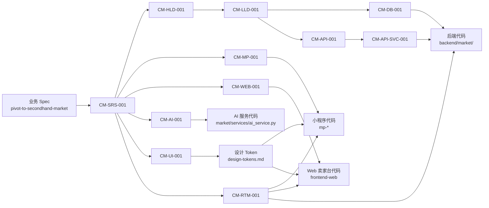
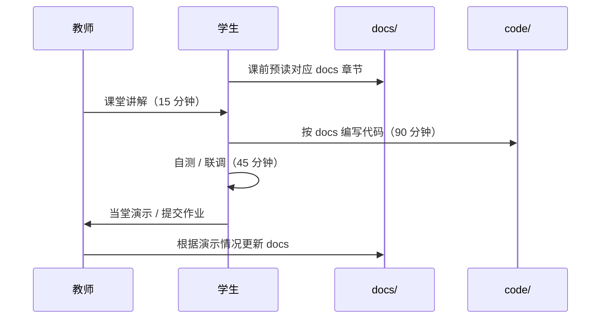
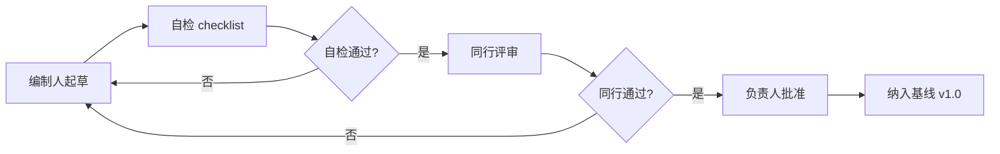
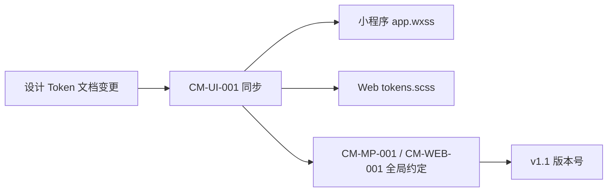

# 企业级软件开发文档体系教学指南

| 属性 | 内容 |
|------|------|
| **文档编号** | CM-GUIDE-001 |
| **文档名称** | 校园二手交易平台 · 企业级软件开发文档体系教学指南 |
| **版本** | v1.0 |
| **密级** | 内部公开 |
| **编制人** | 课程组（Trae IDE 协助） |
| **审核人** | 课程负责人 |
| **批准人** | 课程负责人 |
| **编制日期** | 2026-06-15 |
| **生效日期** | 2026-06-15 |
| **替代版本** | FF-GUIDE-001 v1.1（家庭资产管理版本，已废止） |

---

## 目录

- [1. 导论](#1-导论)
- [2. 企业级文档体系全景](#2-企业级文档体系全景)
- [3. 14 类文档的价值与时机](#3-14-类文档的价值与时机)
- [4. 教学节奏与课次映射](#4-教学节奏与课次映射)
- [5. 评审与基线管理](#5-评审与基线管理)
- [6. 与设计 Token 体系的关系](#6-与设计-token-体系的关系)
- [7. 文档编写常见问题](#7-文档编写常见问题)
- [8. 学生自学路径](#8-学生自学路径)
- [9. 教师授课建议](#9-教师授课建议)
- [10. 答辩与评审要点](#10-答辩与评审要点)
- [11. 工具链与自动化](#11-工具链与自动化)
- [12. 关联文档](#12-关联文档)
- [13. 修订记录](#13-修订记录)

---

## 1. 导论

### 1.1 为什么需要"企业级文档"

学生在课程实训中容易产生一个误解："我写完代码，能跑就行，文档没必要"。这种想法在小作坊式开发中短期内确实成立，但放到企业级项目（10+ 人、6+ 月、3+ 端、需要交接和维护）就会立刻失败：

1. **代码不是文档**：6 个月后回头看自己的代码，没有人能记住"为什么这么写"；
2. **跨人协作成本高**：UI 设计师、后端、前端、测试、运维不同岗位的协作必须靠**单一真相源**；
3. **需求变更必须有迹可循**：业务从"家庭记账"转型为"校园二手交易"时，14 份设计文档的版本演进、字段映射、API 路径变更都需要可追溯；
4. **答辩与验收的硬要求**：课程评分、毕业设计、企业面试都要求"能讲清楚为什么这么做"。

### 1.2 校园二手交易平台为什么需要 14 份文档

| 规模维度 | 数值 |
|----------|------|
| 业务域 | 8 大模块（认证 / 用户 / 商品 / 私聊 / 订单 / 评价 / 举报 / AI） |
| 数据模型 | 12 张表 + 9 个索引 + 2 个状态机 |
| API 端点 | 80+（含 9 个 AI 端点） |
| 前端 | 3 个（小程序买家 / Web 卖家 / Web 管理后台） |
| 第三方 | LLM / 可选 RabbitMQ / 媒体存储 |
| 课程课时 | 4 次实训（每次约 4 学时） |
| 学生人数 | 通常 30-60 人/期 |

规模决定了"必须有完整文档体系"。

### 1.3 本指南读者

| 角色 | 重点章节 |
|------|----------|
| **学生** | §2 全景、§3 文档价值、§4 课次映射、§8 自学路径 |
| **授课教师** | §4 教学节奏、§9 授课建议、§10 答辩要点 |
| **助教 / 答辩评审** | §5 评审流程、§10 评审 checklist |
| **新进项目成员** | §2、§3、§6 Token 体系、§11 工具链 |

---

## 2. 企业级文档体系全景

### 2.1 三层文档结构

```
+-----------------------------------------------------+
|  A. 治理层（Governance）                            |
|     CM-STD-001    文档编写与评审规范                  |
|     CM-GUIDE-001  文档体系教学指南（本文件）           |
|     CM-IDX-001    设计文档总索引                      |
+-----------------------------------------------------+
|  B. 设计层（Design）                                 |
|     CM-SRS-001    需求规格说明书                      |
|     CM-HLD-001    概要设计说明书                      |
|     CM-LLD-001    详细设计说明书                      |
|     CM-DB-001     数据库设计说明书                    |
|     CM-UI-001     UI 与交互设计规范                  |
+-----------------------------------------------------+
|  C. 实现层（Implementation）                         |
|     CM-MP-001     微信小程序功能说明书               |
|     CM-WEB-001    Web 卖家工作台功能说明书           |
|     CM-API-SVC-001 后端服务功能说明书                 |
|     CM-AI-001     AI 智能发布与议价模块设计           |
+-----------------------------------------------------+
|  D. 接口与质量层（API & Quality）                    |
|     CM-API-001    接口设计说明书                     |
|     CM-RTM-001    需求追溯矩阵                       |
+-----------------------------------------------------+
|  E. 运行层（Runtime）                                |
|     CM-RUN-MP-001 微信小程序编译与运行指南           |
|     部署说明.md / QUICKSTART.md / 联调检查清单.md   |
+-----------------------------------------------------+
```

### 2.2 14 份文档一句话定位

| 编号 | 一句话定位 |
|------|------------|
| CM-IDX-001 | docs/ 导航中心 + 14 份文档状态一览 |
| CM-STD-001 | 写文档的"宪法"——编号 / 页眉 / 评审 / 变更规则 |
| CM-GUIDE-001 | 14 份文档怎么读、怎么用、怎么教 |
| CM-SRS-001 | 业务侧"做什么"——功能 / 非功能 / 业务规则 / 验收 |
| CM-HLD-001 | 架构侧"怎么拆"——一后端三前端 + 模块边界 + 技术栈 |
| CM-LLD-001 | 实现侧"怎么写"——状态机 / 关键算法 / 异常处理 |
| CM-DB-001 | 数据侧"存什么"——12 张表 / 索引 / 关系 |
| CM-MP-001 | 买家小程序功能 + 页面 + 组件 + 交互 |
| CM-WEB-001 | 卖家 Web 工作台功能 + 页面 + 组件 + 响应式 |
| CM-API-SVC-001 | 后端 App 结构 + 业务模块 + 通用机制 |
| CM-API-001 | 80+ 端点的入参 / 出参 / 错误码 / 鉴权 |
| CM-AI-001 | 7 个 AI 端点的 Prompt / 降级 / 监控 |
| CM-UI-001 | 三端 UI 共用规范 + 设计 Token 引用 |
| CM-RTM-001 | FR → 设计 → API → 三端 → 测试的可追溯矩阵 |
| CM-RUN-MP-001 | 微信开发者工具编译 + 模拟器 + 真机调试 |

### 2.3 文档与代码的对应关系



---

## 3. 14 类文档的价值与时机

### 3.1 CM-STD-001 文档编写与评审规范

- **价值**：保证 14 份文档风格一致、可评审、可追溯；
- **何时写**：第 0 周（开课前）；
- **何时用**：写任何新文档前先读它；评审任何文档时按其 checklist 逐项检查。

### 3.2 CM-IDX-001 设计文档总索引

- **价值**：14 份文档的导航、状态、三端映射、阅读路径；
- **何时写**：每周末维护；
- **何时用**：新成员加入 / 答辩前 1 周 / 任何"找文档"场景。

### 3.3 CM-SRS-001 需求规格说明书

- **价值**：明确"做什么 / 不做什么"，所有后续设计的源头；
- **何时写**：第 1 次实训前完成 v1.0；
- **何时用**：需求变更时必动；评审会上必读；测试用例编写必参考。

**关键产物**：

- 用户角色与场景（买家 / 卖家 / 平台管理员）
- 10 大功能需求域（FR-AUTH/USER/CAT/PROD/MSG/ORD/REV/REPORT/AI/ADMIN/STATS/SYS）
- 非功能需求（性能 / 安全 / 可用性 / 可维护性 / 兼容性）
- 业务规则 BR-xxx
- 验收标准

### 3.4 CM-HLD-001 概要设计说明书

- **价值**：决定"怎么拆"，所有详细设计的输入；
- **何时写**：第 1 次实训末完成 v1.0；
- **何时用**：架构评审；技术选型讨论；新成员理解全局架构。

**关键产物**：

- "一后端 + 三前端" 架构图
- 技术栈选型表
- 模块划分（12 个模型 / 11 个 views 子模块 / 9 个 AI 端点）
- 数据流图（注册 → 发布 → 浏览 → 私聊 → 下单 → 完成 → 评价 → 信用分）
- 部署拓扑
- 安全设计总览

### 3.5 CM-LLD-001 详细设计说明书

- **价值**：指导"具体怎么写"；
- **何时写**：第 1~2 次实训完成 v1.0；
- **何时用**：后端开发时；Code Review 时；测试用例编写时。

**关键产物**：

- 商品状态机 5 步走流程图
- 订单状态机 5 步走流程图
- 信用分变更算法伪代码
- AI 一键发布流程时序图
- 异常处理矩阵
- `.env` 配置项清单

### 3.6 CM-DB-001 数据库设计说明书

- **价值**：数据模型是任何后端系统的"骨架"；
- **何时写**：第 1 次实训末完成 v1.0；
- **何时用**：建表 / 改表 / 排查性能 / 答辩"画 ER 图"。

**关键产物**：

- 12 张表的 ER 图（Mermaid）
- 字段级数据字典
- DDL 全文
- 索引策略（9 个复合 / 覆盖 / 排序索引）
- 数据迁移与初始化流程

### 3.7 CM-MP-001 微信小程序功能说明书

- **价值**：买家端的"操作手册 + 接口映射"；
- **何时写**：第 2 次实训中完成 v1.0；
- **何时用**：小程序开发 / 联调 / 答辩 demo。

**关键产物**：

- 11 个页面 + 5+ 组件
- 字段级说明 + 交互细节 + 空状态
- 每页 → N 个 API 的映射表
- 设计 Token 引用

### 3.8 CM-WEB-001 Web 卖家工作台功能说明书

- **价值**：卖家端的功能边界 + Vue3 + TS + Element Plus 落地；
- **何时写**：第 3 次实训中完成 v1.0；
- **何时用**：Web 卖家台开发；联调。

**关键产物**：

- 8 个页面 + 路由表
- 响应式断点
- ECharts 图表

### 3.9 CM-API-SVC-001 后端服务功能说明书

- **价值**：从代码视角描述"后端由哪些模块组成 / 怎么组织 / 关键逻辑"；
- **何时写**：第 1~3 次实训中完成 v1.0；
- **何时用**：后端开发 / Code Review / 答辩"讲架构"。

**关键产物**：

- App 结构（11 个 views 子模块 + 7 个 serializers + 4 个 services）
- 11 大业务模块的接口一览
- 通用机制（分页 / 响应封装 / 异常 / 权限 / 限流）
- 部署与运行（waitress-serve / gunicorn）

### 3.10 CM-API-001 接口设计说明书

- **价值**：80+ 端点的"字典"，前端、后端、测试、答辩都离不开；
- **何时写**：第 2~4 次实训中分阶段完成 v1.0；
- **何时用**：联调时实时查阅；写测试用例时；变更时同步。

**关键产物**：

- 通用约定（基址 / Header / JWT / 错误码 / 分页 / 排序）
- 全量端点清单（按 11 个模块分组）
- 兼容性策略（`compat_views.py` 旧路径）
- 鉴权矩阵

### 3.11 CM-AI-001 AI 智能发布与议价模块设计

- **价值**：7 个 AI 端点的 Prompt / 降级 / 监控；
- **何时写**：第 4 次实训完成 v1.0；
- **何时用**：AI 模块开发；答辩"AI 亮点"加分项。

**关键产物**：

- LLM 客户端设计（多模态、限流、重试）
- 7 个端点详细设计 + Prompt 模板
- 降级与回退（mock 数据格式）
- 监控与统计

### 3.12 CM-UI-001 UI 与交互设计规范

- **价值**：保证三端 UI 一致性、设计 Token 单一真相源；
- **何时写**：第 1~2 次实训完成 v1.0；
- **何时用**：UI 设计 / 走查 / 答辩"讲设计"。

**关键产物**：

- 设计原则（6 项）
- 视觉设计（品牌色 / 字体 / 间距 / 圆角 / 阴影）
- 布局系统（容器 / 触控 / 响应式 / z-index）
- 动效系统（150/200/300/500ms）
- 图标规范（Lucide SVG，**严禁 emoji**）
- 组件规范（按钮 / 卡片 / 输入框 / 标签 / 信用分徽章 / 商品状态 / 订单状态 / 瀑布流）
- 可访问性

### 3.13 CM-RTM-001 需求追溯矩阵

- **价值**：FR → 设计 → API → 三端 → 测试的"全链路追溯"；
- **何时写**：第 4 次实训末完成 v1.0；
- **何时用**：答辩时"每条需求都有对应实现"；变更影响分析。

**关键产物**：

- 10 大需求域的矩阵表
- 状态标记（已实现 / 部分实现 / 待扩展）
- 变更追踪

### 3.14 CM-RUN-MP-001 微信小程序编译与运行指南

- **价值**：手把手教"如何在本地把小程序跑起来"；
- **何时写**：第 2 次实训前完成 v1.0；
- **何时用**：第一次跑小程序；真机调试；发布上线。

**关键产物**：

- 环境前置（微信开发者工具 / AppID）
- 项目结构（11 个页面 / 5+ 组件 / utils / 自定义 tab-bar）
- 编译运行步骤
- API 基址配置
- 真机调试 + 内网穿透
- 性能优化
- 常见错误

---

## 4. 教学节奏与课次映射

### 4.1 课程 4 次实训总览

| 课次 | 周次 | 主题 | 关键交付物 | 必读 docs |
|------|------|------|------------|-----------|
| 第 1 次 | 第 1 周 | 需求 + 数据库 + 后端基线 | 1. 业务 Spec<br/>2. 12 张表 DDL<br/>3. 鉴权 + 分类 + 商品 CRUD | CM-SRS-001 §2-4、CM-DB-001、CM-API-SVC-001 §2、CM-RTM-001 |
| 第 2 次 | 第 2 周 | 商品 + 状态机 + 收藏 + 私聊 | 1. 商品状态机<br/>2. 私聊<br/>3. 买家小程序骨架 | CM-LLD-001 §3、CM-API-001 §商品/会话、CM-MP-001 §3.1-3.7、CM-RUN-MP-001 |
| 第 3 次 | 第 3 周 | 订单 + 评价 + 举报 + 信用分 | 1. 订单状态机<br/>2. 信用分算法<br/>3. 卖家 Web 骨架 | CM-LLD-001 §3、CM-API-001 §订单/举报、CM-WEB-001 §3 |
| 第 4 次 | 第 4 周 | AI 模块 + 三端联调 + 部署 | 1. 7 个 AI 端点<br/>2. 三端联调通过<br/>3. 部署演示 | CM-AI-001、CM-API-001 §AI、CM-UI-001、CM-RTM-001、`联调检查清单.md` |

### 4.2 课次 → 文档 → 代码 → 演示 四步闭环



### 4.3 教学版 v1 与文档 v1 边界

| 维度 | 教学 v1（必做） | 文档 v1（延伸 / 加分） |
|------|------------------|------------------------|
| 用户角色 | 买家 + 卖家 + 平台管理员 | 客服 / 运营 / 风控 |
| 商品 | CRUD + 5 步状态机 | 拍卖 / 一口价 / 议价 |
| 私聊 | 文字 + 图片 | 语音 / 商品卡片 / 议价卡 |
| AI | 7 个端点 + mock 降级 | 多模态视频 / 自动直播 |
| 部署 | 本地 waitress + MySQL | Nginx + Gunicorn + 多机 |
| 监控 | 日志文件 | Prometheus + Grafana |

### 4.4 课时分配建议

| 课次 | 理论（min） | 实操（min） | 演示（min） |
|------|-------------|-------------|-------------|
| 第 1 次 | 50（Spec + ER） | 110（建表 + 鉴权 + CRUD） | 20 |
| 第 2 次 | 30（状态机 + 私聊） | 130（小程序骨架） | 20 |
| 第 3 次 | 30（订单 + 信用分） | 130（Web 卖家台） | 20 |
| 第 4 次 | 20（AI 模块） | 130（联调 + 部署） | 30（验收答辩） |

---

## 5. 评审与基线管理

### 5.1 文档评审 checklist（精简版）

> 完整版见 [CM-STD-001 §11](file:///d:/文件/工作 作业/微信小程序实训/4次课程内容/综合实训/docs/00A_文档编写与评审规范.md)。

| 维度 | 检查项 |
|------|--------|
| 页眉 | 编号、版本、密级、编制人、日期、替代版本 |
| 目录 | 至少 3 级锚点链接 |
| 编号 | 所有 FR / API / 数据表 / 状态值有统一编号 |
| 图表 | 流程图、时序图、ER 图用 Mermaid |
| 代码 | 关键代码段带函数级注释 |
| 链接 | 全部使用 file:// 协议，路径绝对 |
| emoji | **零 emoji**（用户规则 5） |
| 旧业务残留 | **无任何"家庭记账 / FF-* / 账本 / 流水"等旧业务词** |
| 关联文档 | 文末列出"关联文档"小节 |
| 修订记录 | 文末包含"修订记录"表 |

### 5.2 评审流程



### 5.3 基线管理

| 基线 | 触发 | 必动文档 |
|------|------|----------|
| v1.0 | 业务整体转型（家庭资产 → 校园二手） | 14 份文档 |
| v1.1 | 修复错别字、链接、字段名 | 涉及文档 |
| v1.2 | 新增 API / 新增字段 / 新增业务规则 | 涉及文档 |
| v2.0 | 重大业务变更（如新增"拍卖"模式） | 全部文档 |

---

## 6. 与设计 Token 体系的关系

### 6.1 设计 Token 单一真相源

`docs/superpowers/specs/2026-06-06-design-tokens.md` 是三端 UI 设计的**单一真相源**：

- 品牌色：`#FF6B35`
- 中性色：10 档灰阶
- 信用分等级色：5 档
- 字号：12 / 14 / 16 / 18 / 20 / 24 / 32
- 间距：4 / 8 / 12 / 16 / 20 / 24 / 32
- 圆角：4 / 8 / 12 / 16 / 24
- 阴影：3 档
- 动效：150 / 200 / 300 / 500ms
- 图标：Lucide SVG（**严禁 emoji**）
- 触控：44pt 最小热区
- 对比度：4.5:1（WCAG AA）

### 6.2 三端引用方式

| 端 | 引用方式 |
|----|----------|
| 小程序 | `app.wxss` 中定义 CSS 变量（`--color-primary` 等），各页面 `wxss` 引用 |
| Web 卖家台 / 管理后台 | `styles/tokens.scss` 编译为 CSS 变量，Element Plus 主题覆盖 |
| 后端 | 不直接引用，商品图片、AI Prompt 间接相关（图片风格、UI 措辞） |

### 6.3 Token 变更流程



---

## 7. 文档编写常见问题

### 7.1 抄代码不抄业务

**症状**：把 `views.py` 的代码贴到文档里，不解释"为什么这么写"。

**处方**：文档是"业务的语言"，代码是"实现细节"。先讲业务规则（BR-xxx），再讲实现要点。

### 7.2 截图代替流程图

**症状**：直接贴运行时截图。

**处方**：截图只是辅助。流程图、时序图、状态机图必须用 Mermaid 画，便于文本编辑和版本控制。

### 7.3 编号混乱

**症状**：FR-01、FR-001、Req-1、需求 1 混用。

**处方**：严格按 [CM-STD-001 §2](file:///d:/文件/工作 作业/微信小程序实训/4次课程内容/综合实训/docs/00A_文档编写与评审规范.md) 编号。

### 7.4 emoji 当图标

**症状**：用 ⭐、🔥、💰 当 UI 图标。

**处方**：**所有 UI 图标必须用 Lucide SVG**。文档中也禁止用 emoji（[EMOJI_AUDIT.md](file:///d:/文件/工作 作业/微信小程序实训/4次课程内容/综合实训/docs/EMOJI_AUDIT.md)）。

### 7.5 PowerShell 用了 `&&`

**症状**：命令示例里写了 `cd dir && python manage.py runserver`，Windows PowerShell 跑不通。

**处方**：PowerShell 用 `;` 分隔多条命令，或用 `if ($?)` 链式调用。

### 7.6 旧业务残留

**症状**：文档里出现"家庭记账 / 账本 / 流水 / 预算 / 成员"等。

**处方**：写完每份文档后 grep 关键字 `家庭|账本|流水|预算|FF-|voice_serializers` 等，确认无残留。

### 7.7 路径含相对路径

**症状**：`./backend/market/models.py`。

**处方**：使用 `file://` 协议的绝对路径，markdown 才能渲染为可点击链接。

### 7.8 没有修订记录

**症状**：文末没有"修订记录"表。

**处方**：每份文档必带，即使只有一版。

---

## 8. 学生自学路径

### 8.1 第一次接触项目（Day 1）

```text
00B（本文件） → 00A → 00 → 01 §2 业务范围
     ↓
读 `QUICKSTART.md` 把项目跑起来
     ↓
读 `pivot-to-secondhand-market/spec.md` 业务 Spec
```

### 8.2 后端方向深入（Day 2~4）

```text
01 §3 功能需求
     ↓
04 数据库设计（12 张表）
     ↓
07 后端服务功能说明书（11 个 views 子模块）
     ↓
08 接口设计说明书（80+ 端点）
     ↓
03 详细设计说明书（状态机 / 算法）
```

### 8.3 小程序方向深入

```text
15 编译与运行指南（先把项目跑起来）
     ↓
05 微信小程序功能说明书（11 个页面）
     ↓
10 UI 与交互设计规范 + 设计 Token
     ↓
08 接口设计说明书（按需查阅）
```

### 8.4 Web 卖家台方向深入

```text
QUICKSTART.md 启动前端
     ↓
06 Web 卖家工作台功能说明书
     ↓
10 UI 规范
     ↓
08 接口设计说明书
```

### 8.5 AI 模块方向深入

```text
09 AI 智能发布与议价模块设计
     ↓
backend/market/services/ai_service.py 源码
     ↓
backend/market/services/ai_prompts.py Prompt 模板
     ↓
.env 中 LLM_* 配置项
```

### 8.6 答辩前 1 周

```text
01 §2 业务范围 + 14 §对照表
     ↓
05 / 06 / 管理后台 三大模块各做一遍 demo
     ↓
08 接口演示（用 Postman / Apifox）
     ↓
`联调检查清单.md` 自查
```

---

## 9. 教师授课建议

### 9.1 课前

- 检查 docs/ 是否已更新到 v1.0；
- 检查 `QUICKSTART.md` 是否仍可一键跑起来；
- 准备 1~2 个真实校园二手商品案例（如二手教材 iPhone、电动车）。

### 9.2 课中

| 时间 | 活动 | 工具 |
|------|------|------|
| 0-15 min | 讲 docs 对应章节 | 投屏 |
| 15-30 min | 演示关键代码 / 数据库 | VSCode / MySQL Workbench |
| 30-110 min | 学生实操 | 本地 |
| 110-130 min | 自测 / 联调 | Postman |
| 130-150 min | 演示 / 答疑 | 投屏 |

### 9.3 课后

- 收集学生当堂提交的 demo 录像 1~2 份；
- 更新 docs（如发现 API 路径错误、字段遗漏）；
- 在 `WAVE4_ACCEPTANCE_REPORT.md` 增补新发现的问题。

### 9.4 4 次实训的"必讲清单"

| 课次 | 必讲 |
|------|------|
| 第 1 次 | ER 图、12 张表、JWT 鉴权流程 |
| 第 2 次 | 商品状态机、私聊消息时序 |
| 第 3 次 | 订单状态机、信用分算法、举报处理 |
| 第 4 次 | AI 一键发布、议价参考价、Prompt 模板、降级策略 |

---

## 10. 答辩与评审要点

### 10.1 答辩评分表（建议）

| 维度 | 满分 | 评分要点 |
|------|------|----------|
| 业务理解 | 10 | 能否讲清楚买家 / 卖家 / 平台管理员三类角色的需求 |
| 架构 | 15 | "一后端 + 三前端" 能否画出来 |
| 数据库 | 15 | 12 张表 ER 图、关键索引 |
| 接口 | 15 | 演示 3~5 个核心 API（登录、发布商品、下单、议价参考价） |
| AI 亮点 | 15 | 7 个端点中演示 2~3 个 + 降级策略 |
| 状态机 | 10 | 商品 / 订单状态机能否讲清 |
| 代码质量 | 10 | 命名、注释、模块化 |
| 文档 | 10 | 14 份文档是否齐全 + 修订记录 |

### 10.2 评审常见问题

1. **"为什么不用闲鱼 App 的方案？"** —— 答：校园二手有"同校优先 + 校园认证 + 学号溯源"特征，闲鱼无此能力。
2. **"AI 7 个端点有没有跑过？"** —— 现场演示 `ai/publish-assist/` 一键发布，截图对比 mock 降级。
3. **"商品状态机为什么不直接 5 步？"** —— 答：因有 `draft` 草稿（保存未提交）和 `pending` 待审核（已提交待审）两个中间态，避免脏数据直接进 `on_sale`。
4. **"信用分为什么初始 80？"** —— 答：80 在 0-100 区间属"中等偏上"，给新用户"信任但需积累"的空间，差评扣到 60 以下触发平台审核。
5. **"为什么三端不用同一种技术栈？"** —— 答：小程序受微信平台约束必须用 WXML/WXSS；Web 端需要 Element Plus 提升效率；后端必须 Django + DRF 教学基线。

### 10.3 评审 checklist（学生自查用）

- [ ] 14 份文档是否齐全
- [ ] 每份文档页眉 / 目录 / 修订记录 / 关联文档 4 件套
- [ ] ER 图、流程图、时序图是否齐全
- [ ] 演示 demo 至少 3 个端到端流程
- [ ] `联调检查清单.md` 自查通过
- [ ] 没有"家庭记账"等旧业务词残留
- [ ] 没有 emoji 残留（用 `EMOJI_AUDIT.md` 扫描）

---

## 11. 工具链与自动化

### 11.1 文档编写工具

| 工具 | 用途 |
|------|------|
| Trae IDE | AI 辅助写作 / 编辑 / 跨文档检索 |
| VSCode | 离线 markdown 编辑 |
| Obsidian | 本地知识图谱、双向链接 |
| Mermaid Live Editor | 在线画图 |

### 11.2 自动化校验脚本

```powershell
# docs/ emoji 扫描
Get-ChildItem -Path "d:\文件\工作 作业\微信小程序实训\4次课程内容\综合实训\docs" -Recurse -Filter "*.md" | ForEach-Object {
    $content = Get-Content $_.FullName -Encoding UTF8
    $emoji = [regex]::Matches($content, '[\u{1F300}-\u{1FAFF}]|[\u{2600}-\u{27BF}]')
    if ($emoji.Count -gt 0) {
        Write-Host "$($_.Name) 发现 $($emoji.Count) 个 emoji" -ForegroundColor Red
    }
}

# docs/ 旧业务残留扫描
$oldKeywords = @('家庭记账', 'FF-STD-001', 'FF-SRS-001', 'voice_serializers', 'expense')
Get-ChildItem -Path "d:\文件\工作 作业\微信小程序实训\4次课程内容\综合实训\docs" -Recurse -Filter "*.md" | ForEach-Object {
    $content = Get-Content $_.FullName -Encoding UTF8
    foreach ($kw in $oldKeywords) {
        if ($content -match $kw) {
            Write-Host "$($_.Name) 含旧业务词: $kw" -ForegroundColor Yellow
        }
    }
}
```

### 11.3 链接校验

```powershell
# 检查所有 file:// 链接是否指向存在的文件
$docsPath = "d:\文件\工作 作业\微信小程序实训\4次课程内容\综合实训\docs"
Get-ChildItem -Path $docsPath -Recurse -Filter "*.md" | ForEach-Object {
    $content = Get-Content $_.FullName -Encoding UTF8 -Raw
    $matches = [regex]::Matches($content, 'file:///([^\s\)\]]+)')
    foreach ($m in $matches) {
        $path = $m.Groups[1].Value
        # 此处简化：实际应将 file:/// 后转为本地路径
    }
}
```

### 11.4 文档统计

```powershell
# 统计每份文档行数
Get-ChildItem -Path "d:\文件\工作 作业\微信小程序实训\4次课程内容\综合实训\docs" -Filter "*.md" | ForEach-Object {
    $lineCount = (Get-Content $_.FullName).Count
    Write-Host "$($_.Name): $lineCount 行"
}
```

---

## 12. 关联文档

- 文档总索引：[00_设计文档索引.md](file:///d:/文件/工作 作业/微信小程序实训/4次课程内容/综合实训/docs/00_设计文档索引.md)
- 文档编写规范：[00A_文档编写与评审规范.md](file:///d:/文件/工作 作业/微信小程序实训/4次课程内容/综合实训/docs/00A_文档编写与评审规范.md)
- 业务 Spec：[pivot-to-secondhand-market/spec.md](file:///d:/文件/工作 作业/微信小程序实训/4次课程内容/综合实训/.trae/specs/pivot-to-secondhand-market/spec.md)
- 任务清单：[pivot-to-secondhand-market/tasks.md](file:///d:/文件/工作 作业/微信小程序实训/4次课程内容/综合实训/.trae/specs/pivot-to-secondhand-market/tasks.md)
- 验收清单：[pivot-to-secondhand-market/checklist.md](file:///d:/文件/工作 作业/微信小程序实训/4次课程内容/综合实训/.trae/specs/pivot-to-secondhand-market/checklist.md)
- 验收报告：[WAVE4_ACCEPTANCE_REPORT.md](file:///d:/文件/工作 作业/微信小程序实训/4次课程内容/综合实训/docs/WAVE4_ACCEPTANCE_REPORT.md)
- Emoji 审查：[EMOJI_AUDIT.md](file:///d:/文件/工作 作业/微信小程序实训/4次课程内容/综合实训/docs/EMOJI_AUDIT.md)
- 设计 Token：[2026-06-06-design-tokens.md](file:///d:/文件/工作 作业/微信小程序实训/4次课程内容/综合实训/docs/superpowers/specs/2026-06-06-design-tokens.md)
- 实操：[QUICKSTART.md](file:///d:/文件/工作 作业/微信小程序实训/4次课程内容/综合实训/docs/QUICKSTART.md) / [部署说明.md](file:///d:/文件/工作 作业/微信小程序实训/4次课程内容/综合实训/docs/部署说明.md) / [联调检查清单.md](file:///d:/文件/工作 作业/微信小程序实训/4次课程内容/综合实训/docs/联调检查清单.md) / [实验指导书.md](file:///d:/文件/工作 作业/微信小程序实训/4次课程内容/综合实训/docs/实验指导书.md)

---

## 13. 修订记录

| 版本 | 日期 | 修订说明 | 修订人 |
|------|------|----------|--------|
| v1.0 | 2026-06-15 | 业务整体转型为校园二手交易平台；编号体系由 FF-* 改为 CM-*；增加 7 个 AI 端点 + 三端架构 + 信用分体系 | 课程组（Trae IDE 协助） |

---

*本文档为 docs/ 14 份核心设计文档的"使用说明"。与 [CM-STD-001](file:///d:/文件/工作 作业/微信小程序实训/4次课程内容/综合实训/docs/00A_文档编写与评审规范.md)（怎么写）和 [CM-IDX-001](file:///d:/文件/工作 作业/微信小程序实训/4次课程内容/综合实训/docs/00_设计文档索引.md)（怎么找）共同构成 docs/ 的"宪法三件套"。*
