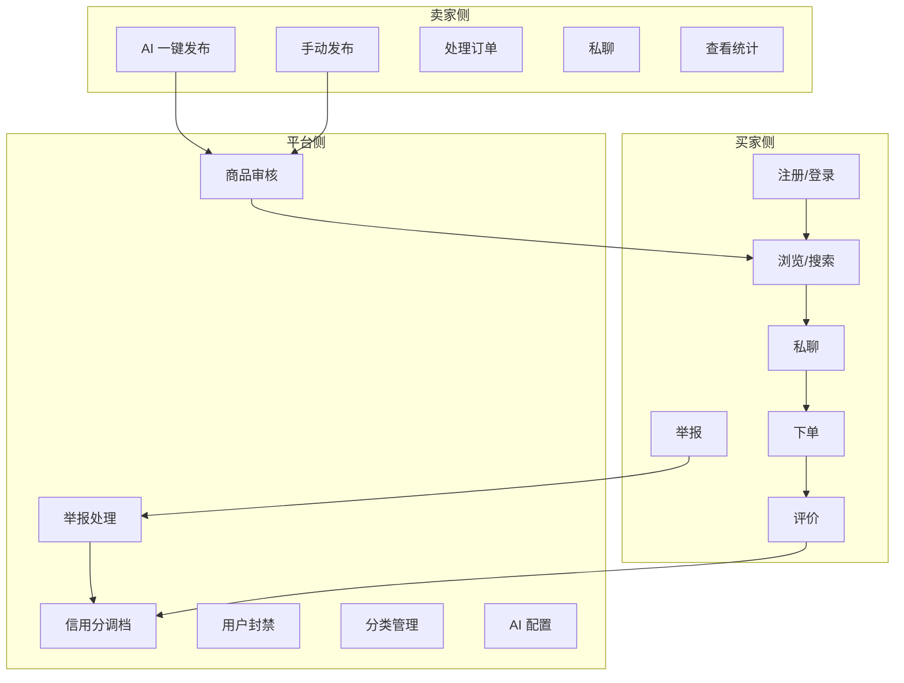
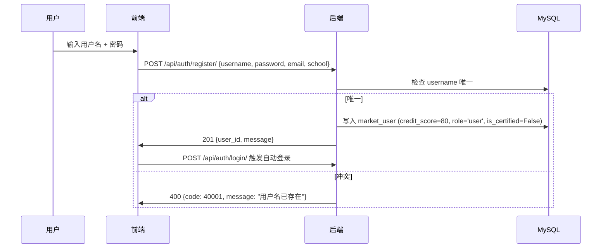
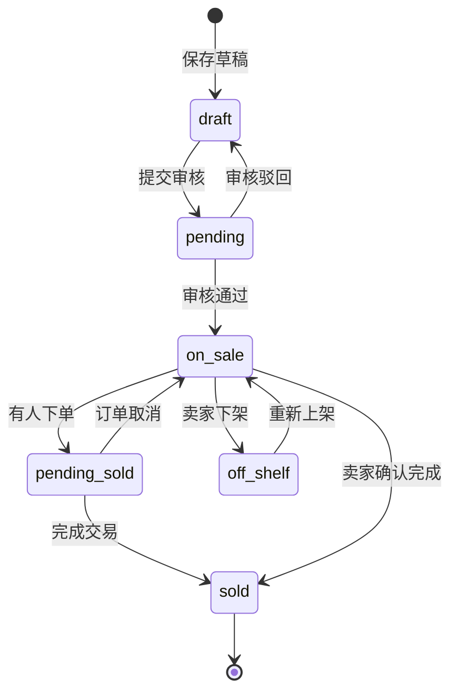
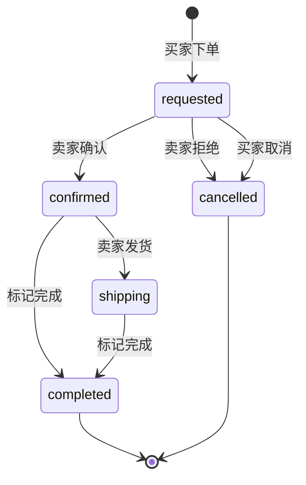
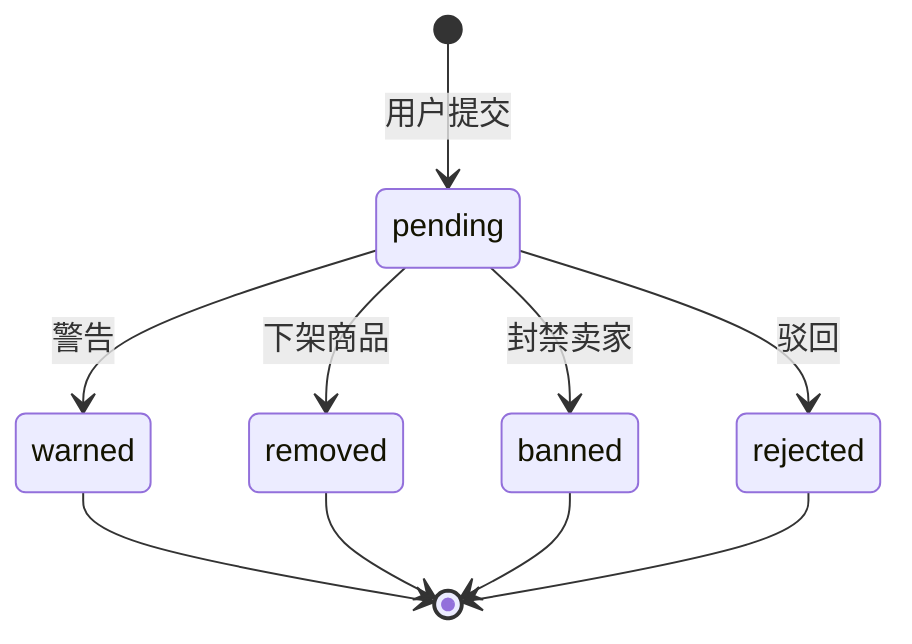

# 需求规格说明书 SRS

| 属性 | 内容 |
|------|------|
| **文档编号** | CM-SRS-001 |
| **文档名称** | 校园二手交易平台 · 需求规格说明书 |
| **版本** | v1.0 |
| **密级** | 内部公开 |
| **编制人** | 课程组（Trae IDE 协助） |
| **审核人** | 课程负责人 |
| **批准人** | 课程负责人 |
| **编制日期** | 2026-06-15 |
| **生效日期** | 2026-06-15 |
| **替代版本** | FF-SRS-001 v3.1（家庭资产管理版本，已废止） |

---

## 目录

- [1. 项目背景与目标](#1-项目背景与目标)
- [2. 用户角色与场景](#2-用户角色与场景)
- [3. 业务范围与边界](#3-业务范围与边界)
- [4. 功能需求 FR](#4-功能需求-fr)
- [5. 非功能需求 NFR](#5-非功能需求-nfr)
- [6. 业务规则 BR](#6-业务规则-br)
- [7. 接口与数据需求](#7-接口与数据需求)
- [8. 验收标准](#8-验收标准)
- [9. 风险与缓解](#9-风险与缓解)
- [10. 关联文档](#10-关联文档)
- [11. 修订记录](#11-修订记录)

---

## 1. 项目背景与目标

### 1.1 背景

高校校园内每学期产生大量二手物品（教材、笔记本、电动车、生活用品等），传统 QQ 群、朋友圈交易存在"信息分散、信任缺失、流程混乱"三大痛点。本项目（**校园二手交易平台 Campus Market**）目标是构建一个面向高校学生的、安全可信的、智能化的二手交易平台。

### 1.2 项目目标

| 维度 | 目标 |
|------|------|
| **业务** | 服务高校学生二手交易全流程：发布、浏览、沟通、议价、下单、支付、评价、售后 |
| **用户** | 支持 3 类角色：买家、卖家、平台管理员 |
| **智能化** | 7 个 AI 端点覆盖发布、议价、审核、客服等场景 |
| **可信** | 校园身份认证 + 信用分体系 |
| **体验** | 微信小程序原生体验（5 tab + 自定义导航）+ Web 卖家工作台 |
| **课程** | 4 次实训完整覆盖需求 → 设计 → 实现 → 联调 |

### 1.3 范围

#### 1.3.1 包含

- 买家小程序：商品浏览 / 私聊 / 下单 / 评价 / 举报 / AI 议价
- 卖家 Web 工作台：发布 / 订单 / 消息 / 统计 / 资料
- 平台管理后台：用户 / 商品审核 / 举报处理 / 分类 / AI 配置 / 审计日志
- 后端 API：80+ 端点
- AI 能力：7 个端点 + LLM 客户端 + 降级策略

#### 1.3.2 不包含（v1.0）

- 真实支付（仅交易方式枚举 + 备注）
- 物流追踪
- 直播 / 视频
- 拍卖 / 一口价
- 多语言 / 海外高校

### 1.4 名词定义

| 名词 | 解释 |
|------|------|
| CM | Campus Market 项目简称 |
| MP | Mini Program 微信小程序 |
| LLM | Large Language Model 大语言模型 |
| JWT | JSON Web Token |
| SKU | Stock Keeping Unit（此处即商品） |
| BR | Business Rule 业务规则 |
| NFR | Non-Functional Requirement 非功能需求 |
| FR | Functional Requirement 功能需求 |

---

## 2. 用户角色与场景

### 2.1 角色矩阵

| 角色 | 关键能力 | 主要使用端 | 频率 |
|------|----------|-------------|------|
| 买家（未注册） | 浏览商品（仅看 on_sale） | 微信小程序 | 高 |
| 买家（已注册） | 浏览 / 私聊 / 下单 / 评价 / 收藏 / 举报 | 微信小程序 | 高 |
| 卖家（已注册 + 已认证） | 发布 / 上下架 / 处理订单 / 私聊 / 查看统计 | 微信小程序 + Web 卖家台 | 中 |
| 平台管理员 | 审核 / 处理举报 / 调分 / 封禁 / 管理分类 / 查看审计日志 | Web 管理后台 | 低 |

### 2.2 典型场景

#### 场景 1：买家找书

```text
大三学生 A 在「首页」搜索「线性代数教材」-> 命中 5 条 on_sale 商品
    -> 点击商品「详情」查看 9 张图片 + 卖家信用分 85
    -> 点击「私聊」与卖家沟通
    -> 卖家发送「议价话术」建议 35 元
    -> 买家点击「我想要」生成订单 (requested)
    -> 卖家「确认」(confirmed) -> 约定自取时间
    -> 买家自取后卖家「完成」(completed)
    -> 双方互评 5 星 -> 卖家信用分 +1 -> 平台佣金 0
```

#### 场景 2：AI 一键发布

```text
卖家 B 在小程序「发布」页上传 3 张电动车照片
    -> 点击「AI 一键发布」
    -> 后端调用 ai/publish-assist/
    -> 返回 {"title": "九成新小龟王电动车", "description": "...", "price": 800, "category": "生活用品-出行工具"}
    -> 卖家微调后提交
    -> 状态进入 pending 待审核
    -> 平台管理员在 24h 内审核通过
    -> 商品进入 on_sale
```

#### 场景 3：恶意举报处理

```text
买家 C 看到 1 个商品价格异常（标价 1 元）-> 点击「举报」选择「价格异常」
    -> 平台管理员后台看到「待处理举报」+1
    -> 管理员查看后下架商品 (removed)
    -> 卖家 D 信用分 -2
    -> 审计日志记录操作
```

---

## 3. 业务范围与边界

### 3.1 业务全景图



### 3.2 业务边界

| 项 | v1.0 范围内 | v1.0 范围外 |
|----|--------------|---------------|
| 支付 | 仅交易方式枚举 + 备注 | 真实支付集成 |
| 物流 | 自取 / 快递占位 | 物流 API 集成 |
| 通知 | 应用内消息 + 站内信 | 短信 / 微信模板消息 |
| AI | 7 个端点 + mock 降级 | 多模态视频 / 自动直播 |
| 部署 | 本地 waitress + MySQL | Kubernetes 多机 |

---

## 4. 功能需求 FR

> 编号规则：FR-{模块}-{序号}，其中模块缩写见 [CM-STD-001 §2.2](file:///d:/文件/工作 作业/微信小程序实训/4次课程内容/综合实训/docs/00A_文档编写与评审规范.md)。

### 4.1 FR-AUTH 认证模块

| 编号 | 需求 | 优先级 | 端点 | 验收 |
|------|------|--------|------|------|
| FR-AUTH-01 | 用户可通过用户名 + 密码注册 | P0 | POST /api/auth/register/ | 用户名唯一、密码长度 ≥ 8、返回 JWT |
| FR-AUTH-02 | 用户可通过用户名 + 密码登录 | P0 | POST /api/auth/login/ | 返回 access + refresh token |
| FR-AUTH-03 | 已登录用户可主动登出 | P1 | POST /api/auth/logout/ | refresh token 失效 |
| FR-AUTH-04 | 校园身份认证（学校 + 学号） | P0 | POST /api/users/me/verify/ | is_certified=true 后才能发布 |
| FR-AUTH-05 | access token 过期可刷新 | P0 | POST /api/auth/refresh/ | 返回新 access token |

**业务流程（FR-AUTH-01）**：



### 4.2 FR-USER 用户与信用分

| 编号 | 需求 | 优先级 | 端点 |
|------|------|--------|------|
| FR-USER-01 | 查看个人资料 | P0 | GET /api/users/me/ |
| FR-USER-02 | 修改个人资料（昵称、头像、简介、学校） | P1 | PATCH /api/users/me/ |
| FR-USER-03 | 查看我的统计（发布数 / 卖出数 / 收藏数） | P1 | GET /api/users/me/stats/ |
| FR-USER-04 | 上传头像 | P1 | POST /api/users/me/avatar/ |
| FR-USER-05 | 修改密码 | P1 | POST /api/users/me/change-password/ |
| FR-USER-06 | 查看他人公开资料 | P2 | GET /api/users/{id}/ |

**信用分规则**：

- 初始 80 分
- 完成校园认证 +5
- 好评 +1（每次评价完成）
- 差评 -1
- 商品被举报属实 -2
- 信用分 < 60 触发平台审核

### 4.3 FR-CAT 分类管理

| 编号 | 需求 | 优先级 | 端点 |
|------|------|--------|------|
| FR-CAT-01 | 查看分类列表（一级 + 二级） | P0 | GET /api/categories/ |
| FR-CAT-02 | 查看分类树 | P0 | GET /api/categories/tree/ |
| FR-CAT-03 | 管理员新增/编辑/删除分类 | P0 | POST/PATCH/DELETE /api/admin/categories/ |

**分类结构**：

```
一级分类
├── 教材书籍
│   ├── 大学教材
│   ├── 考研资料
│   └── 外语/计算机
├── 数码电子
│   ├── 手机
│   ├── 电脑
│   ├── 配件
│   └── 摄影器材
├── 服饰鞋帽
├── 生活用品
│   ├── 出行工具
│   ├── 宿舍小物
│   └── 美妆护肤
└── 其他
```

### 4.4 FR-PROD 商品模块

| 编号 | 需求 | 优先级 | 端点 |
|------|------|--------|------|
| FR-PROD-01 | 发布商品（手动） | P0 | POST /api/products/ |
| FR-PROD-02 | 查看商品列表（瀑布流） | P0 | GET /api/products/ |
| FR-PROD-03 | 查看商品详情 | P0 | GET /api/products/{id}/ |
| FR-PROD-04 | 商品状态机（draft/pending/on_sale/pending_sold/sold/off_shelf） | P0 | PATCH /api/products/{id}/off-shelf/ 等 |
| FR-PROD-05 | 收藏 / 取消收藏 | P0 | POST /api/products/{id}/favorite/ |
| FR-PROD-06 | 编辑商品 | P0 | PATCH /api/products/{id}/ |
| FR-PROD-07 | 删除商品（仅自己的） | P1 | DELETE /api/products/{id}/ |
| FR-PROD-08 | 上传商品图 | P0 | POST /api/upload/ |
| FR-PROD-09 | 同款商品推荐 | P2 | GET /api/products/{id}/similar/ |
| FR-PROD-10 | 商品评价列表 | P1 | GET /api/products/{id}/reviews/ |
| FR-PROD-11 | 我的商品列表（卖家视角） | P0 | GET /api/products/mine/ |
| FR-PROD-12 | 批量下架 | P1 | POST /api/products/bulk-off-shelf/ |

**商品状态机**：



**字段定义**：

| 字段 | 类型 | 必填 | 说明 |
|------|------|------|------|
| title | varchar(64) | 是 | 标题 |
| description | text(500) | 否 | 描述 |
| price | decimal(10,2) | 是 | 售价 |
| original_price | decimal(10,2) | 否 | 原价（用于打折标签） |
| condition | enum | 是 | new/like_new/good/fair |
| category_id | int | 是 | 分类 ID |
| school | varchar(64) | 否 | 商品所在学校 |
| images | array | 是 | 1~9 张图片 URL |

### 4.5 FR-MSG 私聊会话

| 编号 | 需求 | 优先级 | 端点 |
|------|------|--------|------|
| FR-MSG-01 | 查看会话列表 | P0 | GET /api/conversations/ |
| FR-MSG-02 | 创建会话（点击「私聊」） | P0 | POST /api/conversations/ |
| FR-MSG-03 | 查看会话消息 | P0 | GET /api/conversations/{id}/messages/ |
| FR-MSG-04 | 发送消息（文字 / 图片） | P0 | POST /api/messages/send/ |
| FR-MSG-05 | 标记已读 | P0 | POST /api/conversations/{id}/read/ |
| FR-MSG-06 | 未读数实时维护 | P0 | 通过 GET /api/conversations/ 返回 |

**字段**：

| 字段 | 类型 | 说明 |
|------|------|------|
| conversation_id | int | 会话 ID |
| product_id | int | 关联商品 |
| buyer_id | int | 买家 |
| seller_id | int | 卖家 |
| last_message | text | 最后一条预览 |
| last_message_at | datetime | 最后消息时间 |
| unread_buyer / unread_seller | int | 双方未读数 |

### 4.6 FR-ORD 订单与状态机

| 编号 | 需求 | 优先级 | 端点 |
|------|------|--------|------|
| FR-ORD-01 | 创建订单（点击「我想要」） | P0 | POST /api/orders/ |
| FR-ORD-02 | 查看我的订单（买家/卖家视角） | P0 | GET /api/orders/ |
| FR-ORD-03 | 卖家确认订单 | P0 | POST /api/orders/{id}/confirm/ |
| FR-ORD-04 | 卖家拒绝订单 | P0 | POST /api/orders/{id}/reject/ |
| FR-ORD-05 | 买家取消订单 | P1 | POST /api/orders/{id}/cancel/ |
| FR-ORD-06 | 标记完成 | P0 | POST /api/orders/{id}/complete/ |
| FR-ORD-07 | 标记发货（快递） | P1 | POST /api/orders/{id}/ship/ |
| FR-ORD-08 | 提交评价 | P0 | POST /api/reviews/ |

**订单状态机**：



**字段**：

| 字段 | 类型 | 说明 |
|------|------|------|
| product_id | int | 关联商品（SET_NULL，删除后保留记录） |
| buyer_id / seller_id | int | 买卖双方（PROTECT） |
| status | enum | 状态机 |
| shipping_method | enum | pickup / express |
| price | decimal | 成交价快照（避免改价后影响订单） |
| pickup_location | varchar | 自取地点 |
| pickup_time | datetime | 自取时间 |
| note | varchar | 备注 |

### 4.7 FR-REV 评价

| 编号 | 需求 | 优先级 | 端点 |
|------|------|--------|------|
| FR-REV-01 | 订单完成后买卖双方互评 | P0 | POST /api/reviews/ |
| FR-REV-02 | 1 个订单 1 条评价（OneToOne） | 约束 | — |
| FR-REV-03 | 评价影响信用分（好评+1，差评-1） | 规则 | — |

**字段**：

| 字段 | 类型 | 必填 | 说明 |
|------|------|------|------|
| order_id | int | 是 | 关联订单（OneToOne） |
| reviewer_id | int | 是 | 评价方 |
| reviewee_id | int | 是 | 被评价方 |
| rating | int(1-5) | 是 | 星级 |
| content | text(300) | 否 | 评价内容 |

### 4.8 FR-REPORT 举报

| 编号 | 需求 | 优先级 | 端点 |
|------|------|--------|------|
| FR-REPORT-01 | 用户提交举报 | P0 | POST /api/reports/ |
| FR-REPORT-02 | 管理员查看举报列表 | P0 | GET /api/admin/reports/ |
| FR-REPORT-03 | 管理员处理举报（warn/remove/ban/reject） | P0 | POST /api/admin/reports/{id}/handle/ |
| FR-REPORT-04 | 举报待处理数量 | P1 | GET /api/admin/reports/count/ |

**举报状态机**：



### 4.9 FR-AI 智能模块（7 个端点）

| 编号 | 端点 | 用途 | 优先级 |
|------|------|------|--------|
| FR-AI-01 | POST /api/ai/publish-assist/ | AI 一键发布 | P0 |
| FR-AI-02 | GET /api/ai/price-suggest/ | 议价参考价 | P0 |
| FR-AI-03 | POST /api/ai/moderate/ | 内容审核 | P0 |
| FR-AI-04 | POST /api/ai/polish/ | 文案润色 | P1 |
| FR-AI-05 | POST /api/ai/negotiate/ | 议价话术 | P1 |
| FR-AI-06 | POST /api/ai/extract-keywords/ | 关键词提取 | P2 |
| FR-AI-07 | POST /api/ai/customer-service/ | 智能客服 | P1 |
| FR-AI-08 | POST /api/ai/chat/ | 通用对话 | P2 |
| FR-AI-09 | GET /api/ai/health/ | 健康检查 | P0 |

**详细设计见 [CM-AI-001](file:///d:/文件/工作 作业/微信小程序实训/4次课程内容/综合实训/docs/09_语音智能记账模块设计说明书.md)**。

### 4.10 FR-MP 买家小程序（5 tab）

| 编号 | 需求 | 章节 |
|------|------|------|
| FR-MP-01 | 首页 tab：瀑布流 + 搜索 + 分类入口 | CM-MP-001 §3.1 |
| FR-MP-02 | 分类 tab：一级宫格 + 二级列表 | CM-MP-001 §3.2 |
| FR-MP-03 | 发布 tab：表单 + AI 一键发布 | CM-MP-001 §3.3 |
| FR-MP-04 | 消息 tab：会话列表 + 未读数 | CM-MP-001 §3.4 |
| FR-MP-05 | 我的 tab：信用分徽章 + 我的发布/收藏/订单 | CM-MP-001 §3.5 |
| FR-MP-06 | 商品详情：9 图轮播 + 卖家卡 + 双 CTA | CM-MP-001 §3.6 |
| FR-MP-07 | 私聊：文字 + 图片 + 议价参考 | CM-MP-001 §3.7 |
| FR-MP-08 | 订单：tab 切换 + 状态机 | CM-MP-001 §3.8 |
| FR-MP-09 | 搜索结果页 | CM-MP-001 §3.9 |
| FR-MP-10 | 登录页 | CM-MP-001 §3.10 |
| FR-MP-11 | 举报页 | CM-MP-001 §3.10 |

### 4.11 FR-WEB 卖家工作台

| 编号 | 需求 | 章节 |
|------|------|------|
| FR-WEB-01 | 登录页 | CM-WEB-001 §3.1 |
| FR-WEB-02 | 仪表盘：4 张指标卡 + ECharts 销售趋势 | CM-WEB-001 §3.2 |
| FR-WEB-03 | 我的商品：表格 + 筛选 + 批量 | CM-WEB-001 §3.3 |
| FR-WEB-04 | 创建商品：表单 + AI 一键发布 | CM-WEB-001 §3.4 |
| FR-WEB-05 | 订单管理：状态机步骤条 | CM-WEB-001 §3.5 |
| FR-WEB-06 | 消息中心 | CM-WEB-001 §3.6 |
| FR-WEB-07 | 数据统计：类目分布 + 价格区间 | CM-WEB-001 §3.7 |
| FR-WEB-08 | 资料设置 | CM-WEB-001 §3.8 |

### 4.12 FR-ADMIN 平台管理后台

| 编号 | 需求 | 端点 |
|------|------|------|
| FR-ADMIN-01 | 仪表盘 | GET /api/admin/dashboard/ |
| FR-ADMIN-02 | 商品审核（通过 / 驳回） | POST /api/admin/products/{id}/approve/ /reject/ |
| FR-ADMIN-03 | 举报处理 | POST /api/admin/reports/{id}/handle/ |
| FR-ADMIN-04 | 用户封禁 / 解封 | POST /api/admin/users/{id}/ban/ /unban/ |
| FR-ADMIN-05 | 信用分调档 | POST /api/admin/users/{id}/adjust-credit/ |
| FR-ADMIN-06 | 分类管理 | POST/PATCH/DELETE /api/admin/categories/ |
| FR-ADMIN-07 | 审计日志查看 | GET /api/admin/audit-logs/ |
| FR-ADMIN-08 | AI 配置 | GET/PATCH /api/admin/ai/config/ |
| FR-ADMIN-09 | AI 健康检查 | GET /api/admin/ai/health/ |
| FR-ADMIN-10 | 用户列表 | GET /api/admin/users/ |

### 4.13 FR-STATS 统计

| 编号 | 需求 | 端点 |
|------|------|------|
| FR-STATS-01 | 卖家总览 | GET /api/stats/seller/overview/ |
| FR-STATS-02 | 卖家销售趋势 | GET /api/stats/seller/trend/ |
| FR-STATS-03 | 类目分布 | GET /api/stats/seller/category-distribution/ |
| FR-STATS-04 | 价格区间分布 | GET /api/stats/seller/price-range/ |

### 4.14 FR-SYS 系统级

| 编号 | 需求 | 端点 |
|------|------|------|
| FR-SYS-01 | 首页轮播 | GET /api/banners/ |
| FR-SYS-02 | 平台公告 | GET /api/notices/ |
| FR-SYS-03 | 热门搜索词 | GET /api/hot-keywords/ |
| FR-SYS-04 | 站点统计 | GET /api/site-stats/ |
| FR-SYS-05 | 首页 feed 流 | GET /api/home-feed/ |

---

## 5. 非功能需求 NFR

### 5.1 性能 NFR

| 编号 | 指标 | 目标值 |
|------|------|--------|
| NFR-PERF-01 | 首页瀑布流加载 P95 延迟 | < 500ms |
| NFR-PERF-02 | 商品详情页 P95 延迟 | < 300ms |
| NFR-PERF-03 | 单接口 QPS（中等压力测试） | ≥ 100 |
| NFR-PERF-04 | 数据库查询 P95 延迟 | < 100ms |
| NFR-PERF-05 | 列表分页最大页数 | 100 页（5000 条） |
| NFR-PERF-06 | AI 接口 P95 延迟（含 LLM 调用） | < 3s |
| NFR-PERF-07 | AI 接口 mock 降级延迟 | < 200ms |

### 5.2 安全 NFR

| 编号 | 需求 |
|------|------|
| NFR-SEC-01 | JWT access token 30 分钟过期；refresh token 7 天 |
| NFR-SEC-02 | 密码 bcrypt 哈希存储，禁止明文 |
| NFR-SEC-03 | 校园认证信息（学号）加密存储 |
| NFR-SEC-04 | 举报 / 私聊接口防 XSS（前后端双重转义） |
| NFR-SEC-05 | 后台管理接口必须 `is_staff=True` |
| NFR-SEC-06 | 同一用户登录设备数 ≤ 3 |
| NFR-SEC-07 | 错误响应不泄露内部栈信息 |
| NFR-SEC-08 | 上传图片 MIME 校验 + 大小限制（5MB） |
| NFR-SEC-09 | 关键操作（封禁 / 调分）写审计日志 |
| NFR-SEC-10 | HTTPS only（生产环境） |

### 5.3 可用性 NFR

| 编号 | 需求 |
|------|------|
| NFR-AVA-01 | 服务可用性 ≥ 99% |
| NFR-AVA-02 | 故障恢复时间 RTO < 30min |
| NFR-AVA-03 | 数据备份每日一次，保留 7 天 |

### 5.4 可维护性 NFR

| 编号 | 需求 |
|------|------|
| NFR-MAINT-01 | 代码注释覆盖率 ≥ 30% |
| NFR-MAINT-02 | 后端 PEP8 / 前端 ESLint 0 警告 |
| NFR-MAINT-03 | 单元测试覆盖率 ≥ 60% |
| NFR-MAINT-04 | 所有 API 错误码统一封装 |
| NFR-MAINT-05 | 数据库迁移文件纳入版本控制 |

### 5.5 兼容性 NFR

| 编号 | 需求 |
|------|------|
| NFR-COMPAT-01 | 小程序基础库 ≥ 3.0 |
| NFR-COMPAT-02 | Web 端 Chrome ≥ 100、Edge ≥ 100、Safari ≥ 15 |
| NFR-COMPAT-03 | Web 端响应式：768 / 1024 / 1440 三档断点 |
| NFR-COMPAT-04 | MySQL 8.0+ / utf8mb4 |
| NFR-COMPAT-05 | Python 3.11+ / Django 4.2+ / DRF 3.14+ |

### 5.6 可移植性 NFR

| 编号 | 需求 |
|------|------|
| NFR-PORT-01 | 部署支持 Windows / Linux |
| NFR-PORT-02 | 配置全部走 `.env` 文件 |

---

## 6. 业务规则 BR

### 6.1 用户与认证

| 编号 | 规则 |
|------|------|
| BR-USER-01 | 用户名 3-32 字符，仅字母数字下划线 |
| BR-USER-02 | 密码长度 ≥ 8，必须含字母和数字 |
| BR-USER-03 | 用户名全局唯一，不可修改 |
| BR-USER-04 | 校园认证后不可修改学校和学号 |
| BR-USER-05 | 未完成校园认证不能发布商品（FR-AUTH-04 关联） |
| BR-USER-06 | 信用分 0 分自动冻结账号 7 天 |
| BR-USER-07 | 信用分 < 60 进入观察名单，发布需审核 |

### 6.2 商品

| 编号 | 规则 |
|------|------|
| BR-PROD-01 | 商品标题 4-64 字符 |
| BR-PROD-02 | 商品描述 ≤ 500 字符 |
| BR-PROD-03 | 商品图片 1-9 张 |
| BR-PROD-04 | 售价必须 > 0，≤ 100000 |
| BR-PROD-05 | 同款卖家不可重复发布完全相同标题（防 spam） |
| BR-PROD-06 | 商品被举报 3 次以上自动下架审核 |
| BR-PROD-07 | 商品下架后收藏数保留，但前台不展示 |
| BR-PROD-08 | 浏览数 +1 仅当状态为 on_sale |

### 6.3 订单

| 编号 | 规则 |
|------|------|
| BR-ORD-01 | 同一买家对同一商品只可下 1 个未完成订单 |
| BR-ORD-02 | 订单成交价快照，下单后不可改价 |
| BR-ORD-03 | 订单被拒 / 取消后 30 分钟内同商品同买家不可再下单 |
| BR-ORD-04 | 完成后 7 天内未评价，系统默认好评 5 星 |
| BR-ORD-05 | 自取订单必须有 pickup_location 和 pickup_time |
| BR-ORD-06 | 评价 reviewer 与 reviewee 不可相同 |

### 6.4 私聊

| 编号 | 规则 |
|------|------|
| BR-MSG-01 | 同一买家对同一商品仅 1 个会话 |
| BR-MSG-02 | 单条消息 ≤ 1000 字符 |
| BR-MSG-03 | 卖家 24h 未读自动发送「议价话术」提示 |
| BR-MSG-04 | 会话关闭（订单完成后 7 天）后不可发新消息 |

### 6.5 举报

| 编号 | 规则 |
|------|------|
| BR-REPORT-01 | 同一用户对同一商品仅可举报 1 次（待处理期间） |
| BR-REPORT-02 | 举报内容必填，≤ 300 字符 |
| BR-REPORT-03 | 处理后 7 天内不可重复举报同商品 |

### 6.6 AI

| 编号 | 规则 |
|------|------|
| BR-AI-01 | AI 输出必须可解释（返回 reasoning 字段） |
| BR-AI-02 | AI 不可替代法律 / 平台终审（人为兜底） |
| BR-AI-03 | 单用户 AI 调用 60 次/小时（限流） |
| BR-AI-04 | AI 调用失败必须降级到 mock，不得阻塞主流程 |
| BR-AI-05 | AI 内容审核命中违禁词立即拦截发布 |

---

## 7. 接口与数据需求

### 7.1 接口风格

- RESTful
- 路径前缀 `/api/`
- 资源用复数名词（`/products/`）
- HTTP 方法：GET / POST / PATCH / DELETE
- 鉴权：JWT Bearer
- 响应统一封装 `{code, message, data}`，详见 [CM-API-001 §3](file:///d:/文件/工作 作业/微信小程序实训/4次课程内容/综合实训/docs/08_接口设计说明书.md)

### 7.2 数据量预估

| 表 | 初始（1 万用户） | 1 年后 | 3 年后 |
|----|--------------------|--------|--------|
| market_user | 1 万 | 3 万 | 10 万 |
| market_product | 5 万 | 30 万 | 100 万 |
| market_order | 2 万 | 20 万 | 80 万 |
| market_message | 50 万 | 500 万 | 2000 万 |
| market_review | 1.5 万 | 15 万 | 60 万 |

### 7.3 数据保留

- 订单完成后保留 3 年
- 私聊消息保留 1 年
- 举报处理记录永久保留
- 审计日志永久保留

---

## 8. 验收标准

### 8.1 功能验收

| 类别 | 验收项 | 通过标准 |
|------|--------|----------|
| 注册 | FR-AUTH-01 | 10 个测试用例全部通过 |
| 登录 | FR-AUTH-02 | access + refresh token 正常返回 |
| 商品发布 | FR-PROD-01 | 状态机正确流转 |
| 商品状态机 | FR-PROD-04 | 5 步走流程图全部通过 |
| 私聊 | FR-MSG-01~06 | 消息时延 < 1s |
| 订单 | FR-ORD-01~08 | 状态机正确流转 |
| 评价 | FR-REV-01 | 信用分 +1 生效 |
| 举报 | FR-REPORT-01~04 | 审计日志记录 |
| AI 一键发布 | FR-AI-01 | mock 降级正常 |
| AI 议价参考价 | FR-AI-02 | mock 降级正常 |
| 管理员 | FR-ADMIN-01~10 | 权限正确 |

### 8.2 性能验收

- 50 并发用户下，首页加载 P95 < 1s
- AI 接口 mock 降级 P95 < 200ms
- 数据库查询 P95 < 100ms

### 8.3 安全验收

- 渗透测试：未授权访问 0 漏洞
- 密码字段 0 明文
- 校园认证信息加密存储

### 8.4 文档验收

- 14 份核心文档齐全
- ER 图、流程图、时序图无缺失
- API 文档与代码 100% 对应
- emoji 0 残留
- 旧业务词 0 残留

---

## 9. 风险与缓解

| 风险 | 等级 | 缓解措施 |
|------|------|----------|
| AI 服务不可用 | 高 | mock 降级策略（BR-AI-04） |
| 大并发导致数据库慢 | 中 | 9 个复合索引 + 缓存热门 feed |
| 校园认证信息泄露 | 高 | bcrypt 加密 + 权限分离 |
| 恶意用户刷举报 | 中 | 限流 + 行为分析 |
| LLM 成本失控 | 中 | AI 限流 60 次/小时 |
| 商品状态机死锁 | 中 | 状态机校验在数据库层（choices） |
| 私聊内容违规 | 中 | AI 内容审核 + 关键词过滤 |
| 库存数据不一致 | 高 | 状态机 + 数据库事务（订单 confirmed 时） |

---

## 10. 关联文档

- 业务 Spec：[pivot-to-secondhand-market/spec.md](file:///d:/文件/工作 作业/微信小程序实训/4次课程内容/综合实训/.trae/specs/pivot-to-secondhand-market/spec.md)
- 概要设计：[02_概要设计说明书.md](file:///d:/文件/工作 作业/微信小程序实训/4次课程内容/综合实训/docs/02_概要设计说明书.md)
- 详细设计：[03_详细设计说明书.md](file:///d:/文件/工作 作业/微信小程序实训/4次课程内容/综合实训/docs/03_详细设计说明书.md)
- 数据库设计：[04_数据库设计说明书.md](file:///d:/文件/工作 作业/微信小程序实训/4次课程内容/综合实训/docs/04_数据库设计说明书.md)
- 接口设计：[08_接口设计说明书.md](file:///d:/文件/工作 作业/微信小程序实训/4次课程内容/综合实训/docs/08_接口设计说明书.md)
- 需求追溯矩阵：[14_需求追溯矩阵.md](file:///d:/文件/工作 作业/微信小程序实训/4次课程内容/综合实训/docs/14_需求追溯矩阵.md)
- 文档总索引：[00_设计文档索引.md](file:///d:/文件/工作 作业/微信小程序实训/4次课程内容/综合实训/docs/00_设计文档索引.md)

---

## 11. 修订记录

| 版本 | 日期 | 修订说明 | 修订人 |
|------|------|----------|--------|
| v1.0 | 2026-06-15 | 业务整体转型为校园二手交易平台；FR 重新按 13 大模块编号；NFR 扩展为 6 大类；BR 重新梳理 35 条 | 课程组（Trae IDE 协助） |

---

*本文档为校园二手交易平台所有后续设计、开发和测试的"业务基线"。任何 FR 变更须同步更新 [CM-RTM-001](file:///d:/文件/工作 作业/微信小程序实训/4次课程内容/综合实训/docs/14_需求追溯矩阵.md)。*
