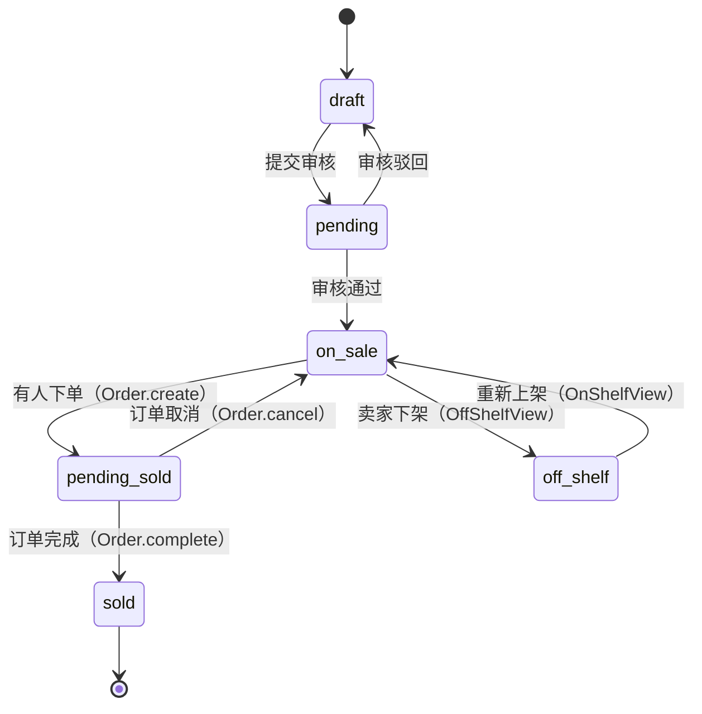
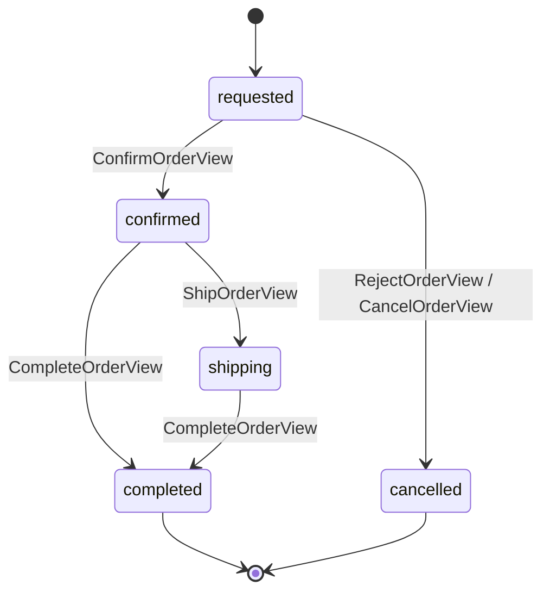
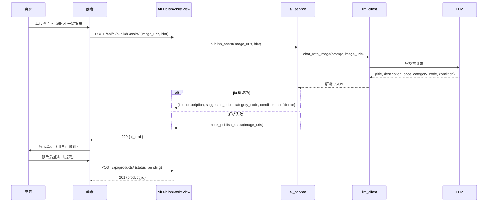
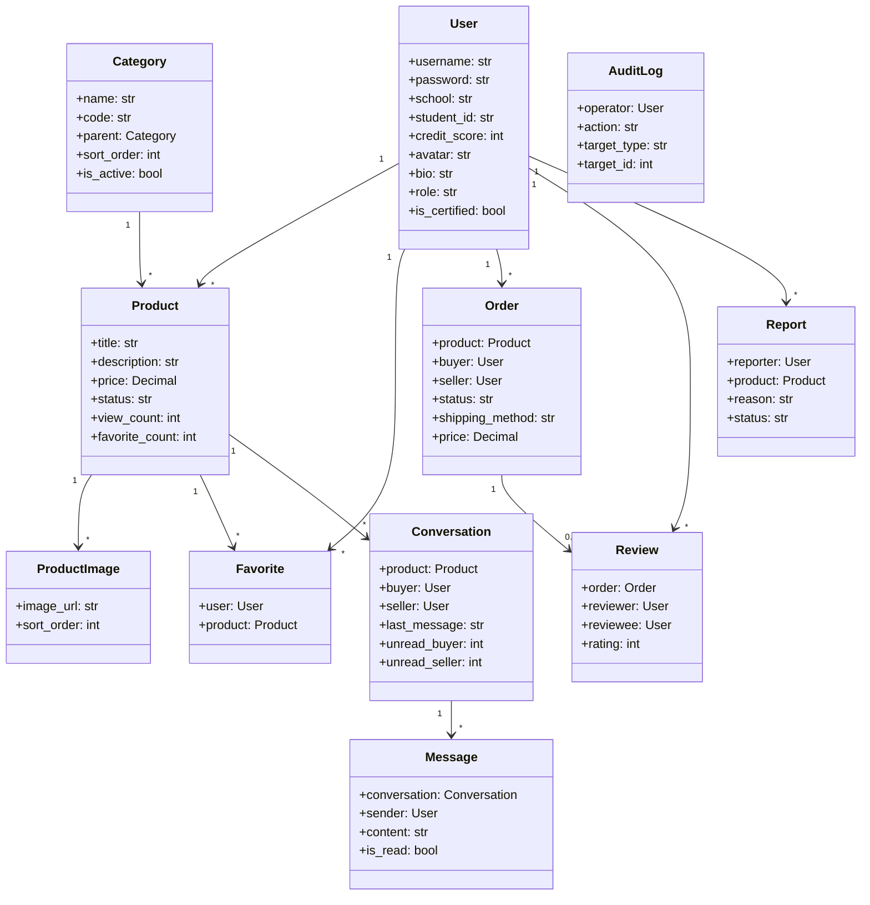
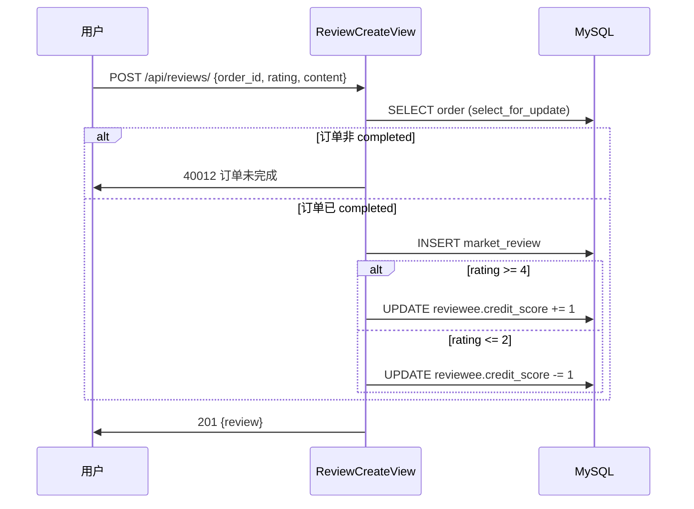

# 详细设计说明书 LLD

| 属性 | 内容 |
|------|------|
| **文档编号** | CM-LLD-001 |
| **文档名称** | 校园二手交易平台 · 详细设计说明书 |
| **版本** | v1.0 |
| **密级** | 内部公开 |
| **编制人** | 课程组（Trae IDE 协助） |
| **审核人** | 课程负责人 |
| **批准人** | 课程负责人 |
| **编制日期** | 2026-06-15 |
| **生效日期** | 2026-06-15 |
| **替代版本** | FF-LLD-001 v3.0（家庭资产管理版本，已废止） |

---

## 目录

- [1. 文档目的与读者](#1-文档目的与读者)
- [2. 模块详细逻辑](#2-模块详细逻辑)
- [3. 关键算法与流程](#3-关键算法与流程)
- [4. 类图与时序图](#4-类图与时序图)
- [5. 异常处理矩阵](#5-异常处理矩阵)
- [6. 配置项清单](#6-配置项清单)
- [7. 缓存策略](#7-缓存策略)
- [8. 并发与幂等性](#8-并发与幂等性)
- [9. 性能与查询优化](#9-性能与查询优化)
- [10. 错误码设计](#10-错误码设计)
- [11. 关联文档](#11-关联文档)
- [12. 修订记录](#12-修订记录)

---

## 1. 文档目的与读者

### 1.1 目的

本文档基于 [CM-HLD-001](file:///d:/文件/工作 作业/微信小程序实训/4次课程内容/综合实训/docs/02_概要设计说明书.md) 给出的架构，对后端 11 个 views 子模块的关键算法、状态机、异常处理、并发与幂等性进行**代码级**描述。

### 1.2 读者

- 后端工程师（开发 / Code Review）
- 测试工程师（用例设计）
- 答辩学生（讲清楚"具体怎么写"）

### 1.3 与 HLD 的边界

| 维度 | HLD | LLD（本文） |
|------|-----|-------------|
| 范围 | 架构 / 模块 / 端点 | 关键算法 / 异常 / 性能 |
| 抽象层 | 模块 / 类 | 函数 / 状态机 |
| 决策 | 技术栈 / 部署 | 具体实现 |

---

## 2. 模块详细逻辑

### 2.1 auth_views（认证）

#### 2.1.1 RegisterView

```python
class RegisterView(APIView):
    """用户注册端点。

    业务规则：
        - 用户名 3-32 字符，仅字母数字下划线（BR-USER-01）
        - 密码长度 ≥ 8，必须含字母和数字（BR-USER-02）
        - 信用分初始 80（CM-SRS-001 §4.2）
    """
    permission_classes = [AllowAny]

    def post(self, request):
        # 1. 校验入参
        serializer = RegisterSerializer(data=request.data)
        serializer.is_valid(raise_exception=True)
        # 2. 检查用户名唯一（DB unique 约束兜底）
        if User.objects.filter(username=serializer.validated_data['username']).exists():
            return fail_response(40001, '用户名已存在')
        # 3. 写入（password 走 set_password 自动哈希）
        user = User.objects.create_user(
            username=serializer.validated_data['username'],
            password=serializer.validated_data['password'],
            email=serializer.validated_data.get('email', ''),
            school=serializer.validated_data.get('school', ''),
            credit_score=80,
            role='user',
            is_certified=False,
        )
        # 4. 自动登录（生成 JWT）
        refresh = RefreshToken.for_user(user)
        return success_response({
            'user_id': user.id,
            'access': str(refresh.access_token),
            'refresh': str(refresh),
        })
```

#### 2.1.2 LoginView

```python
class LoginView(APIView):
    """用户登录端点。"""
    permission_classes = [AllowAny]

    def post(self, request):
        serializer = LoginSerializer(data=request.data)
        serializer.is_valid(raise_exception=True)
        user = authenticate(
            username=serializer.validated_data['username'],
            password=serializer.validated_data['password'],
        )
        if user is None:
            return fail_response(40101, '用户名或密码错误')
        if not user.is_active:
            return fail_response(40303, '账号已被封禁')
        refresh = RefreshToken.for_user(user)
        return success_response({
            'access': str(refresh.access_token),
            'refresh': str(refresh),
            'user': UserSerializer(user).data,
        })
```

#### 2.1.3 VerifyView（校园认证）

```python
class VerifyView(APIView):
    """校园身份认证。"""
    permission_classes = [IsAuthenticated]

    def post(self, request):
        # 1. 校验学校和学号
        school = request.data.get('school', '').strip()
        student_id = request.data.get('student_id', '').strip()
        if not school or not student_id:
            return fail_response(40002, '学校和学号必填')
        # 2. 检查学号是否被其他用户占用
        if User.objects.filter(student_id=student_id).exclude(pk=request.user.pk).exists():
            return fail_response(40003, '学号已被其他用户认证')
        # 3. 简化版：直接通过（生产可接入学号验证服务）
        request.user.school = school
        request.user.student_id = student_id
        request.user.is_certified = True
        # 4. 信用分 +5
        request.user.credit_score = min(100, request.user.credit_score + 5)
        request.user.save()
        return success_response(UserSerializer(request.user).data)
```

### 2.2 user_views

#### 2.2.1 MeView

```python
class MeView(APIView):
    """当前用户资料。

    GET: 返回当前用户信息
    PATCH: 修改昵称、头像、简介、学校（已认证不可改学校）
    """
    permission_classes = [IsAuthenticated]

    def get(self, request):
        return success_response(UserSerializer(request.user).data)

    def patch(self, request):
        user = request.user
        editable = ['first_name', 'avatar', 'bio']
        # 学校已认证不可改（BR-USER-04）
        if user.is_certified and 'school' in request.data:
            return fail_response(40304, '校园认证后不可修改学校')
        for key in editable:
            if key in request.data:
                setattr(user, key, request.data[key])
        user.save()
        return success_response(UserSerializer(user).data)
```

#### 2.2.2 MyStatsView

```python
class MyStatsView(APIView):
    """我的统计：发布数 / 卖出数 / 收藏数 / 信用分。"""
    permission_classes = [IsAuthenticated]

    def get(self, request):
        user = request.user
        return success_response({
            'product_total': Product.objects.filter(seller=user).count(),
            'product_on_sale': Product.objects.filter(seller=user, status='on_sale').count(),
            'product_sold': Product.objects.filter(seller=user, status='sold').count(),
            'order_buy_total': Order.objects.filter(buyer=user).count(),
            'order_sell_total': Order.objects.filter(seller=user).count(),
            'favorite_total': Favorite.objects.filter(user=user).count(),
            'credit_score': user.credit_score,
            'is_certified': user.is_certified,
        })
```

### 2.3 product_views

#### 2.3.1 ProductListCreateView（商品列表 + 发布）

```python
class ProductListCreateView(APIView):
    """商品列表 + 发布。

    GET: 支持 ?status=&category=&keyword=&school=&page=&page_size=&ordering=
    POST: 卖家发布（需 is_certified=True）
    """
    permission_classes = [IsAuthenticatedOrReadOnly]

    def get(self, request):
        qs = Product.objects.select_related('seller', 'category').prefetch_related('images')
        # 1. 状态过滤（默认仅看 on_sale）
        status = request.query_params.get('status', 'on_sale')
        qs = qs.filter(status=status)
        # 2. 分类
        category = request.query_params.get('category')
        if category:
            qs = qs.filter(category_id=category)
        # 3. 关键词（标题 + 描述）
        keyword = request.query_params.get('keyword')
        if keyword:
            qs = qs.filter(Q(title__icontains=keyword) | Q(description__icontains=keyword))
        # 4. 学校
        school = request.query_params.get('school')
        if school:
            qs = qs.filter(school=school)
        # 5. 排序
        ordering = request.query_params.get('ordering', '-created_at')
        qs = qs.order_by(ordering)
        # 6. 分页
        page, page_size = paginate_params(request)
        total = qs.count()
        items = qs[offset:offset+page_size]
        return success_response({
            'total': total,
            'page': page,
            'page_size': page_size,
            'results': ProductListSerializer(items, many=True).data,
        })

    def post(self, request):
        # 1. 校园认证校验（BR-USER-05）
        if not request.user.is_certified:
            return fail_response(40305, '请先完成校园身份认证')
        # 2. 业务校验
        serializer = ProductCreateSerializer(data=request.data)
        serializer.is_valid(raise_exception=True)
        # 3. 标题长度（BR-PROD-01）
        title = serializer.validated_data['title']
        if not (4 <= len(title) <= 64):
            return fail_response(40004, '标题长度 4-64 字符')
        # 4. 写入
        with transaction.atomic():
            product = Product.objects.create(
                seller=request.user,
                category_id=serializer.validated_data['category_id'],
                title=title,
                description=serializer.validated_data.get('description', ''),
                price=serializer.validated_data['price'],
                original_price=serializer.validated_data.get('original_price'),
                condition=serializer.validated_data.get('condition', 'like_new'),
                status='pending',  # 默认待审核
                school=request.user.school,
            )
            # 5. 写入图片
            for idx, url in enumerate(serializer.validated_data.get('image_urls', [])[:9]):
                ProductImage.objects.create(product=product, image_url=url, sort_order=idx)
        return success_response(ProductDetailSerializer(product).data, status=201)
```

#### 2.3.2 ProductDetailView

```python
class ProductDetailView(APIView):
    """商品详情。"""
    permission_classes = [AllowAny]

    def get(self, request, pk):
        try:
            product = (
                Product.objects
                .select_related('seller', 'category')
                .prefetch_related('images')
                .get(pk=pk)
            )
        except Product.DoesNotExist:
            return fail_response(40401, '商品不存在')
        return success_response(ProductDetailSerializer(product).data)
```

#### 2.3.3 ProductViewView（浏览数 +1）

```python
class ProductViewView(APIView):
    """浏览数 +1（仅当状态为 on_sale）。"""
    permission_classes = [AllowAny]

    def post(self, request, pk):
        # 1. 原子更新：避免并发问题
        rows = Product.objects.filter(pk=pk, status='on_sale').update(
            view_count=F('view_count') + 1
        )
        if rows == 0:
            return fail_response(40401, '商品不存在或已下架')
        return success_response({'view_count': Product.objects.get(pk=pk).view_count})
```

#### 2.3.4 OffShelfView / OnShelfView

```python
class OffShelfView(APIView):
    """下架商品（仅卖家）。"""
    permission_classes = [IsAuthenticated]

    def post(self, request, pk):
        try:
            product = Product.objects.get(pk=pk, seller=request.user)
        except Product.DoesNotExist:
            return fail_response(40402, '商品不存在或非本人')
        if product.status not in ('on_sale', 'pending_sold'):
            return fail_response(40005, f'当前状态 {product.status} 不可下架')
        with transaction.atomic():
            product.status = 'off_shelf'
            product.save()
            # 写审计日志（如管理员代下架）
        return success_response({'status': product.status})


class OnShelfView(APIView):
    """重新上架。"""
    permission_classes = [IsAuthenticated]

    def post(self, request, pk):
        try:
            product = Product.objects.get(pk=pk, seller=request.user, status='off_shelf')
        except Product.DoesNotExist:
            return fail_response(40402, '商品不存在或非下架状态')
        product.status = 'on_sale'
        product.save()
        return success_response({'status': product.status})
```

#### 2.3.5 FavoriteToggleView

```python
class FavoriteToggleView(APIView):
    """收藏 / 取消收藏。"""
    permission_classes = [IsAuthenticated]

    def post(self, request, pk):
        try:
            product = Product.objects.get(pk=pk, status='on_sale')
        except Product.DoesNotExist:
            return fail_response(40401, '商品不存在或已下架')
        favorite, created = Favorite.objects.get_or_create(user=request.user, product=product)
        if not created:
            favorite.delete()
            # 收藏数 -1（原子）
            Product.objects.filter(pk=pk).update(favorite_count=F('favorite_count') - 1)
            return success_response({'favorited': False})
        Product.objects.filter(pk=pk).update(favorite_count=F('favorite_count') + 1)
        return success_response({'favorited': True})
```

### 2.4 message_views

#### 2.4.1 SendMessageView

```python
class SendMessageView(APIView):
    """发送消息（文字 / 图片）。"""
    permission_classes = [IsAuthenticated]

    def post(self, request):
        serializer = MessageSendSerializer(data=request.data)
        serializer.is_valid(raise_exception=True)
        conversation_id = serializer.validated_data['conversation_id']
        content = serializer.validated_data['content']
        try:
            conversation = Conversation.objects.select_for_update().get(pk=conversation_id)
        except Conversation.DoesNotExist:
            return fail_response(40401, '会话不存在')
        # 1. 鉴权：买卖双方之一才能发
        if request.user.pk not in (conversation.buyer_id, conversation.seller_id):
            return fail_response(40306, '无权发送消息')
        # 2. 长度校验（BR-MSG-02）
        if len(content) > 1000:
            return fail_response(40006, '消息不超过 1000 字符')
        with transaction.atomic():
            message = Message.objects.create(
                conversation=conversation,
                sender=request.user,
                content=content,
            )
            # 3. 更新会话最后消息 + 未读数
            conversation.last_message = content[:200]
            conversation.last_message_at = message.created_at
            if request.user.pk == conversation.buyer_id:
                conversation.unread_seller += 1
            else:
                conversation.unread_buyer += 1
            conversation.save()
        # 4. 异步触发 AI 议价话术（可选，V1.0 简化同步）
        return success_response(MessageSerializer(message).data, status=201)
```

### 2.5 order_views

#### 2.5.1 OrderListCreateView

```python
class OrderListCreateView(APIView):
    """订单列表 + 创建。"""
    permission_classes = [IsAuthenticated]

    def get(self, request):
        role = request.query_params.get('role', 'buy')
        if role == 'sell':
            qs = Order.objects.filter(seller=request.user)
        else:
            qs = Order.objects.filter(buyer=request.user)
        status = request.query_params.get('status')
        if status:
            qs = qs.filter(status=status)
        # 分页
        page, page_size = paginate_params(request)
        return paginate_response(qs, OrderListSerializer, request)

    def post(self, request):
        serializer = OrderCreateSerializer(data=request.data)
        serializer.is_valid(raise_exception=True)
        product_id = serializer.validated_data['product_id']
        shipping_method = serializer.validated_data.get('shipping_method', 'pickup')
        pickup_location = serializer.validated_data.get('pickup_location', '')
        pickup_time = serializer.validated_data.get('pickup_time')
        try:
            product = Product.objects.select_for_update().get(pk=product_id)
        except Product.DoesNotExist:
            return fail_response(40401, '商品不存在')
        # 1. 业务规则校验
        if product.status != 'on_sale':
            return fail_response(40007, '商品不可下单')
        if product.seller_id == request.user.pk:
            return fail_response(40008, '不能下自己的商品')
        # 2. BR-ORD-01 同一买家对同一商品仅 1 个未完成订单
        if Order.objects.filter(
            product=product, buyer=request.user,
            status__in=('requested', 'confirmed', 'shipping')
        ).exists():
            return fail_response(40009, '已有未完成订单')
        # 3. BR-ORD-05 自取必填
        if shipping_method == 'pickup' and (not pickup_location or not pickup_time):
            return fail_response(40010, '自取订单必填地点和时间')
        with transaction.atomic():
            order = Order.objects.create(
                product=product,
                buyer=request.user,
                seller=product.seller,
                status='requested',
                shipping_method=shipping_method,
                price=product.price,  # 快照
                pickup_location=pickup_location,
                pickup_time=pickup_time,
            )
            # 商品状态变更
            product.status = 'pending_sold'
            product.save()
        return success_response(OrderDetailSerializer(order).data, status=201)
```

#### 2.5.2 ConfirmOrderView

```python
class ConfirmOrderView(APIView):
    """卖家确认订单。"""
    permission_classes = [IsAuthenticated]

    def post(self, request, pk):
        try:
            order = Order.objects.select_for_update().get(pk=pk, seller=request.user)
        except Order.DoesNotExist:
            return fail_response(40402, '订单不存在或非本人')
        if order.status != 'requested':
            return fail_response(40011, f'当前状态 {order.status} 不可确认')
        order.status = 'confirmed'
        order.save()
        return success_response(OrderDetailSerializer(order).data)
```

#### 2.5.3 ReviewCreateView

```python
class ReviewCreateView(APIView):
    """提交评价（订单完成后）。"""
    permission_classes = [IsAuthenticated]

    def post(self, request):
        serializer = ReviewCreateSerializer(data=request.data)
        serializer.is_valid(raise_exception=True)
        order_id = serializer.validated_data['order_id']
        rating = serializer.validated_data['rating']
        content = serializer.validated_data.get('content', '')
        try:
            order = Order.objects.select_for_update().select_related('product').get(pk=order_id)
        except Order.DoesNotExist:
            return fail_response(40401, '订单不存在')
        # 1. 评价权限
        if request.user.pk not in (order.buyer_id, order.seller_id):
            return fail_response(40306, '无权评价')
        if order.status != 'completed':
            return fail_response(40012, '订单未完成')
        # 2. 唯一评价
        if hasattr(order, 'review'):
            return fail_response(40013, '已评价过')
        with transaction.atomic():
            review = Review.objects.create(
                order=order,
                reviewer=request.user,
                reviewee=order.seller if request.user == order.buyer else order.buyer,
                rating=rating,
                content=content,
            )
            # 3. 信用分联动：好评 +1，差评 -1
            reviewee = review.reviewee
            if rating >= 4:
                reviewee.credit_score = min(100, reviewee.credit_score + 1)
            elif rating <= 2:
                reviewee.credit_score = max(0, reviewee.credit_score - 1)
            reviewee.save()
        return success_response(ReviewSerializer(review).data, status=201)
```

### 2.6 report_views

#### 2.6.1 ReportCreateView

```python
class ReportCreateView(APIView):
    """提交举报。"""
    permission_classes = [IsAuthenticated]

    def post(self, request):
        serializer = ReportCreateSerializer(data=request.data)
        serializer.is_valid(raise_exception=True)
        product_id = serializer.validated_data['product_id']
        reason = serializer.validated_data['reason']
        description = serializer.validated_data.get('description', '')
        try:
            product = Product.objects.get(pk=product_id)
        except Product.DoesNotExist:
            return fail_response(40401, '商品不存在')
        # 1. 防重复（BR-REPORT-01）
        if Report.objects.filter(
            reporter=request.user, product=product, status='pending'
        ).exists():
            return fail_response(40014, '已举报过，等待处理')
        report = Report.objects.create(
            reporter=request.user,
            product=product,
            reason=reason,
            description=description,
        )
        # 2. 被举报 ≥ 3 次自动下架审核（BR-PROD-06）
        pending_count = Report.objects.filter(product=product, status='pending').count()
        if pending_count >= 3 and product.status == 'on_sale':
            product.status = 'off_shelf'
            product.audit_remark = '被多次举报，自动下架审核'
            product.save()
        return success_response(ReportSerializer(report).data, status=201)
```

### 2.7 admin_views

#### 2.7.1 AdminDashboardView

```python
class AdminDashboardView(APIView):
    """管理后台仪表盘。"""
    permission_classes = [IsAdminUser]

    def get(self, request):
        return success_response({
            'user_total': User.objects.count(),
            'user_active': User.objects.filter(is_active=True).count(),
            'user_certified': User.objects.filter(is_certified=True).count(),
            'product_total': Product.objects.count(),
            'product_on_sale': Product.objects.filter(status='on_sale').count(),
            'product_pending': Product.objects.filter(status='pending').count(),
            'order_total': Order.objects.count(),
            'order_completed': Order.objects.filter(status='completed').count(),
            'report_pending': Report.objects.filter(status='pending').count(),
        })
```

#### 2.7.2 ProductApproveView

```python
class ProductApproveView(APIView):
    """审核通过商品。"""
    permission_classes = [IsAdminUser]

    def post(self, request, pk):
        try:
            product = Product.objects.select_for_update().get(pk=pk, status='pending')
        except Product.DoesNotExist:
            return fail_response(40401, '商品不存在或非待审核状态')
        with transaction.atomic():
            product.status = 'on_sale'
            product.audited_at = timezone.now()
            product.audit_remark = ''
            product.save()
            AuditLog.objects.create(
                operator=request.user,
                action='approve_product',
                target_type='product',
                target_id=product.pk,
                remark='审核通过',
            )
        return success_response({'status': product.status})
```

#### 2.7.3 UserBanView / UserUnbanView

```python
class UserBanView(APIView):
    """封禁用户。"""
    permission_classes = [IsAdminUser]

    def post(self, request, pk):
        try:
            user = User.objects.get(pk=pk)
        except User.DoesNotExist:
            return fail_response(40401, '用户不存在')
        with transaction.atomic():
            user.is_active = False
            user.save()
            AuditLog.objects.create(
                operator=request.user,
                action='ban_user',
                target_type='user',
                target_id=user.pk,
                remark=request.data.get('remark', ''),
            )
        return success_response({'is_active': user.is_active})
```

---

## 3. 关键算法与流程

### 3.1 商品状态机



**关键校验**：

| 起始状态 | 操作 | 目标状态 | 校验 |
|----------|------|----------|------|
| 任意 | 编辑 | 自身 | 卖家 = 当前用户 |
| draft | 提交 | pending | 校园认证 |
| pending | 审核通过 | on_sale | is_admin |
| pending | 审核驳回 | draft | 写入 audit_remark |
| on_sale | 下单 | pending_sold | 状态机 + 商品快照 |
| on_sale | 下架 | off_shelf | 卖家 = 当前用户 |
| off_shelf | 重新上架 | on_sale | 卖家 = 当前用户 |

### 3.2 订单状态机



**订单完成时的副作用**：

```python
def complete_order(order, by_user):
    with transaction.atomic():
        order.status = 'completed'
        order.completed_at = timezone.now()
        order.save()
        # 1. 商品状态 → sold
        product = order.product
        product.status = 'sold'
        product.sold_at = order.completed_at
        product.save()
        # 2. 写入默认好评（7 天未评价触发）
        # 实际由 Celery beat 异步任务处理
```

### 3.3 信用分变更算法

```python
def adjust_credit_score(user, delta, reason=''):
    """调整用户信用分，下限 0，上限 100。"""
    new_score = max(0, min(100, user.credit_score + delta))
    user.credit_score = new_score
    user.save(update_fields=['credit_score'])
    # 写审计日志
    AuditLog.objects.create(
        operator=user,
        action='adjust_credit',
        target_type='user',
        target_id=user.pk,
        remark=f'delta={delta} new={new_score} reason={reason}',
    )
    return new_score
```

**触发场景**：

| 场景 | delta | 备注 |
|------|-------|------|
| 完成校园认证 | +5 | |
| 好评（4-5 星） | +1 | 评价后触发 |
| 差评（1-2 星） | -1 | 评价后触发 |
| 举报属实 | -2 | 管理员处理后 |
| 管理员手动调分 | ±N | 写入备注 |
| 0 分自动冻结 | — | 由后台任务触发 |

### 3.4 AI 一键发布流程



**关键 Prompt 模板**（[ai_prompts.py](file:///d:/文件/工作 作业/微信小程序实训/4次课程内容/综合实训/backend/market/services/ai_prompts.py)）：

```text
你是一名校园二手商品识别专家。请根据用户上传的图片，输出 JSON：
{
  "title": "≤ 64 字符的商品标题",
  "description": "≤ 200 字符的描述",
  "suggested_price": 整数（人民币元）,
  "category_code": "textbook_uni / digital_phone / ... 等",
  "condition": "new / like_new / good / fair",
  "confidence": 0-1
}
仅返回 JSON，不要其他文字。
```

### 3.5 议价参考价算法

```python
def price_suggest(category_code, condition, school):
    """议价参考价：根据类目 + 成色 + 学校，给出建议价区间。
    
    简化算法：基于类目中位数 × 成色系数 + 学校区域系数
    """
    # 1. 查同分类近 30 天同成色商品
    base_qs = Product.objects.filter(
        category__code=category_code,
        condition=condition,
        status='sold',
        sold_at__gte=timezone.now() - timedelta(days=30),
    )
    prices = list(base_qs.values_list('price', flat=True))
    # 2. 中位数
    if prices:
        median = sorted(prices)[len(prices) // 2]
    else:
        median = DEFAULT_PRICE.get(category_code, 100)
    # 3. AI 加权（同校溢价 / 季节系数）
    ai_input = {
        'category': category_code,
        'condition': condition,
        'school': school,
        'median': float(median),
        'count': len(prices),
    }
    suggestion = ai_service.price_suggest(ai_input)
    return {
        'min': suggestion.get('min', median * 0.7),
        'max': suggestion.get('max', median * 1.3),
        'median': float(median),
        'reasoning': suggestion.get('reasoning', ''),
    }
```

### 3.6 会话未读数维护

```python
# 发送消息
def on_message_send(conversation, sender, content):
    with transaction.atomic():
        Message.objects.create(conversation=conversation, sender=sender, content=content)
        conversation.last_message = content[:200]
        conversation.last_message_at = timezone.now()
        if sender.pk == conversation.buyer_id:
            conversation.unread_seller = F('unread_seller') + 1
        else:
            conversation.unread_buyer = F('unread_buyer') + 1
        conversation.save()

# 标记已读
def mark_read(conversation, by_user):
    with transaction.atomic():
        if by_user.pk == conversation.buyer_id:
            conversation.unread_buyer = 0
        else:
            conversation.unread_seller = 0
        conversation.save(update_fields=['unread_buyer', 'unread_seller'])
        # 把对方发来的消息标记已读
        Message.objects.filter(
            conversation=conversation, is_read=False
        ).exclude(sender=by_user).update(is_read=True)
```

### 3.7 瀑布流分页算法

```javascript
// 前端双列瀑布流
Page({
  data: { leftList: [], rightList: [], page: 1, loading: false },

  onReachBottom() {
    if (this.data.loading || this.data.noMore) return;
    this.loadMore();
  },

  async loadMore() {
    this.setData({ loading: true });
    const res = await api.getProducts({ page: this.data.page, page_size: 20 });
    const items = res.data.results;
    // 双列高度平衡分配
    let leftH = this.data.leftList.length;
    let rightH = this.data.rightList.length;
    items.forEach(item => {
      if (leftH <= rightH) {
        this.data.leftList.push(item);
        leftH++;
      } else {
        this.data.rightList.push(item);
        rightH++;
      }
    });
    this.setData({
      leftList: this.data.leftList,
      rightList: this.data.rightList,
      page: this.data.page + 1,
      loading: false,
      noMore: items.length < 20,
    });
  }
});
```

---

## 4. 类图与时序图

### 4.1 核心类图



### 4.2 注册时序图

见 [CM-SRS-001 §4.1](file:///d:/文件/工作 作业/微信小程序实训/4次课程内容/综合实训/docs/01_需求规格说明书_SRS.md) 中 FR-AUTH-01 的时序图。

### 4.3 AI 一键发布时序图

见 §3.4。

### 4.4 信用分变更时序图



---

## 5. 异常处理矩阵

| 异常 | HTTP | 业务码 | 触发条件 | 客户端处理 |
|------|------|--------|----------|------------|
| 用户名冲突 | 400 | 40001 | 注册时 username 已存在 | 提示用户改名 |
| 密码太弱 | 400 | 40002 | 密码 < 8 字符或缺字母/数字 | 提示强度要求 |
| 学校未认证 | 403 | 40305 | 未 is_certified 就发布 | 跳转认证页 |
| 商品已下架 | 404 | 40401 | 状态非 on_sale | 提示已下架 |
| 非本人操作 | 403 | 40304 | 修改他人商品 | 提示无权 |
| 状态机非法 | 400 | 40005 | 当前状态不允许该操作 | 提示当前状态 |
| 订单已存在 | 400 | 40009 | 同一买家同商品已有未完成订单 | 提示去订单页 |
| 自取缺字段 | 400 | 40010 | 自取订单无地点 / 时间 | 提示补填 |
| 重复举报 | 400 | 40014 | 同一商品已有 pending 举报 | 提示等待 |
| AI 调用失败 | 200 | 20001 | LLM 不可用 | 使用 mock 草稿 |
| 限流 | 429 | 42901 | 单用户 AI 调用 > 60/h | 提示稍后重试 |
| 封禁 | 403 | 40303 | is_active=False | 提示联系客服 |
| 未授权 | 401 | 40101 | 无 access token | 跳登录 |
| 过期 | 401 | 40102 | access 过期 | 调 refresh |
| 服务器错误 | 500 | 50001 | 未捕获异常 | 通用错误页 |

**统一异常处理**：

```python
# market/exceptions.py
class BusinessException(APIException):
    status_code = 400
    default_code = 40000

    def __init__(self, code, message):
        self.detail = {'code': code, 'message': message}

# market/response.py
def fail_response(code, message, http_status=400):
    return Response(
        {'code': code, 'message': message, 'data': None},
        status=http_status,
    )

# DRF 全局异常处理
def custom_exception_handler(exc, context):
    if isinstance(exc, BusinessException):
        return fail_response(exc.detail['code'], exc.detail['message'])
    response = exception_handler(exc, context)
    if response is not None:
        return Response(
            {'code': 50001, 'message': str(exc), 'data': None},
            status=response.status_code,
        )
    return None
```

---

## 6. 配置项清单

完整配置见 [CM-HLD-001 §9.4](file:///d:/文件/工作 作业/微信小程序实训/4次课程内容/综合实训/docs/02_概要设计说明书.md)。

**关键实现**：

```python
# config/settings.py
import os
from pathlib import Path
from dotenv import load_dotenv

load_dotenv()

DATABASES = {
    'default': {
        'ENGINE': 'django.db.backends.mysql',
        'NAME': os.getenv('DB_NAME', 'market'),
        'USER': os.getenv('DB_USER', 'root'),
        'PASSWORD': os.getenv('DB_PASSWORD', ''),
        'HOST': os.getenv('DB_HOST', '127.0.0.1'),
        'PORT': os.getenv('DB_PORT', '3306'),
        'OPTIONS': {'charset': 'utf8mb4'},
    }
}

AUTH_USER_MODEL = 'market.User'

REST_FRAMEWORK = {
    'DEFAULT_AUTHENTICATION_CLASSES': (
        'market.authentication.JWTAuthentication',
    ),
    'DEFAULT_PERMISSION_CLASSES': (
        'rest_framework.permissions.IsAuthenticated',
    ),
    'DEFAULT_PAGINATION_CLASS': 'market.pagination.StandardPagination',
    'EXCEPTION_HANDLER': 'market.exceptions.custom_exception_handler',
}

SIMPLE_JWT = {
    'ACCESS_TOKEN_LIFETIME': timedelta(minutes=int(os.getenv('JWT_ACCESS_LIFETIME_MIN', 30))),
    'REFRESH_TOKEN_LIFETIME': timedelta(days=int(os.getenv('JWT_REFRESH_LIFETIME_DAYS', 7))),
}

# CORS
CORS_ALLOWED_ORIGINS = os.getenv('CORS_ALLOWED_ORIGINS', '').split(',')

# LLM
LLM_BASE_URL = os.getenv('LLM_BASE_URL', '')
LLM_API_KEY = os.getenv('LLM_API_KEY', '')
LLM_MODEL = os.getenv('LLM_MODEL', 'gpt-4o-mini')
```

---

## 7. 缓存策略

| 缓存对象 | 缓存 key | TTL | 失效时机 |
|----------|----------|-----|----------|
| 首页 feed | `home:feed:v1` | 5 min | 新发布 / 上下架 |
| 分类树 | `category:tree:v1` | 1 h | 管理员增删改 |
| 热门关键词 | `keywords:hot:v1` | 30 min | 定时刷新 |
| 站点统计 | `site:stats:v1` | 5 min | 后台任务 |
| 商品详情 | `product:{id}:v1` | 1 min | 状态变更 |
| 用户公开资料 | `user:public:{id}:v1` | 5 min | 修改资料 |

**降级方案**：Redis 不可用时直接读 MySQL，**不阻塞主流程**。

---

## 8. 并发与幂等性

### 8.1 乐观锁

商品 / 订单等关键状态变更使用 `select_for_update` 悲观锁：

```python
with transaction.atomic():
    order = Order.objects.select_for_update().get(pk=pk)
    if order.status == 'requested':
        order.status = 'confirmed'
        order.save()
```

### 8.2 原子更新

收藏数 / 浏览数用 `F` 表达式：

```python
Product.objects.filter(pk=pk).update(view_count=F('view_count') + 1)
```

### 8.3 幂等性

- 收藏：`get_or_create` 保证幂等；
- 评价：OneToOneField 天然幂等；
- 订单：业务规则 + 状态机防止重复创建。

### 8.4 防止超卖

商品状态机在 `on_sale → pending_sold` 转换时加 `select_for_update`，确保同一商品只被一个订单锁定。

---

## 9. 性能与查询优化

### 9.1 索引

见 [CM-DB-001 §5](file:///d:/文件/工作 作业/微信小程序实训/4次课程内容/综合实训/docs/04_数据库设计说明书.md)。

### 9.2 select_related / prefetch_related

```python
# 列表：避免 N+1
qs = Product.objects.select_related('seller', 'category').prefetch_related('images')

# 详情：再加载评价
qs = Product.objects.select_related('seller', 'category').prefetch_related(
    'images', 'reviews__reviewer'
)
```

### 9.3 values / values_list

```python
# 列表返回 dict 即可，无需完整 model
qs = Product.objects.filter(status='on_sale').values('id', 'title', 'price', 'image')
```

### 9.4 only / defer

```python
# 大字段延迟加载
qs = Product.objects.only('id', 'title', 'price', 'status', 'created_at')
```

### 9.5 慢 SQL 监控

```python
# settings.py
LOGGING = {
    'loggers': {
        'django.db.backends': {
            'level': 'DEBUG' if DEBUG else 'WARNING',
            'handlers': ['console'],
        },
    },
}
```

---

## 10. 错误码设计

| 段 | 含义 | HTTP | 示例 |
|----|------|------|------|
| 0 | 成功 | 200 | 0 |
| 1xxx | 通用业务 | 400 | 1001 |
| 400xx | 业务校验 | 400 | 40001 用户名冲突 |
| 401xx | 鉴权 | 401 | 40101 未授权 |
| 403xx | 权限 | 403 | 40303 封禁 |
| 404xx | 资源 | 404 | 40401 商品不存在 |
| 429xx | 限流 | 429 | 42901 限流 |
| 5xxx | 系统 | 500 | 50001 服务器错误 |

**成功响应统一**：

```json
{
    "code": 0,
    "message": "ok",
    "data": { ... }
}
```

**失败响应统一**：

```json
{
    "code": 40001,
    "message": "用户名已存在",
    "data": null
}
```

---

## 11. 关联文档

- 概要设计：[02_概要设计说明书.md](file:///d:/文件/工作 作业/微信小程序实训/4次课程内容/综合实训/docs/02_概要设计说明书.md)
- 数据库设计：[04_数据库设计说明书.md](file:///d:/文件/工作 作业/微信小程序实训/4次课程内容/综合实训/docs/04_数据库设计说明书.md)
- 后端服务功能说明书：[07_后端服务功能说明书.md](file:///d:/文件/工作 作业/微信小程序实训/4次课程内容/综合实训/docs/07_后端服务功能说明书.md)
- 接口设计：[08_接口设计说明书.md](file:///d:/文件/工作 作业/微信小程序实训/4次课程内容/综合实训/docs/08_接口设计说明书.md)
- AI 模块设计：[09_语音智能记账模块设计说明书.md](file:///d:/文件/工作 作业/微信小程序实训/4次课程内容/综合实训/docs/09_语音智能记账模块设计说明书.md)
- 文档总索引：[00_设计文档索引.md](file:///d:/文件/工作 作业/微信小程序实训/4次课程内容/综合实训/docs/00_设计文档索引.md)

---

## 12. 修订记录

| 版本 | 日期 | 修订说明 | 修订人 |
|------|------|----------|--------|
| v1.0 | 2026-06-15 | 业务整体转型为校园二手交易平台；新增 9 个 AI 端点 + 信用分算法 + 状态机；模块从 5 个扩到 11 个 | 课程组（Trae IDE 协助） |

---

*本文档是 HLD 的"代码级"展开。任何 API 路径、状态值、字段名变更须同步更新 [CM-API-001](file:///d:/文件/工作 作业/微信小程序实训/4次课程内容/综合实训/docs/08_接口设计说明书.md) 与 [CM-DB-001](file:///d:/文件/工作 作业/微信小程序实训/4次课程内容/综合实训/docs/04_数据库设计说明书.md)。*
