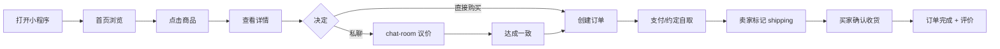
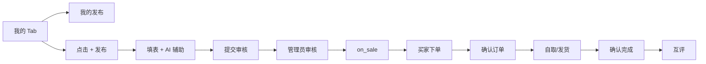

# 微信小程序功能说明书

| 属性 | 内容 |
|------|------|
| **文档编号** | CM-MP-001 |
| **文档名称** | 校园二手交易平台 · 微信小程序功能说明书 |
| **版本** | v1.0 |
| **密级** | 内部公开 |
| **编制人** | 课程组（Trae IDE 协助） |
| **审核人** | 课程负责人 |
| **批准人** | 课程负责人 |
| **编制日期** | 2026-06-15 |
| **生效日期** | 2026-06-15 |
| **替代版本** | FF-MP-001 v3.1（家庭资产管理版本，已废止） |
| **代码位置** | `miniprogram/` |
| **AppID** | （部署时由开发者替换） |

---

## 文档修订记录

| 版本 | 日期 | 变更摘要 | 编制人 |
|------|------|----------|--------|
| v1.0 | 2026-06-15 | 全新改版：从「家庭记账 C 端」切换为「校园二手交易 C 端」；5 Tab 重新设计（首页/分类/发布/消息/我的）；新增 AI 助手页、订单中心、校园认证等模块 | 课程组 |

---

## 目录

- [1. 概述](#1-概述)
- [2. 全局配置](#2-全局配置)
- [3. Tab Bar 与导航](#3-tab-bar-与导航)
- [4. 页面功能说明](#4-页面功能说明)
- [5. 公共组件](#5-公共组件)
- [6. 工具模块](#6-工具模块)
- [7. 用户旅程](#7-用户旅程)
- [8. 状态机与小程序侧交互](#8-状态机与小程序侧交互)
- [9. 错误处理与降级](#9-错误处理与降级)
- [10. 性能与体验指标](#10-性能与体验指标)
- [11. 关联文档](#11-关联文档)

---

## 1. 概述

### 1.1 目标

本文档面向**前端工程师 / 测试工程师 / 答辩学生**，逐页说明校园二手交易平台微信小程序的：

- 页面职责、UI 要素、数据来源
- 关键交互流程（用户旅程）
- 状态机在客户端的可视化映射
- 异常处理与降级策略

### 1.2 设计原则

| 原则 | 说明 |
|------|------|
| 易发现 | 首页 Tab 集中，常用入口 ≤2 步可达 |
| 高效 | 发布 ≤3 步（选分类 → 填信息 → 提交） |
| 可信 | 卖家信息、信用分、AI 建议均显式标注 |
| 包容 | 空状态、错误态有引导文案与可点击按钮 |
| 一致 | 颜色 / 间距 / 圆角 / 字号遵循 [design-tokens](#) |

### 1.3 平台能力

| 能力 | 用途 |
|------|------|
| `wx.request` | 与后端 RESTful 交互，自动注入 JWT |
| `wx.uploadFile` | 发布商品上传图片（最多 9 张） |
| `wx.getUserProfile` | 微信登录获取昵称头像（v1 改为账密登录 + 微信登录并存） |
| `wx.login` | 微信授权登录（备用通道） |
| `wx.showToast` / `wx.showModal` | 轻量反馈与确认 |
| `wx.setStorageSync` | 缓存 access_token / 草稿 |
| `wx.getRecorderManager` | 语音口述发布（v1 沿用 `voice-input` 组件，转文字后用 LLM 抽取结构化字段） |
| `wx.navigateTo` / `wx.switchTab` / `wx.redirectTo` | 路由 |

### 1.4 目录结构

```
miniprogram/
├─ app.js / app.json / app.wxss   # 全局入口
├─ custom-tab-bar/                # 自定义 5 Tab
├─ pages/
│  ├─ home/                       # 首页（瀑布流 + 搜索 + 轮播）
│  ├─ category/                   # 分类（左侧一级 + 右侧二级 + 商品）
│  ├─ publish/                    # 发布（图片 + 表单 + AI 辅助）
│  ├─ chat/                       # 消息列表（会话）
│  ├─ chat-room/                  # 私聊页
│  ├─ mine/                       # 我的（资料 / 订单 / 收藏 / 设置）
│  │  ├─ my-products.js           # 我的发布
│  │  ├─ favorites.js             # 我的收藏
│  │  └─ settings.js              # 偏好设置
│  ├─ detail/                     # 商品详情
│  ├─ orders/                     # 订单中心
│  ├─ ai/                         # AI 助手对话
│  ├─ stats/                      # 个人统计
│  └─ login/                      # 登录 / 注册
├─ components/                    # 公共组件
│  ├─ product-card/               # 商品卡片
│  ├─ credit-badge/               # 信用徽章
│  ├─ voice-input/                # 语音口述按钮
│  ├─ empty-state/                # 空状态
│  ├─ error-state/                # 错误状态
│  └─ skeleton-card/              # 骨架屏
├─ utils/
│  ├─ request.js                  # wx.request 封装 + 拦截器
│  ├─ api.js                      # API 常量
│  ├─ format.js                   # 金额 / 时间 / 价格格式化
│  ├─ icon.js                     # SVG / PNG 图标读取
│  ├─ resolve-url.js              # 相对资源 URL 拼接
│  ├─ share.js                    # onShareAppMessage 工厂
│  ├─ style.js                    # 主题色 / 圆角常量
│  ├─ sys.js                      # 系统信息（rpx 转换）
│  └─ voice.js                    # 录音 + ASR 适配
└─ assets/                        # 图片与图标（详见 [2026-06-06-design-tokens]）
```

---

## 2. 全局配置

### 2.1 `app.json` 关键配置

```json
{
  "pages": [
    "pages/index/index",
    "pages/category/category",
    "pages/publish/publish",
    "pages/chat/chat",
    "pages/mine/mine",
    "pages/login/login",
    "pages/detail/detail",
    "pages/orders/orders",
    "pages/ai/ai",
    "pages/stats/stats",
    "pages/chat-room/chat-room",
    "pages/mine/my-products",
    "pages/mine/favorites",
    "pages/mine/settings"
  ],
  "window": {
    "backgroundTextStyle": "light",
    "navigationBarBackgroundColor": "#FFFFFF",
    "navigationBarTitleText": "校园二手",
    "navigationBarTextStyle": "black",
    "backgroundColor": "#F7F8FA",
    "enablePullDownRefresh": false
  },
  "tabBar": {
    "custom": true,
    "color": "#8A8E99",
    "selectedColor": "#16A34A",
    "backgroundColor": "#FFFFFF",
    "list": [
      { "pagePath": "pages/index/index",     "text": "首页" },
      { "pagePath": "pages/category/category", "text": "分类" },
      { "pagePath": "pages/publish/publish",   "text": "发布" },
      { "pagePath": "pages/chat/chat",         "text": "消息" },
      { "pagePath": "pages/mine/mine",         "text": "我的" }
    ]
  },
  "permission": {
    "scope.userLocation": { "desc": "用于发布时填学校/自取地点" }
  },
  "requiredPrivateInfos": ["chooseLocation"],
  "style": "v2",
  "sitemapLocation": "sitemap.json"
}
```

### 2.2 `app.js` 启动流程

```javascript
App({
  globalData: {
    userInfo: null,        // { id, username, school, avatar, credit_score, role }
    accessToken: '',       // JWT
    refreshToken: '',
    systemInfo: null,      // wx.getSystemInfoSync
    apiBaseURL: 'http://127.0.0.1:8000/api',
  },

  onLaunch() {
    // 1. 系统信息
    this.globalData.systemInfo = wx.getSystemInfoSync();
    // 2. 恢复登录态
    const tk = wx.getStorageSync('access_token');
    if (tk) this.globalData.accessToken = tk;
    // 3. 拉取当前用户资料
    if (tk) this.fetchMe();
    // 4. 拉取首页 Feed
  },

  fetchMe() {
    request.get('/users/me/').then(res => {
      this.globalData.userInfo = res;
    });
  },
});
```

### 2.3 全局样式 `app.wxss`

定义 CSS 变量与基础类（颜色 / 圆角 / 间距参考 [2026-06-06-design-tokens]）：

```css
page {
  --color-primary: #16A34A;
  --color-bg:      #F7F8FA;
  --color-card:    #FFFFFF;
  --color-text:    #1F2329;
  --color-muted:   #8A8E99;
  --color-warn:    #F59E0B;
  --color-danger:  #DC2626;
  --radius-sm: 8rpx;
  --radius-md: 16rpx;
  --radius-lg: 24rpx;
  --space-1: 8rpx;
  --space-2: 16rpx;
  --space-3: 24rpx;
  --space-4: 32rpx;
  background: var(--color-bg);
  color: var(--color-text);
  font-size: 28rpx;
  line-height: 1.5;
}
```

---

## 3. Tab Bar 与导航

### 3.1 自定义 5 Tab

位于 `miniprogram/custom-tab-bar/`。

| 序号 | Tab | 路径 | 图标 | 选中色 |
|------|-----|------|------|--------|
| 1 | 首页 | `pages/index/index` | home | `#16A34A` |
| 2 | 分类 | `pages/category/category` | category | `#16A34A` |
| 3 | 发布（中央凸起） | `pages/publish/publish` | publish | `#16A34A` |
| 4 | 消息 | `pages/chat/chat` | chat | `#16A34A` |
| 5 | 我的 | `pages/mine/mine` | mine | `#16A34A` |

**交互要点**：

- 中央"发布"按钮凸起 16rpx，未登录时点击弹窗提示登录。
- 消息 Tab 显示未读小红点：`unread_count > 0`。
- 长按 Tab 无效果（避免与下拉刷新冲突）。

### 3.2 导航层级

```
Tab 1
  └─ pages/index/index
       └─ pages/detail/detail?pid=123    [商品详情]
            ├─ pages/chat-room/chat-room?cid=12  [私聊卖家]
            └─ pages/orders/orders?action=create&pid=123  [下单]

Tab 2
  └─ pages/category/category
       └─ pages/detail/detail?pid=123

Tab 3
  └─ pages/publish/publish
       └─ pages/ai/ai?from=publish           [AI 辅助填写]

Tab 4
  └─ pages/chat/chat
       └─ pages/chat-room/chat-room?cid=12

Tab 5
  └─ pages/mine/mine
       ├─ pages/mine/my-products              [我的发布]
       ├─ pages/mine/favorites                [我的收藏]
       ├─ pages/orders/orders                 [我的订单]
       ├─ pages/stats/stats                   [我的统计]
       └─ pages/mine/settings                 [偏好设置]
```

---

## 4. 页面功能说明

### 4.1 登录页 `pages/login/login`

#### 4.1.1 入口

- 冷启动未登录时进入任意受保护页 → 重定向到登录
- 我的 Tab 点击"立即登录"

#### 4.1.2 页面元素

| 元素 | 说明 |
|------|------|
| Logo + Slogan | 顶部居中，slogan "校园闲置，循环起来" |
| 账号输入框 | 用户名，3-32 字符 |
| 密码输入框 | 密码，≥8 字符，密文 |
| 学校输入框（注册） | 注册时显示 |
| 登录按钮 | 主按钮，绿色 |
| 注册 / 忘记密码链接 | 次要文字链接 |
| 微信登录按钮 | 次按钮，文案 "微信账号一键登录" |

#### 4.1.3 业务规则

- BR-USER-01：用户名 3-32 字符，字母数字下划线。
- BR-USER-02：密码 ≥8 字符且必须含字母+数字。
- 登录失败 5 次 / 15 分钟内拒绝（前端不依赖，由后端 401 错误码返回）。

#### 4.1.4 数据流

```
点击登录 -> request.post('/auth/login/', {username, password})
       <- 200 { access, refresh, user_id }
       -> wx.setStorageSync('access_token', access)
       -> app.globalData.accessToken = access
       -> app.fetchMe() 后 switchTab('home')
```

---

### 4.2 首页 `pages/index/index`

#### 4.2.1 页面元素

| 区域 | 元素 | 说明 |
|------|------|------|
| 顶部 | 搜索框 | placeholder "搜索商品 / 学校"，点击进入搜索结果页（复用 home） |
| | 通知 icon | 点击进入系统通知列表 |
| 轮播 | 3-5 张 banner | 调用 `GET /banners/` 拉取 |
| 分类入口 | 横向 5 宫格 | 一级分类，icon + name |
| 推荐 | "猜你喜欢" | `GET /products/?ordering=-view_count&page_size=10` |
| 最新 | "最新发布" | `GET /products/?ordering=-created_at&page_size=10` |
| 校园优选 | "本校精选" | `GET /products/?school=<my_school>&page_size=10` |

#### 4.2.2 交互

- **下拉刷新**：`onPullDownRefresh` 中清空列表后重新请求 1-2 页。
- **上拉触底**：`onReachBottom` 中 page += 1，拼接列表。
- **点击商品**：`navigateTo pages/detail/detail?pid=xxx`。
- **点击分类**：`switchTab pages/category`。
- **点击 banner**：`navigateTo` 对应 H5 或商品详情。

#### 4.2.3 数据格式

请求：`GET /products/?status=on_sale&page=1&page_size=20&ordering=-created_at&school=...`

响应：

```json
{
  "code": 0,
  "data": {
    "total": 487,
    "page": 1,
    "page_size": 20,
    "results": [
      {
        "id": 1,
        "title": "高等数学（同济版）",
        "price": "12.00",
        "original_price": "45.00",
        "cover_url": "https://...",
        "condition": "like_new",
        "school": "示例大学",
        "seller": { "id": 2, "username": "demo_001", "credit_score": 80 },
        "view_count": 23,
        "favorite_count": 3
      }
    ]
  }
}
```

#### 4.2.4 性能

- 首屏渲染 ≤1.5s
- 列表项 `product-card` 组件使用 `lazy-load` 图片
- 滚动到 5 页时清理离屏 DOM 节点

---

### 4.3 分类页 `pages/category/category`

#### 4.3.1 页面元素

- **左侧栏**：一级分类列表（教材 / 数码 / 服饰 / 生活 / 其他），高亮当前选中
- **右侧栏**：当前一级分类的二级分类 + 商品网格（2 列）
- **顶部**：搜索框（复用首页搜索逻辑）

#### 4.3.2 交互

- 点击一级分类 → 切换右侧二级分类 + 商品
- 点击二级分类 → `GET /products/?category_id=xxx&page=1`
- 点击商品 → 详情页
- 右侧网格支持下拉刷新 + 上拉触底

#### 4.3.3 数据来源

`GET /categories/tree/` 返回完整树：

```json
{
  "code": 0,
  "data": [
    { "id": 1, "code": "textbook", "name": "教材", "icon": "book-open",
      "children": [
        { "id": 11, "code": "textbook_uni", "name": "大学教材" },
        { "id": 12, "code": "textbook_ex", "name": "考研资料" }
      ]
    },
    { "id": 4, "code": "digital", "name": "数码", ... }
  ]
}
```

---

### 4.4 发布页 `pages/publish/publish`

#### 4.4.1 页面元素

| 区块 | 元素 |
|------|------|
| 图片区 | 9 宫格，0/9 时显示虚线占位 + 相机 icon |
| 标题 | input，最多 32 字（服务端兜底 64） |
| 描述 | textarea，最多 500 字，带字数计数 |
| 价格 | input，type=digit，限制 > 0 |
| 原价 | input，type=digit，可空 |
| 成色 | radio（全新 / 9 成新 / 8 成新 / 7 成新及以下） |
| 分类 | picker，二级分类 |
| AI 辅助按钮 | 浮动按钮 "AI 帮我写" |
| 提交 | 主按钮 "提交审核" |

#### 4.4.2 业务流程

```
选择图片（最多 9 张）-> wx.uploadFile 上传到 /upload/ -> 拿到 image_url 列表
填写标题 / 描述 / 价格 / 原价 / 成色 / 分类
（可选）点击 AI 辅助 -> 跳转 ai 页（带 from=publish）
       -> AI 返回优化后 title + description -> 回调填回
点击 "提交审核" -> request.post('/products/', {title, description, price, ...})
                -> 后端写入 product (status='pending')
                -> 弹窗 "已提交审核，预计 1 小时内完成"
                -> 跳转 "我的发布"
```

#### 4.4.3 校验规则

| 字段 | 客户端校验 | 服务端兜底 |
|------|------------|------------|
| 图片 | 1-9 张 | 1-9 张 |
| 标题 | 非空，≤32 字 | 非空，≤64 字 |
| 描述 | 可空，≤500 字 | 可空，≤500 字 |
| 价格 | 数字 > 0 | DECIMAL(10,2) > 0 |
| 原价 | 数字 ≥ 价格 | 数字 ≥ 价格（可选） |
| 分类 | 必选 | 必选且存在 |

#### 4.4.4 AI 辅助交互

详见 [CM-AI-001 §4.1](#)；客户端通过 `navigateTo` 跳转到 AI 页，AI 完成后通过 `getCurrentPages()[..].setData()` 回填。

---

### 4.5 商品详情页 `pages/detail/detail`

#### 4.5.1 页面元素

| 区块 | 内容 |
|------|------|
| 顶部轮播 | 商品图片（最多 9 张） |
| 标题 + 价格 | 标题（大字）/ 价格（红色 / 28号）/ 原价（删除线） |
| 标签 | 成色 / 校园认证 / 浏览数 / 收藏数 |
| 描述 | 文本块，markdown 渲染（v1 纯文本） |
| 卖家卡片 | 头像 / 昵称 / 学校 / 信用徽章 / "进入主页" |
| 同类推荐 | 6 张商品卡片（`GET /products/{id}/similar/`） |
| 底部操作栏 | "收藏" + "私聊" + "立即购买" |

#### 4.5.2 业务规则

- `onLoad` 中 `GET /products/{id}/` 详情，同时 `POST /products/{id}/view/` 累加浏览数（仅 1 次/会话）。
- 仅 `status='on_sale'` 显示"立即购买"；其他状态显示"已下架 / 已售出"且按钮置灰。
- 卖家本人进入时，底部操作栏变为"编辑 / 下架 / 重新上架"。

#### 4.5.3 状态机可视化

| 商品状态 | UI 表现 |
|----------|---------|
| draft | 显示"草稿"标签 + "编辑"按钮 |
| pending | 显示"审核中"标签 + "撤回"按钮 |
| on_sale | 正常展示 + 底部"私聊 / 购买" |
| pending_sold | "已订未付"标签 + 卖家可"取消订单" |
| sold | "已售出"标签 + 详情置灰 |
| off_shelf | "已下架"标签 + 卖家可"重新上架" |

---

### 4.6 私聊列表 `pages/chat/chat`

#### 4.6.1 页面元素

- 顶部"消息"标题
- 会话列表项：商品缩略图 + 对方昵称 + 最后消息预览 + 时间 + 未读小红点

#### 4.6.2 交互

- `onShow` 触发 `GET /conversations/` 拉取列表
- 点击会话 → `navigateTo chat-room?cid=xx`
- 长按会话 → 弹窗 "删除会话"（v1 仅 UI 预留，后端未实现删除）

---

### 4.7 私聊页 `pages/chat-room/chat-room`

#### 4.7.1 页面元素

- 顶部：对方昵称 + 关联商品卡片（可点击跳详情）
- 中间：消息流（自己右对齐、对方左对齐）
- 底部：输入框 + 发送按钮 + "AI 帮我说" 浮动按钮

#### 4.7.2 业务流程

```
ws / poll（v1 用 onShow + 定时器轮询）-> GET /conversations/{cid}/messages/?since=...
  -> 增量追加到 messages
用户输入 -> POST /messages/send/ { conversation_id, content }
       -> 乐观更新 UI
       -> 后端回传 message
       -> 同时 POST /ai/negotiate/ 触发 AI 议价建议（可选）
```

#### 4.7.3 状态管理

```javascript
data: {
  conversationId: 0,
  product: null,
  counterpart: null,
  messages: [],
  draft: '',
  loading: false,
  polling: false
}

// 每 3 秒拉取一次
pollTimer = setInterval(() => fetchNewer(), 3000);
```

#### 4.7.4 AI 议价入口

- "AI 帮我说" 按钮 → 调用 `POST /ai/negotiate/` 传入对方最近一条消息 + 商品价格
- AI 返回"建议话术"（3 条候选）→ 用户选一条 → 填入输入框 → 发送

---

### 4.8 订单中心 `pages/orders/orders`

#### 4.8.1 Tab 切换

| Tab | 范围 | 排序 |
|-----|------|------|
| 我购买的 | `buyer=me` | -created_at |
| 我卖出的 | `seller=me` | -created_at |

#### 4.8.2 状态过滤

- 全部 / 待确认 / 进行中 / 已完成 / 已取消

#### 4.8.3 订单卡片

| 区块 | 元素 |
|------|------|
| 头部 | 卖家昵称 + 状态徽章 |
| 商品 | 缩略图 + 标题 + 价格 + 数量 |
| 备注 | 备注（自取地点 / 时间） |
| 底部按钮 | 根据 `status + role` 动态显示：确认 / 拒绝 / 取消 / 完成 / 评价 |

#### 4.8.4 状态机按钮矩阵（与 LLD §3.2 对应）

| 状态 | 买家操作 | 卖家操作 |
|------|----------|----------|
| requested | 取消 | 确认 / 拒绝 |
| confirmed | 取消 | 标记为"待取/待发" |
| shipping | 确认收货 | - |
| completed | 评价 | 评价 |
| cancelled | - | - |

---

### 4.9 AI 助手页 `pages/ai/ai`

#### 4.9.1 入口

- 发布页"AI 帮我写"按钮（带 `from=publish`）
- 我的 Tab → "AI 助手"
- 私聊页"AI 帮我说"（带 `from=chat`）

#### 4.9.2 页面元素

- 顶部：AI 助手头像 + 标题 + "清空对话"按钮
- 中间：消息流
- 底部：快捷场景卡片 + 输入框 + 发送

#### 4.9.3 快捷场景

| 场景 | 触发端点 | 入参 |
|------|----------|------|
| 帮我写商品描述 | `/ai/publish-assist/` | 关键词、分类 |
| 建议合理价格 | `/ai/price-suggest/` | 标题、分类、成色 |
| 议价话术 | `/ai/negotiate/` | 商品价格 + 对方出价 |
| 内容是否违规 | `/ai/moderate/` | 标题 + 描述 |
| 智能客服 | `/ai/customer-service/` | 自然语言问题 |

#### 4.9.4 数据流

```
用户输入 -> request.post('/ai/chat/', {message, scene, context})
        <- { reply, suggestions, followups }
        -> 渲染到消息流
```

---

### 4.10 我的 `pages/mine/mine`

#### 4.10.1 已登录态

| 区块 | 元素 |
|------|------|
| 头部 | 头像 / 昵称 / 学校 / 信用徽章 / "编辑资料" |
| 数据卡 | 在售数 / 已售数 / 收藏数 / 订单数 |
| 入口网格 | 我的发布 / 我的收藏 / 我的订单 / 我的统计 / 校园认证 / 通知 / 设置 |
| 退出登录 | 底部红色文字按钮 |

#### 4.10.2 未登录态

- 居中 Logo + "立即登录" 主按钮 + 微信登录次按钮

---

### 4.11 子页面

| 路径 | 用途 |
|------|------|
| `pages/mine/my-products` | 我的发布（Tab：全部 / 在售 / 审核中 / 已下架 / 已售），支持下架 / 重新上架 / 删除 |
| `pages/mine/favorites` | 我的收藏，长按取消收藏 |
| `pages/mine/settings` | 偏好设置：消息推送、清除缓存、主题色（v1 仅浅色）、退出登录 |
| `pages/stats/stats` | 我的统计：发布数 / 售出数 / 收藏数 / 月度趋势（折线图） |

---

## 5. 公共组件

### 5.1 `product-card`

```html
<product-card product="{{item}}" bind:tap="onTap" />
```

Props：

| 字段 | 类型 | 说明 |
|------|------|------|
| product | Object | 商品概要 |
| showSeller | Boolean | 是否显示卖家行 |

内部元素：封面图、标题、价格、原价（删除线）、成色标签、卖家行（头像 + 昵称 + 信用徽章）。

### 5.2 `credit-badge`

```html
<credit-badge score="{{80}}" size="sm" />
```

- 80-100：金牌（绿底）
- 60-79：银牌（蓝底）
- 0-59：铜牌（橙底）

### 5.3 `voice-input`

- 长按 1s 录音，松开后调 `POST /ai/polish/` 或 `/ai/extract-keywords/`
- 录音中显示波形（CSS 动画）
- 失败时 Toast "未识别到有效内容"

### 5.4 `empty-state`

Props：`icon` / `text` / `actionText` / `bind:action`；空数据态统一调用。

### 5.5 `error-state`

Props：`code` / `message` / `actionText` / `bind:action`；网络错误时调用。

### 5.6 `skeleton-card`

- 列表首次加载显示 6 个骨架卡
- 数据到达后切换为真实内容（避免抖动）

---

## 6. 工具模块

### 6.1 `utils/request.js`

```javascript
const app = getApp();
function request({ url, method, data, header, hideLoading }) {
  if (!hideLoading) wx.showLoading({ title: '加载中', mask: true });
  return new Promise((resolve, reject) => {
    wx.request({
      url: app.globalData.apiBaseURL + url,
      method,
      data,
      header: {
        'Content-Type': 'application/json',
        Authorization: app.globalData.accessToken
          ? 'Bearer ' + app.globalData.accessToken
          : '',
        ...header,
      },
      success(res) {
        if (res.statusCode === 401) {
          // token 过期：尝试 refresh
          return doRefresh().then(() => request(...arguments)).then(resolve, reject);
        }
        if (res.data && res.data.code === 0) return resolve(res.data.data);
        return reject(res.data || { message: '未知错误' });
      },
      fail(err) { reject({ message: '网络异常', detail: err }); },
      complete() { if (!hideLoading) wx.hideLoading(); },
    });
  });
}
```

### 6.2 `utils/api.js`

集中维护 50+ API 端点路径常量，避免散落字符串。

### 6.3 `utils/format.js`

- `formatPrice(decimal)` → "￥12.00"
- `formatRelativeTime(datetime)` → "刚刚 / 3 分钟前 / 昨天 / 2026-06-01"
- `truncate(text, n)` → 截断 + "..."

### 6.4 `utils/icon.js`

读取 `assets/icons/*.png`（PNG 给兼容性，SVG 给高分屏）。

### 6.5 `utils/voice.js`

封装 `wx.getRecorderManager()` + 录音 → 上传 `/upload/audio/` → 后端 ASR。

---

## 7. 用户旅程

### 7.1 买家路径



### 7.2 卖家路径



### 7.3 管理员路径（小程序无管理入口，仅 Web 后台）

---

## 8. 状态机与小程序侧交互

### 8.1 商品状态机客户端映射

详见 [CM-LLD-001 §3.1](#)。客户端在 `product.status` 上的渲染规则：

| status | 列表显示 | 详情按钮组 | 订单卡显示 |
|--------|----------|------------|------------|
| draft | "草稿" 灰底 | 卖家：编辑 / 提交 | - |
| pending | "审核中" 蓝底 | 卖家：撤回 | - |
| on_sale | 正常 | 全部：收藏 / 私聊 / 购买 | - |
| pending_sold | "已订未付" 黄底 | 卖家：取消订单 | 进行中 |
| sold | "已售" 灰底 | 全部：仅查看 | 已完成 |
| off_shelf | "已下架" 灰底 | 卖家：重新上架 | - |

### 8.2 订单状态机客户端映射

| status | 买家按钮 | 卖家按钮 |
|--------|----------|----------|
| requested | 取消订单 | 确认 / 拒绝 |
| confirmed | 取消订单 | 标记待发 |
| shipping | 确认收货 | - |
| completed | 评价 | 评价 |
| cancelled | - | - |

---

## 9. 错误处理与降级

| 场景 | 客户端处理 |
|------|------------|
| 网络断开 | `error-state` 组件 + "重试"按钮 |
| 401 未登录 | 跳 `login` 页 + Toast "请先登录" |
| 403 无权限 | Toast "您没有此操作权限" |
| 404 资源不存在 | 详情页显示 "商品不存在或已删除" + 返回 |
| 500 服务器异常 | Toast "服务异常，请稍后再试" |
| AI 超时 | 降级为本地兜底话术 |
| 图片上传失败 | 单张图片角标"重传" |
| 重复收藏 | 收藏按钮保持已收藏状态，不报错 |

---

## 10. 性能与体验指标

| 指标 | 目标 |
|------|------|
| 启动耗时（首屏可见） | ≤ 1.5s |
| 首页 Feed 渲染 | ≤ 2s |
| 详情页加载 | ≤ 1s |
| 私聊消息延迟 | ≤ 200ms（轮询 3s） |
| 包大小 | 主包 ≤ 2MB（不含图片） |
| LCP | ≤ 2.5s |
| CLS | ≤ 0.1 |

优化手段：

- 启动阶段预拉取 `/categories/tree/` 与 `/site-stats/`
- 商品图片使用 CDN + webp
- 列表分页 + 虚拟列表（100+ 启用）
- 公共组件按需注入

---

## 11. 关联文档

| 文档 | 链接 |
|------|------|
| 需求规格说明书 | [CM-SRS-001](file:///d:/文件/工作 作业/微信小程序实训/4次课程内容/综合实训/docs/01_需求规格说明书_SRS.md) |
| 概要设计说明书 | [CM-HLD-001](file:///d:/文件/工作 作业/微信小程序实训/4次课程内容/综合实训/docs/02_概要设计说明书.md) |
| 详细设计说明书 | [CM-LLD-001](file:///d:/文件/工作 作业/微信小程序实训/4次课程内容/综合实训/docs/03_详细设计说明书.md) |
| 接口设计说明书 | [CM-API-001](file:///d:/文件/工作 作业/微信小程序实训/4次课程内容/综合实训/docs/08_接口设计说明书.md) |
| UI 与交互规范 | [CM-UI-001](file:///d:/文件/工作 作业/微信小程序实训/4次课程内容/综合实训/docs/10_UI与交互设计规范.md) |
| AI 模块设计 | [CM-AI-001](file:///d:/文件/工作 作业/微信小程序实训/4次课程内容/综合实训/docs/09_AI智能发布与议价模块设计说明书.md) |
| 编译运行指南 | [CM-RUN-MP-001](file:///d:/文件/工作 作业/微信小程序实训/4次课程内容/综合实训/docs/15_微信小程序编译与运行指南.md) |
| 设计令牌 | [2026-06-06-design-tokens](file:///d:/文件/工作 作业/微信小程序实训/4次课程内容/综合实训/docs/superpowers/specs/2026-06-06-design-tokens.md) |

---

> **说明**：本文档为全新改版（v1.0），替换旧 FF-MP-001 家庭资产管理 C 端版本。后续修订请保持「5 Tab + AI 助手 + 状态机驱动 + 校园场景」的设计风格。
