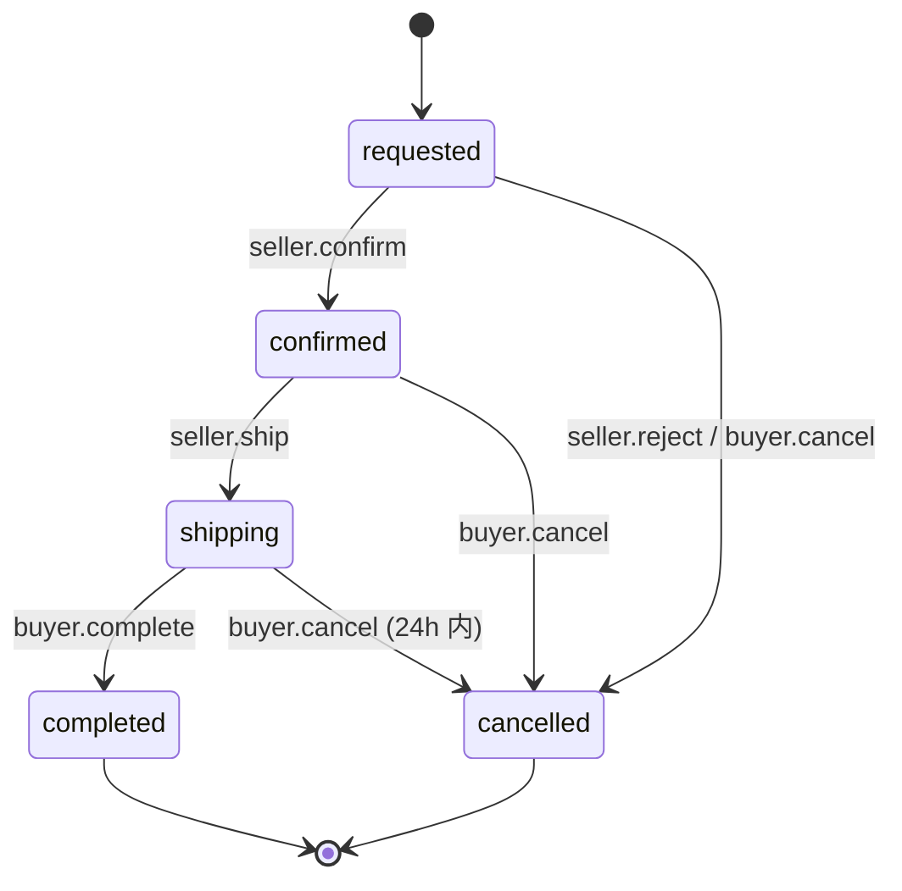
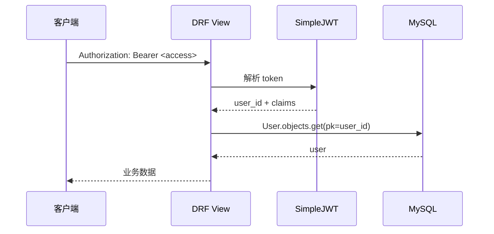

# 后端服务功能说明书

| 属性 | 内容 |
|------|------|
| **文档编号** | CM-API-SVC-001 |
| **文档名称** | 校园二手交易平台 · 后端服务功能说明书 |
| **版本** | v1.0 |
| **密级** | 内部公开 |
| **编制人** | 课程组（Trae IDE 协助） |
| **审核人** | 课程负责人 |
| **批准人** | 课程负责人 |
| **编制日期** | 2026-06-15 |
| **生效日期** | 2026-06-15 |
| **替代版本** | FF-API-SVC-001 v3.1（家庭资产管理版本，已废止） |
| **代码位置** | `backend/market/` |
| **Django App** | `market` |
| **WSGI Server** | Waitress 3.x |

---

## 文档修订记录

| 版本 | 日期 | 变更摘要 | 编制人 |
|------|------|----------|--------|
| v1.0 | 2026-06-15 | 全新改版：业务切换到「校园二手交易」；模块拆分为 auth/user/category/product/message/order/report/admin/ai/upload/health；12 个 ORM 模型；JWT 鉴权；统一响应格式 | 课程组 |

---

## 目录

- [1. 概述](#1-概述)
- [2. 运行环境与启动](#2-运行环境与启动)
- [3. 项目结构](#3-项目结构)
- [4. 配置（settings.py 关键项）](#4-配置settingspy-关键项)
- [5. 路由总览](#5-路由总览)
- [6. 模块详细设计](#6-模块详细设计)
- [7. 鉴权与权限](#7-鉴权与权限)
- [8. 响应格式与异常处理](#8-响应格式与异常处理)
- [9. 事务边界与一致性](#9-事务边界与一致性)
- [10. 缓存策略](#10-缓存策略)
- [11. 日志与可观测性](#11-日志与可观测性)
- [12. 安全加固](#12-安全加固)
- [13. 部署与运维](#13-部署与运维)
- [14. 关联文档](#14-关联文档)

---

## 1. 概述

### 1.1 服务定位

校园二手交易平台后端 API 服务，基于 **Django 4.2 + DRF** 实现，为三端提供统一接口：

- 微信小程序（买家 + 卖家 + 私聊）
- Web 卖家工作台（`frontend-web/`，普通用户视角）
- Web 平台管理后台（`frontend-admin/`，管理员视角）

### 1.2 技术栈

| 维度 | 选择 | 版本 |
|------|------|------|
| Web 框架 | Django | 4.2.x |
| API 框架 | Django REST Framework | 3.14.x |
| 鉴权 | djangorestframework-simplejwt | 5.x |
| 数据库 | MySQL | 9.4 |
| WSGI Server | Waitress | 3.x |
| 任务队列 | v1 不引入（v2 引入 Celery + RabbitMQ） | - |
| 缓存 | 本进程 LRU + 后期 Redis | - |
| 静态 / 媒体 | Django MEDIA_ROOT | - |
| LLM | OpenAI 兼容协议（自托管或云端） | - |
| 测试 | Django test + pytest | - |

### 1.3 设计原则

| 原则 | 说明 |
|------|------|
| 单一职责 | 每个 view 子模块对应一个业务域（auth/user/product/...） |
| 显式优于隐式 | 显式外键、显式索引、显式状态机迁移函数 |
| 业务集中在 Django 层 | 不引入存储过程 / 触发器 / 物化视图 |
| 可审计 | 关键运营动作写 `market_audit_log` |
| 可降级 | AI 服务不可用时返回本地兜底话术 |

---

## 2. 运行环境与启动

### 2.1 依赖

`backend/requirements.txt`：

```text
Django==4.2.7
djangorestframework==3.14.0
djangorestframework-simplejwt==5.3.0
mysqlclient==2.2.4
django-cors-headers==4.3.1
Pillow==10.4.0
waitress==3.0.0
openai==1.30.0
requests==2.32.0
```

### 2.2 启动

```bash
# 1. 进入后端目录
cd backend

# 2. 准备虚拟环境
python -m venv venv
.\venv\Scripts\Activate.ps1

# 3. 安装依赖
pip install -r requirements.txt

# 4. 数据库迁移
python manage.py migrate

# 5. 初始化数据
python manage.py shell < scripts/init_categories.py
python manage.py shell < scripts/init_data_market.py

# 6. 启动（开发）
python manage.py runserver 0.0.0.0:8000

# 7. 启动（生产）
waitress-serve --port=8000 config.wsgi:application
```

### 2.3 健康检查

```bash
curl http://127.0.0.1:8000/api/health/
# {"code":0,"data":{"status":"ok","db":"up","ts":"2026-06-15T10:00:00Z"}}
```

---

## 3. 项目结构

```
backend/
├─ config/                 # Django 项目级配置
│  ├─ settings.py
│  ├─ urls.py              # 挂载 /api/ -> market.urls
│  └─ wsgi.py
├─ market/                 # 业务 App
│  ├─ models.py            # 12 个 ORM 模型
│  ├─ urls.py              # 全部 API 路由
│  ├─ authentication.py    # 自定义 JWT 用户解析
│  ├─ permissions.py       # 权限类（IsAuthenticatedOrReadOnly / IsAdmin / IsOwnerOrReadOnly）
│  ├─ response.py          # success_response / fail_response / 标准错误码
│  ├─ pagination.py        # 通用分页
│  ├─ exceptions.py        # 自定义异常 + DRF 异常处理
│  ├─ utils.py             # 通用工具（图片压缩 / 时间格式化 / 加密）
│  ├─ apps.py
│  ├─ admin.py             # Django Admin（开发期使用）
│  ├─ migrations/
│  ├─ serializers/         # 按业务域拆分
│  │  ├─ user_serializers.py
│  │  ├─ category_serializers.py
│  │  ├─ product_serializers.py
│  │  ├─ order_serializers.py
│  │  ├─ message_serializers.py
│  │  ├─ favorite_serializers.py
│  │  ├─ report_serializers.py
│  │  └─ audit_serializers.py
│  ├─ services/            # 业务服务层
│  │  ├─ ai_prompts.py     # 7 个端点的提示词集中管理
│  │  ├─ ai_data_context.py# 组装 LLM 上下文
│  │  ├─ ai_service.py     # 端点路由 + 降级策略
│  │  ├─ llm_client.py     # OpenAI 兼容协议
│  │  └─ asr_adapter.py    # 语音转写（v1 走端侧 wx.getRecorderManager）
│  └─ views/               # 按业务域拆分
│     ├─ auth_views.py
│     ├─ user_views.py
│     ├─ category_views.py
│     ├─ product_views.py
│     ├─ message_views.py
│     ├─ order_views.py
│     ├─ report_views.py
│     ├─ admin_views.py
│     ├─ ai_views.py
│     ├─ upload_views.py
│     ├─ system_views.py
│     ├─ stats_views.py
│     └─ health.py
├─ media/                  # 用户上传（商品图、头像、音频）
├─ scripts/                # 运维脚本
│  ├─ init_categories.py
│  ├─ init_data_market.py
│  └─ init_admin.py
├─ manage.py
├─ requirements.txt
└─ .env                    # 本地环境变量（不入库）
```

---

## 4. 配置（settings.py 关键项）

```python
# config/settings.py
INSTALLED_APPS = [
    'django.contrib.admin',
    'django.contrib.auth',
    'django.contrib.contenttypes',
    'django.contrib.sessions',
    'django.contrib.messages',
    'django.contrib.staticfiles',
    'rest_framework',
    'corsheaders',
    'market',
]

MIDDLEWARE = [
    'corsheaders.middleware.CorsMiddleware',
    'django.middleware.security.SecurityMiddleware',
    'django.contrib.sessions.middleware.SessionMiddleware',
    'django.middleware.common.CommonMiddleware',
    'django.middleware.csrf.CsrfViewMiddleware',
    'django.contrib.auth.middleware.AuthenticationMiddleware',
    'django.contrib.messages.middleware.MessageMiddleware',
]

ROOT_URLCONF = 'config.urls'
WSGI_APPLICATION = 'config.wsgi.application'

DATABASES = {
    'default': {
        'ENGINE':   'django.db.backends.mysql',
        'NAME':     'campus_market',
        'USER':     'root',
        'PASSWORD': os.environ.get('DB_PASSWORD', ''),
        'HOST':     '127.0.0.1',
        'PORT':     '3306',
        'OPTIONS':  {'charset': 'utf8mb4'},
    }
}

AUTH_USER_MODEL = 'market.User'

REST_FRAMEWORK = {
    'DEFAULT_AUTHENTICATION_CLASSES': (
        'market.authentication.MarketJWTAuthentication',
    ),
    'DEFAULT_PERMISSION_CLASSES':     ('rest_framework.permissions.IsAuthenticatedOrReadOnly',),
    'DEFAULT_PAGINATION_CLASS':        ('market.pagination.StandardPagination',),
    'EXCEPTION_HANDLER':               ('market.exceptions.custom_exception_handler',),
    'DEFAULT_RENDERER_CLASSES':        ('market.response.MarketJSONRenderer',),
}

# JWT
SIMPLE_JWT = {
    'ACCESS_TOKEN_LIFETIME':  timedelta(hours=2),
    'REFRESH_TOKEN_LIFETIME': timedelta(days=14),
    'ALGORITHM': 'HS256',
    'AUTH_HEADER_TYPES': ('Bearer',),
}

# CORS
CORS_ALLOW_ALL_ORIGINS = True   # 开发期；生产收紧
CORS_ALLOW_CREDENTIALS = True

# 媒体
MEDIA_URL  = '/media/'
MEDIA_ROOT = BASE_DIR / 'media'

# 静态
STATIC_URL  = '/static/'
STATIC_ROOT = BASE_DIR / 'static'

# 日志
LOGGING = {
    'version': 1,
    'disable_existing_loggers': False,
    'formatters': {
        'verbose': {
            'format': '[{asctime}] {levelname} {name} {message}',
            'style': '{',
        },
    },
    'handlers': {
        'console': {'class': 'logging.StreamHandler', 'formatter': 'verbose'},
        'file': {
            'class': 'logging.handlers.RotatingFileHandler',
            'filename': BASE_DIR / 'backend.log',
            'maxBytes': 10 * 1024 * 1024,
            'backupCount': 5,
            'formatter': 'verbose',
        },
    },
    'root': {'handlers': ['console', 'file'], 'level': 'INFO'},
    'loggers': {
        'market': {'handlers': ['console', 'file'], 'level': 'DEBUG', 'propagate': False},
    },
}
```

---

## 5. 路由总览

详见 [CM-API-001 §3](#)。摘录 `market/urls.py`：

| 路径前缀 | 端点数量 | 业务域 |
|----------|----------|--------|
| `/api/auth/*` | 4 | 认证 |
| `/api/users/*` | 5 | 用户 |
| `/api/categories/*` | 2 | 分类 |
| `/api/products/*` | 12 | 商品 |
| `/api/favorites/*` | 2 | 收藏 |
| `/api/conversations/*` | 4 | 会话 |
| `/api/messages/*` | 1 | 消息 |
| `/api/orders/*` | 7 | 订单 |
| `/api/reviews/*` | 1 | 评价 |
| `/api/reports/*` | 1 | 举报 |
| `/api/admin/*` | 18 | 管理后台 |
| `/api/ai/*` | 9 | AI |
| `/api/stats/*` | 5 | 卖家统计 |
| `/api/upload/*` | 1 | 上传 |
| `/api/{banners,notices,hot-keywords,site-stats,home-feed}` | 5 | 系统级 |
| `/api/health/` | 1 | 健康检查 |

总计 ~78 个端点。

---

## 6. 模块详细设计

### 6.1 `auth_views` 认证

| 端点 | 方法 | 权限 | 说明 |
|------|------|------|------|
| `/auth/register/` | POST | AllowAny | 用户名 + 密码 + 学校注册，返回 JWT |
| `/auth/login/` | POST | AllowAny | 账密登录，返回 access/refresh |
| `/auth/logout/` | POST | IsAuthenticated | 撤销 refresh token |
| `/auth/refresh/` | POST | AllowAny | 用 refresh 换新 access |
| `/health/` | GET | AllowAny | 健康检查 |

#### 6.1.1 业务规则

- **BR-USER-01**：用户名 3-32 字符，仅 `[A-Za-z0-9_]`。
- **BR-USER-02**：密码 ≥ 8 字符，且必须含字母 + 数字。
- **BR-USER-03**：初始 `credit_score=80`，`role='user'`，`is_certified=False`。
- **BR-AUTH-01**：登录失败 5 次 / 15 分钟 / IP，触发 1 小时冻结（基于 cache 计数）。
- **BR-AUTH-02**：refresh token 14 天有效；access token 2 小时有效。

#### 6.1.2 关键代码

```python
# market/views/auth_views.py
class LoginView(APIView):
    permission_classes = [AllowAny]

    def post(self, request):
        serializer = LoginSerializer(data=request.data)
        serializer.is_valid(raise_exception=True)
        user = serializer.authenticate()
        if not user:
            return fail_response(40100, '账号或密码错误')
        if not user.is_active:
            return fail_response(40301, '账号已被封禁')
        # 颁发 JWT
        refresh = RefreshToken.for_user(user)
        return success_response({
            'user_id': user.id,
            'access':  str(refresh.access_token),
            'refresh': str(refresh),
        })
```

### 6.2 `user_views` 用户

| 端点 | 方法 | 权限 | 说明 |
|------|------|------|------|
| `/users/me/` | GET / PATCH | IsAuthenticated | 当前用户资料 |
| `/users/me/stats/` | GET | IsAuthenticated | 在售数 / 已售 / 收藏 / 订单 |
| `/users/me/avatar/` | POST | IsAuthenticated | 上传头像 |
| `/users/me/verify/` | POST | IsAuthenticated | 校园身份认证（提交学号 + 校名） |
| `/users/me/change-password/` | POST | IsAuthenticated | 改密 |
| `/users/<id>/` | GET | AllowAny | 公开主页 |

#### 6.2.1 校园身份认证流程

```
用户提交 { school, student_id, avatar(可选) }
       -> 管理员后台人工审核（v1 不自动化）
       -> 审核通过 -> is_certified=True
       -> 商家发布商品时无需再校验
```

#### 6.2.2 信用分调整（`adjust_credit_score`）

```python
def adjust_credit_score(user, delta, reason=''):
    """调整用户信用分，下限 0，上限 100。"""
    new_score = max(0, min(100, user.credit_score + delta))
    user.credit_score = new_score
    user.save(update_fields=['credit_score'])
    AuditLog.objects.create(
        operator=user,
        action='adjust_credit',
        target_type='user',
        target_id=user.pk,
        remark=f'delta={delta} new={new_score} reason={reason}',
    )
    return new_score
```

### 6.3 `category_views` 分类

| 端点 | 方法 | 权限 | 说明 |
|------|------|------|------|
| `/categories/` | GET | AllowAny | 扁平列表（按 sort_order） |
| `/categories/tree/` | GET | AllowAny | 嵌套树 |
| `/admin/categories/` | GET/POST | IsAdmin | 管理端列表 / 新建 |
| `/admin/categories/<id>/` | PATCH/DELETE | IsAdmin | 更新 / 删除 |

#### 6.3.1 删除保护

- 当分类下仍有商品时，删除返回 `40900` 错误。
- 二级分类删除自动将商品 `category` 置为父级（一级），但当前实现走 PROTECT，不允许删除。

### 6.4 `product_views` 商品（核心）

| 端点 | 方法 | 权限 | 说明 |
|------|------|------|------|
| `/products/` | GET | AllowAny | 列表（多条件过滤） |
| `/products/` | POST | IsAuthenticated + `is_certified` | 发布 |
| `/products/mine/` | GET | IsAuthenticated | 我的发布 |
| `/products/<id>/` | GET | AllowAny | 详情 |
| `/products/<id>/` | PATCH | IsOwner | 修改 |
| `/products/<id>/` | DELETE | IsOwner | 删除（仅 draft/pending/off_shelf） |
| `/products/<id>/view/` | POST | AllowAny | 累加浏览数 |
| `/products/<id>/favorite/` | POST | IsAuthenticated | 切换收藏 |
| `/products/<id>/off-shelf/` | POST | IsOwner | 下架 |
| `/products/<id>/on-shelf/` | POST | IsOwner | 重新上架 |
| `/favorites/` | GET | IsAuthenticated | 我的收藏 |
| `/products/suggest/` | GET | AllowAny | AI 标题建议（v1 走同义词） |

#### 6.4.1 列表查询实现

详见 [CM-LLD-001 §2.4](#)，核心：

```python
qs = Product.objects.select_related('seller', 'category').prefetch_related('images')
qs = qs.filter(status=request.query_params.get('status', 'on_sale'))
# category / keyword / school / ordering / page / page_size
```

#### 6.4.2 状态机迁移函数

详见 [CM-LLD-001 §3.1](#)。关键：

```python
def transition_product_status(product, target, actor, remark=''):
    """商品状态机迁移；非法迁移抛 InvalidStateTransition。"""
    ALLOWED = {
        'draft':        {'pending'},
        'pending':      {'draft', 'on_sale'},
        'on_sale':      {'pending_sold', 'off_shelf'},
        'pending_sold': {'on_sale', 'sold'},
        'sold':         set(),
        'off_shelf':    {'on_sale'},
    }
    if target not in ALLOWED.get(product.status, set()):
        raise InvalidStateTransition(
            f'{product.status} -> {target} 不允许'
        )
    with transaction.atomic():
        product.status = target
        if target == 'sold':
            product.sold_at = timezone.now()
        if target == 'pending' and remark:
            product.audit_remark = remark
        product.save(update_fields=['status', 'sold_at', 'audit_remark', 'updated_at'])
    return product
```

### 6.5 `message_views` 会话 / 消息

| 端点 | 方法 | 权限 | 说明 |
|------|------|------|------|
| `/conversations/` | GET | IsAuthenticated | 我的会话列表 |
| `/conversations/` | POST | IsAuthenticated | 创建会话（基于商品） |
| `/conversations/<id>/` | GET | 参与方 | 会话详情 |
| `/conversations/<id>/messages/` | GET | 参与方 | 消息分页（since= 时间戳增量） |
| `/conversations/<id>/read/` | POST | 参与方 | 标记已读 |
| `/messages/send/` | POST | 参与方 | 发送消息 |

#### 6.5.1 轮询协议

v1 不引入 WebSocket，客户端用 3 秒轮询：

```
GET /conversations/<id>/messages/?since=<last_id>&page_size=50
<- { code:0, data: { results: [...], has_more: false } }
```

### 6.6 `order_views` 订单

| 端点 | 方法 | 权限 | 说明 |
|------|------|------|------|
| `/orders/` | GET | IsAuthenticated | 列表（按 `?role=buyer|seller` 区分） |
| `/orders/` | POST | IsAuthenticated + `is_certified` | 创建订单 |
| `/orders/<id>/` | GET | 参与方 | 详情 |
| `/orders/<id>/confirm/` | POST | 卖家 | 卖家确认 |
| `/orders/<id>/reject/` | POST | 卖家 | 卖家拒绝 |
| `/orders/<id>/cancel/` | POST | 买家 / 卖家 | 取消订单 |
| `/orders/<id>/ship/` | POST | 卖家 | 标记为"待取 / 待发" |
| `/orders/<id>/complete/` | POST | 买家 | 买家确认收货 |
| `/reviews/` | POST | 参与方 + `status=completed` | 创建评价 |

#### 6.6.1 状态机



#### 6.6.2 评价触发信用分

```python
def on_review_created(review):
    if review.rating >= 4:   delta = +1
    elif review.rating == 3: delta =  0
    else:                    delta = -1
    adjust_credit_score(review.reviewee, delta, reason=f'review#{review.id} rating={review.rating}')
```

### 6.7 `report_views` 举报

| 端点 | 方法 | 权限 | 说明 |
|------|------|------|------|
| `/reports/` | POST | IsAuthenticated | 提交举报 |
| `/admin/reports/` | GET | IsAdmin | 列表 |
| `/admin/reports/<id>/handle/` | POST | IsAdmin | 处理 |
| `/admin/reports/count/` | GET | IsAdmin | 各状态计数 |

#### 6.7.1 处理动作联动

| 动作 | 副作用 |
|------|--------|
| warn | 发站内通知给卖家，写 `AuditLog` |
| remove | 商品 → `off_shelf` |
| ban | 卖家 `is_active=False` |
| reject | 仅关闭举报 |

### 6.8 `admin_views` 平台管理后台

详见 [CM-API-001 §3](#) 与 [CM-WEB-001 §8](#)。端点包括仪表盘 / 审核 / 用户管理 / 分类 CRUD / 审计日志 / AI 配置 / 举报处理。

#### 6.8.1 审计日志

所有写操作必须落 `market_audit_log`：

```python
def write_audit_log(operator, action, target_type, target_id, remark=''):
    AuditLog.objects.create(
        operator=operator,
        action=action,
        target_type=target_type,
        target_id=target_id,
        remark=remark,
    )
```

### 6.9 `ai_views` AI 智能体

详见 [CM-AI-001](#)。9 个端点：

| 端点 | 用途 |
|------|------|
| `/ai/publish-assist/` | 一键优化商品标题 / 描述 |
| `/ai/price-suggest/` | 智能建议价格 |
| `/ai/moderate/` | 内容合规审核 |
| `/ai/polish/` | 文案润色 |
| `/ai/negotiate/` | 议价话术 |
| `/ai/extract-keywords/` | 关键词抽取 |
| `/ai/customer-service/` | 智能客服 |
| `/ai/chat/` | 通用对话 |
| `/ai/health/` | AI 服务健康检查 |

#### 6.9.1 限流

每个端点 60 次 / 分钟 / 用户；超额返回 `42900`。

#### 6.9.2 降级

LLM 不可用时返回本地兜底话术（如议价时返回 "建议回复：可以小刀到 X 元"）。

### 6.10 `upload_views` 上传

| 端点 | 方法 | 权限 | 说明 |
|------|------|------|------|
| `/upload/` | POST | IsAuthenticated | 通用图片上传 |

- 接受格式：jpg / png / webp，≤ 5MB
- 路径：`media/products/yyyy/mm/<uuid>.<ext>`
- 客户端：`<input type="file">` 或 `wx.uploadFile`

### 6.11 `system_views` 系统级

| 端点 | 方法 | 说明 |
|------|------|------|
| `/banners/` | GET | 首页轮播 |
| `/notices/` | GET | 系统通知 |
| `/hot-keywords/` | GET | 热搜词 |
| `/site-stats/` | GET | 站点统计（首页展示） |
| `/home-feed/` | GET | 首页 Feed 聚合 |

`home-feed` 在后端聚合 banner / 通知 / 分类 / 推荐 / 最新，**单次调用**返回首页所有数据，减少移动端请求次数。

### 6.12 `stats_views` 卖家统计

为 `frontend-web/`（卖家工作台）服务：

| 端点 | 方法 | 说明 |
|------|------|------|
| `/stats/seller/overview/` | GET | 卖家总览（商品 / 售出 / 收藏 / 访客） |
| `/stats/seller/trend/` | GET | 30 日趋势 |
| `/stats/seller/category-distribution/` | GET | 分类分布 |
| `/stats/seller/price-range/` | GET | 价格区间分布 |
| `/stats/me/overview/` | GET | 当前用户总览 |

### 6.13 `health.py` 健康检查

- 函数式：`health()` → `{status, db, ts}`
- ViewSet：`HealthCheckView` 兼容旧路径

---

## 7. 鉴权与权限

### 7.1 鉴权流



### 7.2 权限类

| 类 | 作用 |
|----|------|
| `AllowAny` | 公开 |
| `IsAuthenticated` | 必须登录 |
| `IsAuthenticatedOrReadOnly` | 读公开，写必须登录 |
| `IsOwnerOrReadOnly` | 写必须为资源所有者 |
| `IsAdmin` | role=admin |
| `IsCertified` | is_certified=True |

### 7.3 Token 刷新策略

- `Authorization: Bearer <access>` 默认 2 小时
- 401 → 客户端调 `/auth/refresh/` → 失败则跳登录

---

## 8. 响应格式与异常处理

### 8.1 统一响应

```python
# market/response.py
def success_response(data=None, message='ok', code=0):
    return Response({'code': code, 'message': message, 'data': data or {}})

def fail_response(code, message, data=None):
    return Response({'code': code, 'message': message, 'data': data or {}}, status=http_code_for(code))
```

### 8.2 业务错误码

| code | 含义 | HTTP |
|------|------|------|
| 0 | 成功 | 200 |
| 40000 | 参数错误 | 400 |
| 40001 | 缺少必填字段 | 400 |
| 40100 | 未登录 | 401 |
| 40101 | Token 过期 | 401 |
| 40300 | 无权限 | 403 |
| 40301 | 账号被封禁 | 403 |
| 40400 | 资源不存在 | 404 |
| 40401 | 资源已删除 | 404 |
| 40900 | 状态机冲突 | 409 |
| 40901 | 重复操作 | 409 |
| 42200 | 业务规则校验失败 | 422 |
| 42900 | 限流 | 429 |
| 50000 | 服务异常 | 500 |

### 8.3 异常处理

`market.exceptions.custom_exception_handler`：

- DRF `ValidationError` → 40000
- DRF `NotAuthenticated` → 40100
- DRF `PermissionDenied` → 40300
- DRF `NotFound` → 40400
- 自定义 `InvalidStateTransition` → 40900
- 自定义 `RateLimited` → 42900
- 兜底 `Exception` → 50000

---

## 9. 事务边界与一致性

### 9.1 事务使用原则

- 涉及多表写入（创建订单 + 状态机迁移）必须 `transaction.atomic()`
- 只读操作不开事务
- 状态机迁移函数统一包在 `with transaction.atomic():` 中

### 9.2 关键事务场景

| 场景 | 事务范围 |
|------|----------|
| 创建订单 | Order 写入 + Product 状态 `on_sale → pending_sold` + 卖家通知 |
| 评价完成 | Review 写入 + 调用 `adjust_credit_score` + AuditLog |
| 管理员审核通过 | Product `pending → on_sale` + AuditLog + 卖家通知 |
| 举报封禁 | Report `pending → banned` + User `is_active=False` + 商品下架（批量） + AuditLog |

### 9.3 死锁规避

- 多表更新按固定顺序：User → Order → Product → AuditLog
- 短事务（< 100ms）
- 关键路径加 `select_for_update()`

---

## 10. 缓存策略

### 10.1 本进程 LRU（v1）

```python
from functools import lru_cache

@lru_cache(maxsize=512)
def get_category_tree():
    return build_tree(Category.objects.filter(is_active=True))
```

适用：

- `/categories/tree/`（变更频率低）
- `/banners/` / `/notices/` / `/hot-keywords/` / `/site-stats/`

失效：管理员更新后调用 `cache.clear()`。

### 10.2 Redis（v2 引入）

- 首页 Feed 缓存 5 分钟
- 限流计数器
- Session（v2 撤掉 JWT，改为 Session）

---

## 11. 日志与可观测性

### 11.1 日志级别

| 场景 | 级别 |
|------|------|
| 启动 / 关闭 | INFO |
| API 成功 | INFO |
| 鉴权失败 | WARNING |
| 业务规则冲突 | WARNING |
| 异常 | ERROR |
| 堆栈 | ERROR（带 traceback） |

### 11.2 关键日志格式

```python
logger.info('api.product.create', extra={
    'user_id': user.id,
    'product_id': product.id,
    'category_id': product.category_id,
    'ip': request.META.get('REMOTE_ADDR'),
})
```

### 11.3 慢请求

- 中间件记录 > 1s 的请求
- 每天 23:00 输出慢请求 TOP 10

### 11.4 健康检查深度

`/api/health/` 返回：

```json
{
  "code": 0,
  "data": {
    "status": "ok",
    "db": "up",
    "ai": "up",
    "media": "writable",
    "ts": "2026-06-15T10:00:00Z"
  }
}
```

---

## 12. 安全加固

### 12.1 输入校验

- DRF Serializer 校验
- 价格 / 信用分 等数值字段强制 `min_value`
- 文本字段 max_length 限制

### 12.2 越权防护

- `IsOwnerOrReadOnly` 校验资源所有权
- 订单 / 消息 / 会话 校验"参与方"身份
- 写操作校验 `request.user == obj.seller` 等

### 12.3 SQL 注入

- 全部 ORM 化
- 禁止 raw SQL 字符串拼接
- 必要时使用 `params=[...]`

### 12.4 XSS

- description / content 不渲染 HTML（v1 走白名单转义）
- 管理端用 Element Plus 自动转义

### 12.5 CSRF

- 微信小程序 + JWT 不涉及 CSRF
- Django Admin / Admin 后台用 Session + CSRF token

### 12.6 限流

```python
REST_FRAMEWORK['DEFAULT_THROTTLE_CLASSES'] = (
    'rest_framework.throttling.UserRateThrottle',
    'rest_framework.throttling.AnonRateThrottle',
)
REST_FRAMEWORK['DEFAULT_THROTTLE_RATES'] = {
    'user': '300/min',
    'anon': '60/min',
}
AI 端点 60/min/user（自定义 throttle scope）。
```

### 12.7 密码

- `pbkdf2_sha256` 600,000 轮
- 不在日志中输出
- 改密需校验旧密码

---

## 13. 部署与运维

### 13.1 部署架构

```
   客户端
     |
   Nginx (80/443)  ← 反代 + 静态资源 + 限流
     |
   Waitress (8000) ← WSGI 4 worker
     |
   Django 4.2 + DRF
     |
   MySQL 9.4 (3306)
```

### 13.2 部署脚本

`deploy/start_backend.ps1`：

```powershell
# 启动后端
$env:DJANGO_SETTINGS_MODULE = "config.settings"
waitress-serve --port=8000 --threads=4 config.wsgi:application
```

### 13.3 数据库初始化

`deploy/setup_database.ps1`：

```powershell
# 创建库
& "C:\Program Files\MySQL\MySQL Server 9.4\bin\mysql.exe" `
  -u root -p`
  -e "CREATE DATABASE IF NOT EXISTS campus_market DEFAULT CHARSET utf8mb4;"

# 迁移
python manage.py migrate

# 初始化数据
python manage.py shell < scripts/init_data_market.py
```

### 13.4 监控

- 健康检查：curl `/api/health/` 每 30 秒一次
- 进程监控：Waitress 自带 `--threads` / `--ident`
- 日志：rotating file 10MB × 5
- 异常告警：ERROR 级别日志触发邮件（v2 引入 Sentry）

### 13.5 备份

详见 [CM-DB-001 §10](#)。

---

## 14. 关联文档

| 文档 | 链接 |
|------|------|
| 需求规格说明书 | [CM-SRS-001](file:///d:/文件/工作 作业/微信小程序实训/4次课程内容/综合实训/docs/01_需求规格说明书_SRS.md) |
| 概要设计说明书 | [CM-HLD-001](file:///d:/文件/工作 作业/微信小程序实训/4次课程内容/综合实训/docs/02_概要设计说明书.md) |
| 详细设计说明书 | [CM-LLD-001](file:///d:/文件/工作 作业/微信小程序实训/4次课程内容/综合实训/docs/03_详细设计说明书.md) |
| 数据库设计说明书 | [CM-DB-001](file:///d:/文件/工作 作业/微信小程序实训/4次课程内容/综合实训/docs/04_数据库设计说明书.md) |
| 接口设计说明书 | [CM-API-001](file:///d:/文件/工作 作业/微信小程序实训/4次课程内容/综合实训/docs/08_接口设计说明书.md) |
| AI 模块设计 | [CM-AI-001](file:///d:/文件/工作 作业/微信小程序实训/4次课程内容/综合实训/docs/09_AI智能发布与议价模块设计说明书.md) |
| 部署说明 | [部署说明.md](file:///d:/文件/工作 作业/微信小程序实训/4次课程内容/综合实训/docs/部署说明.md) |
| 源文件入口 | [market/urls.py](file:///d:/文件/工作 作业/微信小程序实训/4次课程内容/综合实训/backend/market/urls.py) |

---

> **说明**：本文档为全新改版（v1.0），替换旧的 FF-API-SVC-001 家庭资产管理 API 服务版本。后续修订请保持「按业务域拆分 view、统一响应格式、显式事务、状态机驱动」的设计风格。
