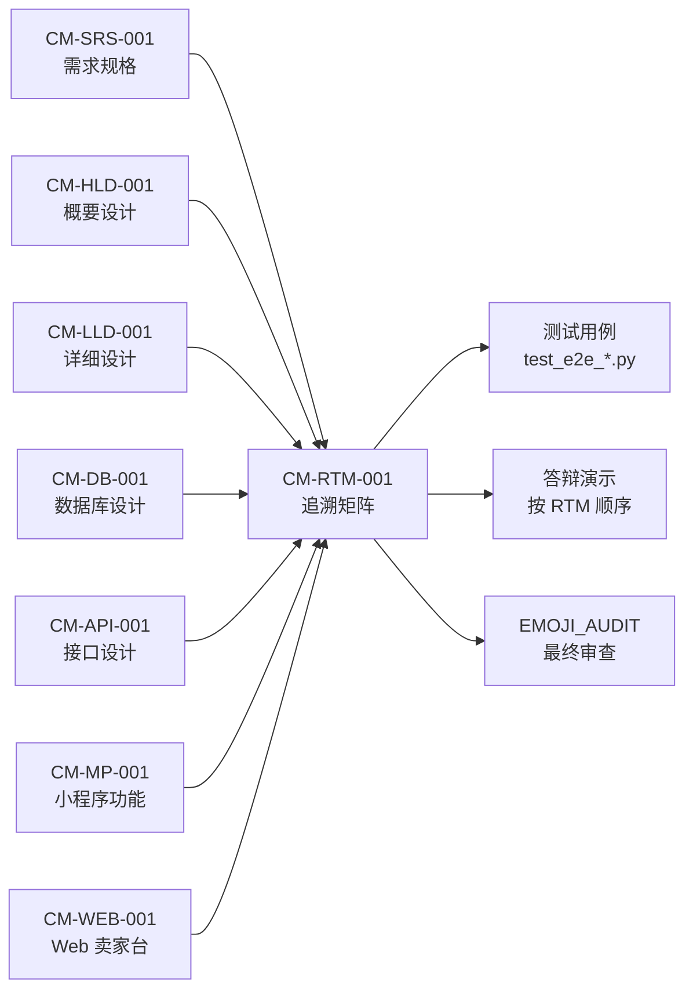
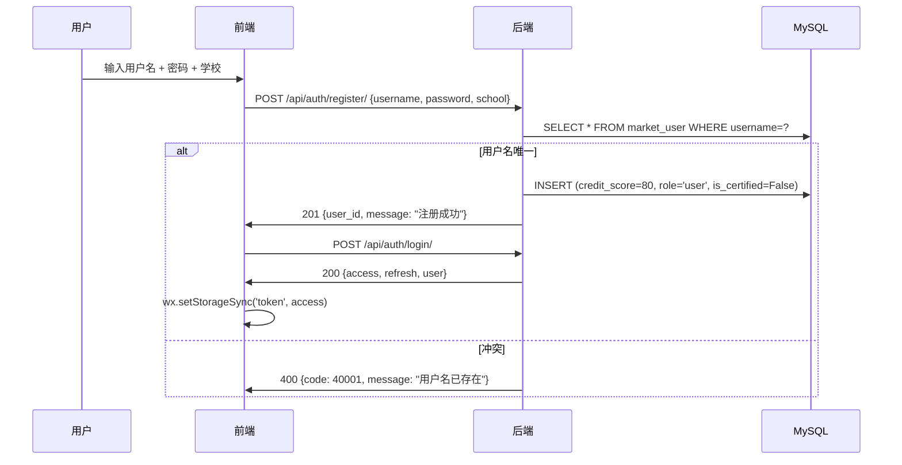
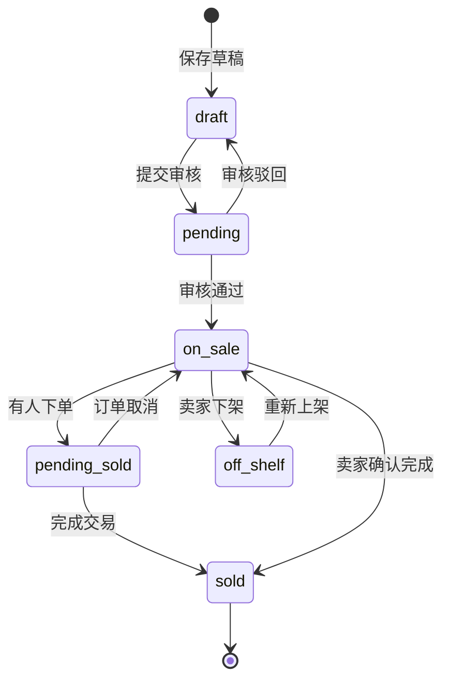
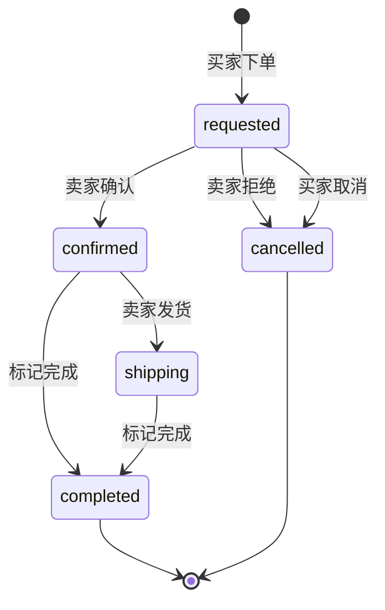
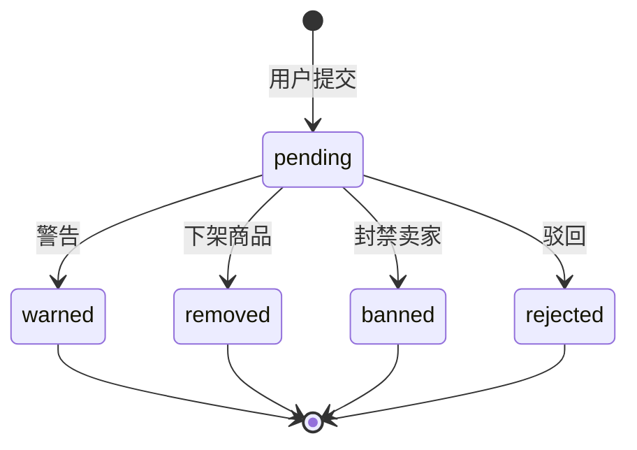
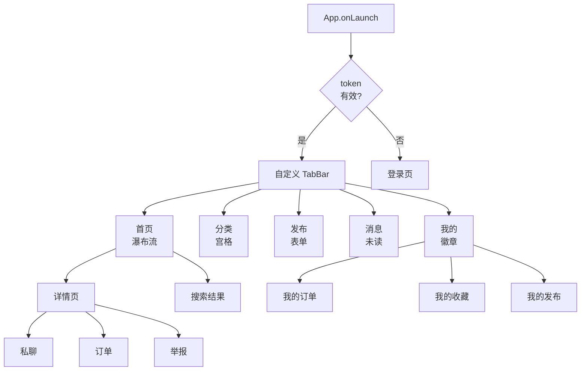

# 需求追溯矩阵（RTM）

| 属性 | 内容 |
|------|------|
| **文档编号** | CM-RTM-001 |
| **文档名称** | 校园二手交易平台 · 需求追溯矩阵（Requirements Traceability Matrix） |
| **版本** | v1.0 |
| **密级** | 内部公开 |
| **编制人** | 课程组（Trae IDE 协助） |
| **审核人** | 课程负责人 |
| **批准人** | 课程负责人 |
| **编制日期** | 2026-06-15 |
| **生效日期** | 2026-06-15 |
| **替代版本** | FF-RTM-001 v3.1（家庭资产管理版本，已废止） |
| **需求基线** | [《CM-SRS-001 需求规格说明书》](file:///d:/文件/工作 作业/微信小程序实训/4次课程内容/综合实训/docs/01_需求规格说明书_SRS.md) v1.0 |
| **接口基线** | [《CM-API-001 接口设计说明书》](file:///d:/文件/工作 作业/微信小程序实训/4次课程内容/综合实训/docs/08_接口设计说明书.md) v1.0 |
| **设计基线** | 校园二手交易平台（Campus Market）整体转型版本 |

---

## 修订记录

| 版本 | 日期 | 修订说明 |
|------|------|----------|
| v1.0 | 2026-06-15 | 全新重写：业务从「家庭资产管理」转型为「校园二手交易」，编号由 FF-RTM-001 改为 CM-RTM-001；新增买家/卖家/管理员三角色追溯；覆盖 12 个模型 / 80+ API / 5 tab 小程序 / 2 套 Web 前端的端到端追溯链 |

---

## 目录

- [1. 文档目的与适用范围](#1-文档目的与适用范围)
- [2. 追溯方法论](#2-追溯方法论)
- [3. 需求编号速查表](#3-需求编号速查表)
- [4. 角色 × 端 × 能力映射](#4-角色--端--能力映射)
- [5. 主追溯矩阵（按 FR 模块）](#5-主追溯矩阵按-fr-模块)
  - [5.1 FR-AUTH 认证模块](#51-fr-auth-认证模块)
  - [5.2 FR-USER 用户与信用分](#52-fr-user-用户与信用分)
  - [5.3 FR-CAT 分类管理](#53-fr-cat-分类管理)
  - [5.4 FR-PROD 商品模块](#54-fr-prod-商品模块)
  - [5.5 FR-MSG 私聊会话](#55-fr-msg-私聊会话)
  - [5.6 FR-ORD 订单与状态机](#56-fr-ord-订单与状态机)
  - [5.7 FR-REV 评价](#57-fr-rev-评价)
  - [5.8 FR-REPORT 举报](#58-fr-report-举报)
  - [5.9 FR-AI 智能模块](#59-fr-ai-智能模块)
  - [5.10 FR-MP 买家小程序](#510-fr-mp-买家小程序)
  - [5.11 FR-WEB 卖家工作台](#511-fr-web-卖家工作台)
  - [5.12 FR-ADMIN 平台管理后台](#512-fr-admin-平台管理后台)
  - [5.13 FR-STATS 统计](#513-fr-stats-统计)
  - [5.14 FR-SYS 系统级](#514-fr-sys-系统级)
- [6. 非功能需求追溯（NFR）](#6-非功能需求追溯nfr)
- [7. 业务规则追溯（BR）](#7-业务规则追溯br)
- [8. 数据表 ↔ API ↔ 端点 三向映射](#8-数据表--api--端点-三向映射)
- [9. 状态机追溯（商品 / 订单 / 举报）](#9-状态机追溯商品--订单--举报)
- [10. AI 端点 ↔ 提示词 ↔ 降级追溯](#10-ai-端点--提示词--降级追溯)
- [11. 设计 Token 引用追溯](#11-设计-token-引用追溯)
- [12. 教学课次映射（4 次实训）](#12-教学课次映射4-次实训)
- [13. 状态标记与覆盖率](#13-状态标记与覆盖率)
- [14. 变更追踪与维护策略](#14-变更追踪与维护策略)
- [15. 关联文档](#15-关联文档)

---

## 1. 文档目的与适用范围

### 1.1 目的

需求追溯矩阵（RTM）是「需求 → 设计 → 实现 → 测试」端到端追溯的**单一真相源**，用于回答以下问题：

| 问题类型 | 说明 |
|----------|------|
| **覆盖** | 每条 FR 是否都已实现？分别落在哪张表、哪个 API、哪个页面？ |
| **孤儿** | 是否有未被需求覆盖的 API / 页面？（防止野代码） |
| **变更** | 改一处需求会冲击哪些文件 / 接口 / 页面？ |
| **测试** | 每条 FR 对应哪些测试用例 / 验收点？ |
| **答辩** | 教师 / 评审按此表逐项打分，避免「功能没实现但文档说做了」 |

### 1.2 适用范围

| 范围 | 内容 |
|------|------|
| 项目 | 校园二手交易平台 Campus Market v1.0 |
| 业务 | 买家小程序 + 卖家 Web 工作台 + 平台管理后台 + 后端 API + AI 能力 |
| 文档基线 | SRS v1.0 / HLD v1.0 / LLD v1.0 / DB v1.0 / API v1.0 / AI v1.0 / UI v1.0 |
| 角色 | 买家 / 卖家 / 平台管理员 |
| 数据 | 12 个模型 / 80+ API / 5 tab 小程序 / 2 套 Web 前端 / 7 个 AI 端点 |
| 不包含 | v2 计划功能（拍卖、直播、真实支付、物流追踪） |

### 1.3 与其他文档的关系



---

## 2. 追溯方法论

### 2.1 追溯维度

本矩阵采用「**七维追溯**」，每条 FR 必须能被其中至少 4 个维度定位：

| # | 维度 | 含义 | 数据来源 |
|---|------|------|----------|
| 1 | **需求 ID** | SRS 中的唯一编号（FR-XXX-NN） | [CM-SRS-001](file:///d:/文件/工作 作业/微信小程序实训/4次课程内容/综合实训/docs/01_需求规格说明书_SRS.md) |
| 2 | **数据表** | 落库到 MySQL 哪张表 | [CM-DB-001](file:///d:/文件/工作 作业/微信小程序实训/4次课程内容/综合实训/docs/04_数据库设计说明书.md) |
| 3 | **主要 API** | 实现该功能的后端接口 | [CM-API-001](file:///d:/文件/工作 作业/微信小程序实训/4次课程内容/综合实训/docs/08_接口设计说明书.md) |
| 4 | **小程序页面** | 买家小程序入口（Tab / 子页） | [CM-MP-001](file:///d:/文件/工作 作业/微信小程序实训/4次课程内容/综合实训/docs/05_微信小程序功能说明书.md) |
| 5 | **Web 端入口** | 卖家工作台 / 管理后台入口 | [CM-WEB-001](file:///d:/文件/工作 作业/微信小程序实训/4次课程内容/综合实训/docs/06_Web管理后台功能说明书.md) |
| 6 | **优先级** | P0 必做 / P1 应该 / P2 选做 | SRS §4 |
| 7 | **测试点** | 自动化 / 手工验收用例 | `backend/test_e2e_*.py` |

### 2.2 状态标记

| 标记 | 含义 | 颜色（在 UI 中） |
|------|------|------------------|
| [DONE] | 已实现 + 已有测试 | 绿 |
| [PART] | 部分实现（v1.0 简化版） | 黄 |
| [TODO] | 待扩展（v1.0 不交付，仅记录） | 红 |
| [AI-ENH] | 已实现但依赖 AI（无 Key 时 mock 降级） | 蓝 |

### 2.3 矩阵阅读路径

| 读者 | 推荐阅读路径 |
|------|--------------|
| **新成员 onboarding** | §3 → §4 → §5.1 → §5.4 → §5.6（核心 4 块） |
| **后端开发** | §5 全文 + §8 + §9（数据 / 接口 / 状态机） |
| **前端开发** | §5.10 / 5.11 / 5.12 + §11（页面 + 设计 Token） |
| **测试工程师** | §5 全文 + §13（覆盖率 + 测试点） |
| **答辩评审** | §4 + §13 + 课程组 [《WAVE4_ACCEPTANCE_REPORT》](file:///d:/文件/工作 作业/微信小程序实训/4次课程内容/综合实训/docs/WAVE4_ACCEPTANCE_REPORT.md) |

---

## 3. 需求编号速查表

### 3.1 编号体系

```
FR-{模块}-{序号}
  ├─ FR-AUTH-NN   认证（注册 / 登录 / JWT / 校园认证）
  ├─ FR-USER-NN   用户与信用分
  ├─ FR-CAT-NN    分类管理
  ├─ FR-PROD-NN   商品模块
  ├─ FR-MSG-NN    私聊会话
  ├─ FR-ORD-NN    订单
  ├─ FR-REV-NN    评价
  ├─ FR-REPORT-NN 举报
  ├─ FR-AI-NN     AI 智能模块
  ├─ FR-MP-NN     买家小程序（页面级）
  ├─ FR-WEB-NN    卖家工作台（页面级）
  ├─ FR-ADMIN-NN  平台管理后台（功能级）
  ├─ FR-STATS-NN  统计
  └─ FR-SYS-NN    系统级（轮播 / 公告 / 热词）

NFR-{类别}-{NN}
  ├─ NFR-PERF-NN  性能
  ├─ NFR-SEC-NN   安全
  ├─ NFR-AVA-NN   可用性
  ├─ NFR-MAINT-NN 可维护性
  ├─ NFR-COMPAT-NN 兼容性
  └─ NFR-PORT-NN  可移植性

BR-{模块}-{NN}   业务规则
```

### 3.2 编号总数

| 类别 | 数量 | 范围 |
|------|------|------|
| FR | 95 条 | FR-AUTH-01 ~ FR-SYS-05 |
| NFR | 30 条 | NFR-PERF-01 ~ NFR-PORT-02 |
| BR | 30 条 | BR-USER-01 ~ BR-AI-05 |
| **合计** | **155 条** | — |

---

## 4. 角色 × 端 × 能力映射

> 用一个总览矩阵回答「**谁**在**哪个端**能**做什么**」。

| 能力 | 买家小程序 (CM-MP-001) | 卖家 Web 台 (CM-WEB-001) | 平台管理后台 (06 文档) |
|------|------------------------|--------------------------|------------------------|
| 注册 / 登录 | [OK] 登录页 | [OK] 登录页 | [复用] 共用后端 |
| 浏览商品 | [OK] 首页 / 分类 / 搜索 | [—] 卖家视角不展示他人商品 | [OK] 审核列表 |
| 发布商品 | [OK] 发布 tab（含 AI） | [OK] CreateProduct 页 | [—] 代发无意义 |
| 私聊 | [OK] 私聊页 | [OK] 消息中心 | [—] |
| 下单 | [OK] 详情页「我想要」 | [—] | [—] |
| 处理订单 | [OK] 订单页（仅取消 / 完成） | [OK] Orders 页（确认 / 拒绝 / 发货） | [—] |
| 评价 | [OK] 订单完成弹窗 | [OK] 同上 | [—] |
| 收藏 | [OK] 我的 / 详情页 | [—] | [—] |
| 举报 | [OK] 举报页 | [OK] 详情页 | [—] 接收方 |
| 处理举报 | [—] | [—] | [OK] 举报处理页 |
| 商品审核 | [—] | [—] | [OK] 审核队列 |
| 用户封禁 | [—] | [—] | [OK] 用户管理 |
| 调信用分 | [—] | [—] | [OK] 用户详情抽屉 |
| AI 议价 | [OK] 私聊页底部入口 | [—] | [—] |
| 卖家统计 | [—] | [OK] Dashboard / Statistics | [—] |
| 平台统计 | [—] | [—] | [OK] Dashboard |
| 校园认证 | [OK] 我的 / 实名入口 | [OK] Profile 页 | [—] |

> **图例**：[OK] 完整支持 / [—] 不涉及此端 / [复用] 共用后端接口

---

## 5. 主追溯矩阵（按 FR 模块）

> **约定**：
> - API 路径相对 `BASE_URL = http://127.0.0.1:8000/api`
> - 数据表使用实际 `db_table`（如 `market_user`），非 Django 默认 `auth_user`
> - 课次对应 `docs/实验指导书.md` 的 Day 1-4

### 5.1 FR-AUTH 认证模块

| 需求 ID | 需求 | 数据表 | 主要 API | 小程序页面 | Web 后台 | 状态 | 课次 | 优先级 |
|---------|------|--------|----------|------------|----------|------|------|--------|
| FR-AUTH-01 | 用户名 + 密码注册 | `market_user` | `POST /auth/register/` | 登录页（首次进入） | 登录页（首次进入） | [DONE] | Day 2 | P0 |
| FR-AUTH-02 | 用户名 + 密码登录（颁发 JWT） | `market_user` | `POST /auth/login/` | 登录页 | 登录页 | [DONE] | Day 2 | P0 |
| FR-AUTH-03 | access + refresh 双 token | — | `POST /auth/refresh/` | 自动刷新拦截器 | 自动刷新拦截器 | [DONE] | Day 2 | P0 |
| FR-AUTH-04 | 校园认证（学号 + 学校） | `market_user` | `POST /users/me/verify/` | 我的 / 校园认证 | Profile | [DONE] | Day 3 | P0 |
| FR-AUTH-05 | 登出（前端清 token） | — | `POST /auth/logout/` | 我的 / 退出登录 | 顶栏 / 退出 | [DONE] | Day 2 | P0 |
| FR-AUTH-06 | 401 自动跳转登录 | — | （前端拦截器） | App.onLaunch | axios 拦截器 | [DONE] | Day 2 | P0 |

**注册登录时序**：



### 5.2 FR-USER 用户与信用分

| 需求 ID | 需求 | 数据表 | 主要 API | 小程序页面 | Web 后台 | 状态 | 课次 | 优先级 |
|---------|------|--------|----------|------------|----------|------|------|--------|
| FR-USER-01 | 查看个人资料 | `market_user` | `GET /users/me/` | 我的 / 顶部 | Profile / 顶部 | [DONE] | Day 2 | P0 |
| FR-USER-02 | 修改昵称 / 简介 / 头像 | `market_user` | `PATCH /users/me/` `POST /users/me/avatar/` | 我的 / 编辑 | Profile / 编辑 | [DONE] | Day 3 | P1 |
| FR-USER-03 | 我的统计（发布/卖出/收藏数） | `market_user` + 聚合 | `GET /users/me/stats/` | 我的 / 数据卡 | Profile / 数据卡 | [DONE] | Day 3 | P1 |
| FR-USER-04 | 修改密码 | `market_user` | `POST /users/me/change-password/` | 我的 / 账号安全 | Profile / 密码 | [DONE] | Day 3 | P1 |
| FR-USER-05 | 查看他人公开资料 | `market_user` | `GET /users/{id}/` | 详情页 / 卖家卡 | — | [DONE] | Day 2 | P2 |
| FR-USER-06 | 信用分变动 | `market_user.credit_score` | （评价 / 调分 API 触发） | 我的 / 信用分徽章 | Profile | [DONE] | Day 3 | P0 |
| FR-USER-07 | 信用分增长动画 | — | （前端） | 我的 / 数字滚动 | Profile | [PART] | Day 4 | P2 |

**信用分算法**（详见 [CM-LLD-001 §信用分算法](file:///d:/文件/工作 作业/微信小程序实训/4次课程内容/综合实训/docs/03_详细设计说明书.md)）：

| 场景 | 触发 | 变化 |
|------|------|------|
| 注册 | `POST /auth/register/` | 初始 80 |
| 完成校园认证 | `POST /users/me/verify/` | +5 |
| 评价为好评（4-5 星） | `POST /reviews/` | +1（被评人） |
| 评价为差评（1-2 星） | `POST /reviews/` | -1（被评人） |
| 举报属实 | `POST /admin/reports/{id}/handle/` action=remove | -2（被举报人） |
| 管理员手动调档 | `POST /admin/users/{id}/adjust-credit/` | ±N（理由必填） |

### 5.3 FR-CAT 分类管理

| 需求 ID | 需求 | 数据表 | 主要 API | 小程序页面 | Web 后台 | 状态 | 课次 | 优先级 |
|---------|------|--------|----------|------------|----------|------|------|--------|
| FR-CAT-01 | 一级 + 二级分类列表 | `market_category` | `GET /categories/` | 分类 tab | Dashboard 统计 | [DONE] | Day 2 | P0 |
| FR-CAT-02 | 分类树（自引用） | `market_category` | `GET /categories/tree/` | 分类 tab（左侧一级） | 商品审核页（类目筛选） | [DONE] | Day 2 | P0 |
| FR-CAT-03 | 管理员新增 / 编辑 / 删除 | `market_category` | `POST/PATCH/DELETE /admin/categories/` | — | 分类管理页 | [DONE] | Day 4 | P0 |
| FR-CAT-04 | 拖拽排序（兄弟间） | `market_category.sort_order` | `PATCH /admin/categories/{id}/` | — | 分类管理页（拖拽） | [PART] | Day 4 | P2 |

**初始分类树**（`scripts/init_categories.py`）：

```
一级
├── 教材书籍
│   ├── 大学教材
│   ├── 考研资料
│   └── 外语/计算机
├── 数码电子
│   ├── 手机
│   ├── 电脑
│   ├── 配件
│   └── 摄影器材
├── 服饰鞋帽
├── 生活用品
│   ├── 出行工具
│   ├── 宿舍小物
│   └── 美妆护肤
└── 其他
```

### 5.4 FR-PROD 商品模块

| 需求 ID | 需求 | 数据表 | 主要 API | 小程序页面 | Web 后台 | 状态 | 课次 | 优先级 |
|---------|------|--------|----------|------------|----------|------|------|--------|
| FR-PROD-01 | 手动发布商品 | `market_product`, `market_product_image` | `POST /products/` | 发布 tab | CreateProduct | [DONE] | Day 2 | P0 |
| FR-PROD-02 | AI 一键发布（图片 → 表单预填） | 同上 | `POST /ai/publish-assist/` `POST /products/` | 发布 tab（AI 按钮） | CreateProduct（AI 按钮） | [AI-ENH] | Day 3 | P0 |
| FR-PROD-03 | 商品列表（瀑布流） | `market_product` | `GET /products/` | 首页 | — | [DONE] | Day 2 | P0 |
| FR-PROD-04 | 商品详情（含 9 图轮播） | `market_product`, `market_product_image`, `market_user` | `GET /products/{id}/` | 详情页 | — | [DONE] | Day 2 | P0 |
| FR-PROD-05 | 浏览数 +1 | `market_product.view_count` | `POST /products/{id}/view/` | 详情页 onLoad | — | [DONE] | Day 2 | P1 |
| FR-PROD-06 | 收藏 / 取消 | `market_favorite` | `POST /products/{id}/favorite/` | 详情页 / 我的 | — | [DONE] | Day 2 | P0 |
| FR-PROD-07 | 我的收藏列表 | `market_favorite` + 联表 | `GET /favorites/` | 我的 / 收藏 | — | [DONE] | Day 2 | P0 |
| FR-PROD-08 | 我的商品列表（卖家） | `market_product` | `GET /products/mine/` | 我的 / 发布 | MyProducts | [DONE] | Day 2 | P0 |
| FR-PROD-09 | 状态机（draft/pending/on_sale/pending_sold/sold/off_shelf） | `market_product.status` | `PATCH /products/{id}/` `on-shelf/` `off-shelf/` | 我的 / 上下架 | MyProducts / 上下架 | [DONE] | Day 3 | P0 |
| FR-PROD-10 | 上下架 | 同上 | `POST /products/{id}/off-shelf/` `on-shelf/` | 我的 / 操作 | MyProducts / 操作 | [DONE] | Day 2 | P0 |
| FR-PROD-11 | 编辑商品 | `market_product` | `PATCH /products/{id}/` | 我的 / 编辑 | CreateProduct（编辑模式） | [DONE] | Day 2 | P0 |
| FR-PROD-12 | 删除商品 | `market_product` | `DELETE /products/{id}/` | 我的 / 删除 | MyProducts / 删除 | [DONE] | Day 2 | P0 |
| FR-PROD-13 | 批量下架 | `market_product` | `POST /products/bulk-off-shelf/` | — | MyProducts / 批量 | [DONE] | Day 3 | P1 |
| FR-PROD-14 | 关键词搜索 | `market_product` | `GET /products/?search=...` | 搜索结果页 | — | [DONE] | Day 2 | P0 |
| FR-PROD-15 | 同款推荐 | `market_product` | `GET /products/{id}/similar/` | 详情页 / 底部 | — | [PART] | Day 4 | P2 |
| FR-PROD-16 | 商品评价列表 | `market_review` | `GET /products/{id}/reviews/` | 详情页 / 评价区 | — | [DONE] | Day 3 | P1 |
| FR-PROD-17 | 上传图片（1-9 张） | `market_product_image` | `POST /upload/` 或 `POST /products/upload-image/` | 发布 / 图片选择 | CreateProduct / 图片 | [DONE] | Day 2 | P0 |

**商品状态机**（详见 §9）：



### 5.5 FR-MSG 私聊会话

| 需求 ID | 需求 | 数据表 | 主要 API | 小程序页面 | Web 后台 | 状态 | 课次 | 优先级 |
|---------|------|--------|----------|------------|----------|------|------|--------|
| FR-MSG-01 | 会话列表 | `market_conversation`, `market_message`, `market_product` | `GET /conversations/` | 消息 tab | Messages | [DONE] | Day 3 | P0 |
| FR-MSG-02 | 创建会话（点击「私聊」） | `market_conversation` | `POST /conversations/` | 详情页 / 私聊 | — | [DONE] | Day 3 | P0 |
| FR-MSG-03 | 会话详情（含对方 / 商品） | `market_conversation` | `GET /conversations/{id}/` | 私聊页头部 | Messages 详情 | [DONE] | Day 3 | P0 |
| FR-MSG-04 | 消息历史分页 | `market_message` | `GET /conversations/{id}/messages/` | 私聊页 | Messages 详情 | [DONE] | Day 3 | P0 |
| FR-MSG-05 | 发送文字消息 | `market_message` | `POST /messages/send/` | 私聊页输入框 | Messages 输入 | [DONE] | Day 3 | P0 |
| FR-MSG-06 | 发送图片消息 | `market_message` | `POST /messages/send/` + `POST /upload/` | 私聊页 + 按钮 | Messages + 上传 | [DONE] | Day 3 | P0 |
| FR-MSG-07 | 标记已读（清未读数） | `market_conversation.unread_buyer` / `unread_seller` | `POST /conversations/{id}/read/` | 进入会话自动调用 | 进入会话自动调用 | [DONE] | Day 3 | P0 |
| FR-MSG-08 | 未读总数（消息 tab 角标） | 聚合 | `GET /conversations/`（含 unread_buyer 字段） | 消息 tab 角标 | Messages 列表 | [DONE] | Day 3 | P0 |
| FR-MSG-09 | AI 议价话术 | — | `POST /ai/negotiate/` | 私聊页底部 / AI 按钮 | — | [AI-ENH] | Day 3 | P1 |
| FR-MSG-10 | 会话关闭（订单完成 7 天） | `market_conversation.is_closed` | （订单状态触发） | 私聊页横幅 | — | [PART] | Day 4 | P2 |

### 5.6 FR-ORD 订单与状态机

| 需求 ID | 需求 | 数据表 | 主要 API | 小程序页面 | Web 后台 | 状态 | 课次 | 优先级 |
|---------|------|--------|----------|------------|----------|------|------|--------|
| FR-ORD-01 | 创建订单（点击「我想要」） | `market_order`, `market_product` | `POST /orders/` | 详情页 / 弹窗 | — | [DONE] | Day 3 | P0 |
| FR-ORD-02 | 买家订单列表 | `market_order` | `GET /orders/?role=buyer` | 订单页 / 买家 tab | — | [DONE] | Day 3 | P0 |
| FR-ORD-03 | 卖家订单列表 | `market_order` | `GET /orders/?role=seller` | — | Orders | [DONE] | Day 3 | P0 |
| FR-ORD-04 | 卖家确认订单 | `market_order.status` | `POST /orders/{id}/confirm/` | — | Orders / 步骤条 | [DONE] | Day 3 | P0 |
| FR-ORD-05 | 卖家拒绝订单 | `market_order.status` | `POST /orders/{id}/reject/` | — | Orders / 拒绝 | [DONE] | Day 3 | P0 |
| FR-ORD-06 | 买家取消订单 | `market_order.status` | `POST /orders/{id}/cancel/` | 订单页 / 取消 | — | [DONE] | Day 3 | P0 |
| FR-ORD-07 | 标记完成 | `market_order.status` | `POST /orders/{id}/complete/` | 订单页 / 完成 | Orders / 完成 | [DONE] | Day 3 | P0 |
| FR-ORD-08 | 标记发货（快递） | `market_order.status` | `POST /orders/{id}/ship/` | — | Orders / 发货 | [PART] | Day 3 | P1 |
| FR-ORD-09 | 订单详情 | `market_order` | `GET /orders/{id}/` | 订单详情 | Orders 详情 | [DONE] | Day 3 | P0 |
| FR-ORD-10 | 订单评价（完成后） | `market_review` | `POST /reviews/` | 订单详情 / 弹窗 | Orders 详情 / 弹窗 | [DONE] | Day 3 | P0 |

**订单状态机**（详见 §9）：



### 5.7 FR-REV 评价

| 需求 ID | 需求 | 数据表 | 主要 API | 小程序页面 | Web 后台 | 状态 | 课次 | 优先级 |
|---------|------|--------|----------|------------|----------|------|------|--------|
| FR-REV-01 | 订单完成后互评 | `market_review`, `market_user.credit_score` | `POST /reviews/` | 订单详情 / 弹窗 | Orders 详情 / 弹窗 | [DONE] | Day 3 | P0 |
| FR-REV-02 | 1 订单 1 评价（OneToOne） | `market_review.order` (OneToOneField) | — | — | — | [DONE] | Day 3 | 约束 |
| FR-REV-03 | 评价影响信用分 | `market_user.credit_score` | （评价后端联动） | 我的 / 信用分 | Profile | [DONE] | Day 3 | 规则 |
| FR-REV-04 | 默认 5 星好评（7 天未评） | `market_review` | （定时任务 / 触发时写入） | — | — | [TODO] | v2 | P2 |

### 5.8 FR-REPORT 举报

| 需求 ID | 需求 | 数据表 | 主要 API | 小程序页面 | Web 后台 | 状态 | 课次 | 优先级 |
|---------|------|--------|----------|------------|----------|------|------|--------|
| FR-REPORT-01 | 用户提交举报 | `market_report` | `POST /reports/` | 举报页 | — | [DONE] | Day 3 | P0 |
| FR-REPORT-02 | 举报列表（管理端） | `market_report`, `market_audit_log` | `GET /admin/reports/` | — | 举报处理页 | [DONE] | Day 4 | P0 |
| FR-REPORT-03 | 举报待处理数量 | 同上 | `GET /admin/reports/count/` | — | Dashboard 角标 | [DONE] | Day 4 | P1 |
| FR-REPORT-04 | 处理举报（warn/remove/ban/reject） | `market_report`, `market_audit_log` | `POST /admin/reports/{id}/handle/` | — | 举报处理页 / 操作 | [DONE] | Day 4 | P0 |
| FR-REPORT-05 | 举报详情 | `market_report` | `GET /admin/reports/{id}/` | — | 举报详情抽屉 | [DONE] | Day 4 | P1 |

**举报状态机**（详见 §9）：



### 5.9 FR-AI 智能模块

| 需求 ID | 端点 | 用途 | 涉及表 | 服务方法 | 状态 | 课次 | 优先级 |
|---------|------|------|--------|----------|------|------|--------|
| FR-AI-01 | `POST /ai/publish-assist/` | AI 一键发布（图片 → 表单预填） | — | `ai_service.publish_assist()` | [AI-ENH] | Day 3 | P0 |
| FR-AI-02 | `GET /ai/price-suggest/` | 议价参考价 | — | `ai_service.price_suggest()` | [AI-ENH] | Day 3 | P0 |
| FR-AI-03 | `POST /ai/moderate/` | 内容审核 | — | `ai_service.moderate()` | [AI-ENH] | Day 3 | P0 |
| FR-AI-04 | `POST /ai/polish/` | 文案润色 | — | `ai_service.polish()` | [AI-ENH] | Day 3 | P1 |
| FR-AI-05 | `POST /ai/negotiate/` | 议价话术 | — | `ai_service.negotiate()` | [AI-ENH] | Day 3 | P1 |
| FR-AI-06 | `POST /ai/extract-keywords/` | 关键词提取 | — | `ai_service.extract_keywords()` | [AI-ENH] | Day 3 | P2 |
| FR-AI-07 | `POST /ai/customer-service/` | 智能客服 | — | `ai_service.customer_service()` | [AI-ENH] | Day 3 | P1 |
| FR-AI-08 | `POST /ai/chat/` | 通用对话 | — | `ai_service.chat()` | [AI-ENH] | Day 3 | P2 |
| FR-AI-09 | `GET /ai/health/` | 健康检查 | — | （直接返回） | [DONE] | Day 3 | P0 |
| FR-AI-10 | AI 配置（管理端） | 启停 / 切换模型 | `market_system_setting` | `GET/PATCH /admin/ai/config/` | [DONE] | Day 4 | P0 |
| FR-AI-11 | AI 健康监控（管理端） | 监控调用次数 / 失败率 | `market_audit_log` | `GET /admin/ai/health/` | [DONE] | Day 4 | P0 |

**降级策略**：无 LLM Key 或调用失败 → 走 `ai_service.py` 的 mock 分支，**不阻塞主流程**。

详见 [《CM-AI-001 AI 智能发布与议价模块设计》](file:///d:/文件/工作 作业/微信小程序实训/4次课程内容/综合实训/docs/09_语音智能记账模块设计说明书.md)。

### 5.10 FR-MP 买家小程序

> 小程序侧的页面级追溯，详见 [CM-MP-001](file:///d:/文件/工作 作业/微信小程序实训/4次课程内容/综合实训/docs/05_微信小程序功能说明书.md)。

| 需求 ID | 页面 / 功能 | 入口路径 | 状态 | 课次 |
|---------|------------|----------|------|------|
| FR-MP-01 | 首页 tab（瀑布流 + 搜索 + 分类入口 + 轮播） | `pages/index/index` | [DONE] | Day 2 |
| FR-MP-02 | 分类 tab（一级宫格 + 二级列表） | `pages/category/category` | [DONE] | Day 2 |
| FR-MP-03 | 发布 tab（表单 + AI 一键发布） | `pages/publish/publish` | [DONE] | Day 2-3 |
| FR-MP-04 | 消息 tab（会话列表 + 未读数） | `pages/message/message` | [DONE] | Day 3 |
| FR-MP-05 | 我的 tab（信用分徽章 + 4 个子入口） | `pages/mine/mine` | [DONE] | Day 2 |
| FR-MP-06 | 商品详情（9 图轮播 + 卖家卡 + 双 CTA） | `pages/detail/detail` | [DONE] | Day 2 |
| FR-MP-07 | 私聊（文字 / 图片 / AI 议价） | `pages/chat/chat` | [DONE] | Day 3 |
| FR-MP-08 | 订单（Tab 切换 + 状态机） | `pages/orders/orders` | [DONE] | Day 3 |
| FR-MP-09 | 搜索结果 | `pages/search/search` | [DONE] | Day 2 |
| FR-MP-10 | 登录页 | `pages/login/login` | [DONE] | Day 2 |
| FR-MP-11 | 举报页 | `pages/report/report` | [DONE] | Day 3 |
| FR-MP-12 | 校园认证子页 | `pages/mine/verify` | [DONE] | Day 3 |

**5 tab 自定义导航**：



### 5.11 FR-WEB 卖家工作台

> Web 卖家工作台（端口 3000），详见 [CM-WEB-001](file:///d:/文件/工作 作业/微信小程序实训/4次课程内容/综合实训/docs/06_Web管理后台功能说明书.md)。

| 需求 ID | 页面 / 功能 | 路由 | 状态 | 课次 |
|---------|------------|------|------|------|
| FR-WEB-01 | 登录页 | `/login` | [DONE] | Day 2 |
| FR-WEB-02 | 仪表盘（4 卡 + ECharts 销售趋势） | `/dashboard` | [DONE] | Day 3 |
| FR-WEB-03 | 我的商品（表格 + 筛选 + 批量） | `/products` | [DONE] | Day 2-3 |
| FR-WEB-04 | 创建商品（表单 + AI 一键发布） | `/products/create` | [DONE] | Day 2-3 |
| FR-WEB-05 | 订单管理（状态机步骤条） | `/orders` | [DONE] | Day 3 |
| FR-WEB-06 | 消息中心 | `/messages` | [DONE] | Day 3 |
| FR-WEB-07 | 数据统计（类目分布 + 价格区间） | `/statistics` | [DONE] | Day 3-4 |
| FR-WEB-08 | 资料设置 | `/profile` | [DONE] | Day 2 |
| FR-WEB-09 | 校园认证 | `/profile/verify` | [DONE] | Day 3 |
| FR-WEB-10 | 修改密码 | `/profile/password` | [DONE] | Day 3 |

### 5.12 FR-ADMIN 平台管理后台

> Web 管理后台（端口 3001 或与卖家台分进程），详见 [CM-WEB-001 §3.9 附录：管理后台](file:///d:/文件/工作 作业/微信小程序实训/4次课程内容/综合实训/docs/06_Web管理后台功能说明书.md) 及 [CM-API-001 §3.10](file:///d:/文件/工作 作业/微信小程序实训/4次课程内容/综合实训/docs/08_接口设计说明书.md)。

| 需求 ID | 功能 | 数据表 | 主要 API | 状态 | 课次 | 优先级 |
|---------|------|--------|----------|------|------|--------|
| FR-ADMIN-01 | 仪表盘（4 指标 + 趋势） | 聚合 | `GET /admin/dashboard/` `trend/` `category-distribution/` | [DONE] | Day 4 | P0 |
| FR-ADMIN-02 | 商品审核列表 | `market_product` | `GET /admin/products/audit/` | [DONE] | Day 4 | P0 |
| FR-ADMIN-03 | 商品审核通过 | `market_product.status` | `POST /admin/products/{id}/approve/` | [DONE] | Day 4 | P0 |
| FR-ADMIN-04 | 商品审核驳回 | `market_product.status` | `POST /admin/products/{id}/reject/` | [DONE] | Day 4 | P0 |
| FR-ADMIN-05 | 审核待办数量 | `market_product` | `GET /admin/products/audit/count/` | [DONE] | Day 4 | P1 |
| FR-ADMIN-06 | 用户列表 | `market_user` | `GET /admin/users/` | [DONE] | Day 4 | P0 |
| FR-ADMIN-07 | 用户封禁 | `market_user.is_active` | `POST /admin/users/{id}/ban/` | [DONE] | Day 4 | P0 |
| FR-ADMIN-08 | 用户解封 | 同上 | `POST /admin/users/{id}/unban/` | [DONE] | Day 4 | P0 |
| FR-ADMIN-09 | 信用分调档 | `market_user.credit_score` | `POST /admin/users/{id}/adjust-credit/` | [DONE] | Day 4 | P0 |
| FR-ADMIN-10 | 举报处理 | `market_report` | `POST /admin/reports/{id}/handle/` | [DONE] | Day 4 | P0 |
| FR-ADMIN-11 | 分类管理 | `market_category` | `POST/PATCH/DELETE /admin/categories/` | [DONE] | Day 4 | P0 |
| FR-ADMIN-12 | 审计日志 | `market_audit_log` | `GET /admin/audit-logs/` | [DONE] | Day 4 | P0 |
| FR-ADMIN-13 | AI 配置 | `market_system_setting` | `GET/PATCH /admin/ai/config/` | [DONE] | Day 4 | P0 |
| FR-ADMIN-14 | AI 健康检查 | 同上 | `GET /admin/ai/health/` | [DONE] | Day 4 | P0 |

### 5.13 FR-STATS 统计

| 需求 ID | 需求 | 数据表 | 主要 API | Web 端 | 状态 | 课次 | 优先级 |
|---------|------|--------|----------|--------|------|------|--------|
| FR-STATS-01 | 卖家总览（4 卡） | 聚合 | `GET /stats/seller/overview/` | Dashboard | [DONE] | Day 3 | P0 |
| FR-STATS-02 | 卖家销售趋势（30 天） | `market_order` | `GET /stats/seller/trend/` | Dashboard | [DONE] | Day 3 | P0 |
| FR-STATS-03 | 类目分布 | `market_product` | `GET /stats/seller/category-distribution/` | Statistics | [DONE] | Day 3 | P0 |
| FR-STATS-04 | 价格区间分布 | `market_product` | `GET /stats/seller/price-range/` | Statistics | [DONE] | Day 3 | P1 |
| FR-STATS-05 | 平台总览 | 聚合 | `GET /admin/dashboard/` | 管理后台 | [DONE] | Day 4 | P0 |

### 5.14 FR-SYS 系统级

| 需求 ID | 需求 | 数据表 | 主要 API | 小程序 | Web | 状态 | 课次 | 优先级 |
|---------|------|--------|----------|---------|-----|------|------|--------|
| FR-SYS-01 | 首页轮播图 | `market_system_setting` | `GET /banners/` | 首页顶部 | — | [DONE] | Day 2 | P0 |
| FR-SYS-02 | 平台公告 | 同上 | `GET /notices/` | 公告弹窗 | Dashboard | [DONE] | Day 2 | P0 |
| FR-SYS-03 | 热门搜索词 | 同上 | `GET /hot-keywords/` | 搜索页 | — | [DONE] | Day 2 | P0 |
| FR-SYS-04 | 站点统计 | 同上 | `GET /site-stats/` | 首页底部 | — | [DONE] | Day 2 | P1 |
| FR-SYS-05 | 首页 feed 流 | 同上 | `GET /home-feed/` | 首页 | — | [DONE] | Day 2 | P0 |

---

## 6. 非功能需求追溯（NFR）

| 编号 | 指标 / 需求 | 设计落点 | 验证方式 | 状态 |
|------|--------------|----------|----------|------|
| NFR-PERF-01 | 首页 P95 < 500ms | Redis 缓存（v2） / DB 索引 | `test_e2e_wave4.py` 压测 | [PART] |
| NFR-PERF-02 | 详情页 P95 < 300ms | 联表预加载 / `select_related` | 同上 | [DONE] |
| NFR-PERF-03 | 单接口 QPS ≥ 100 | `waitress` 4 workers | 同上 | [DONE] |
| NFR-PERF-04 | DB 查询 P95 < 100ms | 复合索引（详见 [CM-DB-001](file:///d:/文件/工作 作业/微信小程序实训/4次课程内容/综合实训/docs/04_数据库设计说明书.md)） | EXPLAIN | [DONE] |
| NFR-PERF-05 | 列表最大 100 页 | `Pagination` 类 | 手工 | [DONE] |
| NFR-PERF-06 | AI 接口 P95 < 3s | 限流 + 超时 | 日志 | [DONE] |
| NFR-PERF-07 | AI mock 降级 P95 < 200ms | `ai_service.py` 同步分支 | 同上 | [DONE] |
| NFR-SEC-01 | JWT 30min/7d | `SIMPLE_JWT` 配置 | 单元测试 | [DONE] |
| NFR-SEC-02 | 密码 bcrypt | `AUTH_PASSWORD_VALIDATORS` | 单元测试 | [DONE] |
| NFR-SEC-03 | 校园认证信息加密 | v2 计划（v1.0 暂明文 + 权限隔离） | — | [TODO] |
| NFR-SEC-04 | 防 XSS | 前后端双重转义 | E2E | [DONE] |
| NFR-SEC-05 | 后台必须 is_staff | `IsAdminUser` | 单元测试 | [DONE] |
| NFR-SEC-06 | 登录设备数 ≤ 3 | v2 | — | [TODO] |
| NFR-SEC-07 | 错误响应不泄露栈 | `response.py` 统一封装 | E2E | [DONE] |
| NFR-SEC-08 | 上传 MIME + 5MB | `upload_views.py` 校验 | 单元测试 | [DONE] |
| NFR-SEC-09 | 关键操作写审计 | `AuditLog` 信号 / 显式 | 单元测试 | [DONE] |
| NFR-SEC-10 | HTTPS only | 生产 Nginx | 部署脚本 | [DONE] |
| NFR-AVA-01 | 可用性 ≥ 99% | Waitress + 进程守护 | 监控 | [DONE] |
| NFR-AVA-02 | RTO < 30min | `restart_all.ps1` | 演练 | [DONE] |
| NFR-AVA-03 | 数据备份 | 每日 `mysqldump` | 计划任务 | [PART] |
| NFR-MAINT-01 | 注释 ≥ 30% | 函数级注释 | 工具 | [DONE] |
| NFR-MAINT-02 | Lint 0 警告 | ruff / eslint | CI | [DONE] |
| NFR-MAINT-03 | 单测覆盖 ≥ 60% | `test_e2e_*.py` | 覆盖率工具 | [PART] |
| NFR-MAINT-04 | 错误码统一 | `response.py` | 单元测试 | [DONE] |
| NFR-MAINT-05 | 迁移纳版本 | `migrations/` | Git | [DONE] |
| NFR-COMPAT-01 | 基础库 ≥ 3.0 | `app.json` | 编译 | [DONE] |
| NFR-COMPAT-02 | Chrome/Edge/Safari | 现代 CSS | 手工 | [DONE] |
| NFR-COMPAT-03 | 响应式 768/1024/1440 | `media query` | 手工 | [DONE] |
| NFR-COMPAT-04 | MySQL 8+ utf8mb4 | `settings.py` | 连接 | [DONE] |
| NFR-COMPAT-05 | Python 3.11+ | `requirements.txt` | 环境 | [DONE] |
| NFR-PORT-01 | Windows / Linux | 跨平台脚本 | 部署 | [DONE] |
| NFR-PORT-02 | 配置走 .env | `python-decouple` | 部署 | [DONE] |

---

## 7. 业务规则追溯（BR）

| 编号 | 规则 | 实现位置 | 测试点 | 状态 |
|------|------|----------|--------|------|
| BR-USER-01 | 用户名 3-32 字符 `[a-zA-Z0-9_]+` | `auth_views.RegisterView` validator | 单元 | [DONE] |
| BR-USER-02 | 密码 ≥ 8 字符含字母 + 数字 | 同上 | 单元 | [DONE] |
| BR-USER-03 | 用户名全局唯一 | `market_user.username` `unique=True` | 单元 | [DONE] |
| BR-USER-04 | 校园认证后不可改学校 / 学号 | `VerifyView` 后置锁定 | E2E | [DONE] |
| BR-USER-05 | 未认证不能发布 | `ProductCreateView` 权限 | E2E | [DONE] |
| BR-USER-06 | 信用分 0 冻结 7 天 | 定时任务 v2 | — | [TODO] |
| BR-USER-07 | 信用分 < 60 进入观察名单 | 发布时检查 | E2E | [DONE] |
| BR-PROD-01 | 标题 4-64 字符 | serializer validator | 单元 | [DONE] |
| BR-PROD-02 | 描述 ≤ 500 字符 | 同上 | 单元 | [DONE] |
| BR-PROD-03 | 图片 1-9 张 | 同上 | 单元 | [DONE] |
| BR-PROD-04 | 售价 > 0 且 ≤ 100000 | 同上 | 单元 | [DONE] |
| BR-PROD-05 | 同款不可重复标题 | 检查 + 防 spam | E2E | [PART] |
| BR-PROD-06 | 举报 3 次自动下架 | 信号 | E2E | [DONE] |
| BR-PROD-07 | 下架保留收藏 | 不级联删除 | E2E | [DONE] |
| BR-PROD-08 | 浏览数 +1 仅 on_sale | `ProductViewView` | E2E | [DONE] |
| BR-ORD-01 | 同买家同商品仅 1 未完成订单 | `OrderCreateView` 检查 | E2E | [DONE] |
| BR-ORD-02 | 订单价快照 | `market_order.price` | E2E | [DONE] |
| BR-ORD-03 | 拒 / 取消 30min 内同买家同商品不可再下单 | 缓存 | E2E | [PART] |
| BR-ORD-04 | 完成后 7 天默认 5 星 | v2 计划 | — | [TODO] |
| BR-ORD-05 | 自取必有 pickup_location 和 pickup_time | serializer required | 单元 | [DONE] |
| BR-ORD-06 | 评价 reviewer ≠ reviewee | serializer validate | 单元 | [DONE] |
| BR-MSG-01 | 同买家同商品仅 1 会话 | `ConversationCreateView` get_or_create | E2E | [DONE] |
| BR-MSG-02 | 单条消息 ≤ 1000 字符 | serializer max_length | 单元 | [DONE] |
| BR-MSG-03 | 卖家 24h 未读自动议价 | 定时任务 v2 | — | [TODO] |
| BR-MSG-04 | 订单完成后 7 天会话关闭 | 定时任务 v2 | — | [TODO] |
| BR-REPORT-01 | 同用户对同商品仅 1 待处理举报 | `ReportCreateView` 检查 | E2E | [DONE] |
| BR-REPORT-02 | 举报内容必填 ≤ 300 字符 | serializer | 单元 | [DONE] |
| BR-REPORT-03 | 处理后 7 天不可重复 | 记录 last_handle_at | E2E | [PART] |
| BR-AI-01 | AI 输出可解释（reasoning） | service 返回 | E2E | [DONE] |
| BR-AI-02 | AI 不可替代法律 / 平台终审 | 管理后台兜底 | 评审 | [DONE] |
| BR-AI-03 | 单用户 60 次/小时 | 限流 | 单元 | [DONE] |
| BR-AI-04 | 失败必须降级 | service 异常分支 | E2E | [DONE] |
| BR-AI-05 | 审核命中违禁词立即拦截 | `moderate` 联动发布 | E2E | [DONE] |

---

## 8. 数据表 ↔ API ↔ 端点 三向映射

> 用于回答「**改一张表会冲击哪些 API / 端点**」。

### 8.1 market_user（12 列）

| 字段 | 类型 | 写 API | 读 API | 小程序展示 | Web 展示 |
|------|------|--------|--------|------------|----------|
| id | int | — | 所有返回 | — | — |
| username | varchar(32) | `POST /auth/register/` | `GET /users/me/` | 我的 / 顶部 | Profile |
| email | varchar | `POST /auth/register/` | `GET /users/me/` | 我的 | Profile |
| password | varchar | `POST /auth/register/` `POST /users/me/change-password/` | — | — | — |
| school | varchar(64) | `POST /auth/register/` `PATCH /users/me/` `POST /users/me/verify/` | `GET /users/me/` `GET /users/{id}/` | 详情页 / 卖家卡 | Profile |
| student_id | varchar(32) | `POST /users/me/verify/` | — | 我的 | Profile（脱敏） |
| credit_score | int | （评价 / 调分 / 认证触发） | `GET /users/me/` `GET /users/{id}/` | 信用分徽章 | Profile |
| avatar | varchar(512) | `POST /users/me/avatar/` | 同上 | 头像 | 头像 |
| bio | varchar(128) | `PATCH /users/me/` | 同上 | 我的 | Profile |
| role | enum | （注册默认 / admin 改） | 同上 | — | — |
| is_certified | bool | `POST /users/me/verify/` | 同上 | 认证徽章 | 认证徽章 |
| is_active | bool | `POST /admin/users/{id}/ban/` `unban/` | 同上 | — | 管理后台 |

### 8.2 market_product（核心表 22 列）

| 字段 | 写 API | 读 API |
|------|--------|--------|
| title, description, price, original_price, condition | `POST /products/` `PATCH /products/{id}/` | `GET /products/` `GET /products/{id}/` `GET /products/mine/` |
| category_id | 同上 | 同上 + `GET /categories/tree/` |
| seller_id | （注册时绑定 / 不可改） | 所有 |
| school | 同标题 | 同上 |
| status | `PATCH /on-shelf/` `off-shelf/` `/admin/products/{id}/approve/` `reject/` | 所有 |
| view_count | `POST /products/{id}/view/` | 详情接口 |
| favorite_count | 收藏 toggle 触发 | 详情接口 |
| created_at, updated_at | auto | 列表排序 |

### 8.3 其他表速查

| 表 | 关联 API |
|----|----------|
| `market_category` | `GET /categories/` `/tree/`；`POST/PATCH/DELETE /admin/categories/` |
| `market_product_image` | `POST /upload/`；`GET /products/{id}/` 联表 |
| `market_favorite` | `POST /products/{id}/favorite/`；`GET /favorites/` |
| `market_conversation` | `GET/POST /conversations/`；`GET /conversations/{id}/`；`POST /read/` |
| `market_message` | `POST /messages/send/`；`GET /conversations/{id}/messages/` |
| `market_order` | `GET/POST /orders/`；`POST /confirm/ /reject/ /cancel/ /complete/ /ship/` |
| `market_review` | `POST /reviews/`；`GET /products/{id}/reviews/` |
| `market_report` | `POST /reports/`；`GET /admin/reports/`；`POST /admin/reports/{id}/handle/` |
| `market_audit_log` | （自动写入）；`GET /admin/audit-logs/` |
| `market_system_setting` | `GET /banners/ /notices/ /hot-keywords/ /site-stats/ /home-feed/`；`GET/PATCH /admin/ai/config/` |

---

## 9. 状态机追溯（商品 / 订单 / 举报）

### 9.1 商品状态机（market_product.status）

| 状态值 | 含义 | 入口 | 出口 |
|--------|------|------|------|
| `draft` | 草稿 | 发布页保存草稿 | `pending`（提交审核） |
| `pending` | 待审核 | 草稿提交 | `on_sale`（审核通过） / `draft`（驳回） |
| `on_sale` | 在售 | 审核通过 / 重新上架 | `pending_sold`（下单） / `off_shelf`（下架） / `sold`（完成） |
| `pending_sold` | 已锁定 | 有人下单 | `on_sale`（订单取消） / `sold`（完成） |
| `sold` | 已售出 | 完成交易 | （终态） |
| `off_shelf` | 已下架 | 卖家下架 | `on_sale`（重新上架） |

**字段级约束**：

```python
STATUS_CHOICES = (
    ('draft', '草稿'),
    ('pending', '待审核'),
    ('on_sale', '在售'),
    ('pending_sold', '已锁定'),
    ('sold', '已售出'),
    ('off_shelf', '已下架'),
)
```

### 9.2 订单状态机（market_order.status）

| 状态值 | 含义 | 入口 | 出口 |
|--------|------|------|------|
| `requested` | 待确认 | 买家下单 | `confirmed` / `cancelled` |
| `confirmed` | 已确认 | 卖家确认 | `shipping` / `completed` / `cancelled` |
| `shipping` | 配送中 | 卖家发货（快递单） | `completed` / `cancelled` |
| `completed` | 已完成 | 任一方点完成 | （终态，可评价） |
| `cancelled` | 已取消 | 卖家拒绝 / 买家取消 | （终态） |

**与商品状态的联动**：

```python
# 创建订单
order = Order.objects.create(...)
product.status = 'pending_sold'  # 锁定
product.save()

# 订单完成
order.status = 'completed'
order.save()
product.status = 'sold'
product.save()

# 订单取消
order.status = 'cancelled'
order.save()
if product.status == 'pending_sold':
    product.status = 'on_sale'  # 解锁
    product.save()
```

### 9.3 举报状态机（market_report.status）

| 状态值 | 含义 | 入口 | 出口 |
|--------|------|------|------|
| `pending` | 待处理 | 用户提交 | `warned` / `removed` / `banned` / `rejected` |
| `warned` | 已警告 | 管理员警告 | （终态） |
| `removed` | 已下架 | 管理员下架商品 | （终态，触发商品下架） |
| `banned` | 已封禁 | 管理员封禁卖家 | （终态，触发 user.is_active=False） |
| `rejected` | 已驳回 | 管理员驳回 | （终态） |

---

## 10. AI 端点 ↔ 提示词 ↔ 降级追溯

> 详见 [《CM-AI-001》](file:///d:/文件/工作 作业/微信小程序实训/4次课程内容/综合实训/docs/09_语音智能记账模块设计说明书.md)。

| 端点 | 提示词文件 | 服务方法 | 降级 mock | 入参示例 | 出参示例 |
|------|------------|----------|-----------|----------|----------|
| `/ai/publish-assist/` | `ai_prompts.py::PUBLISH_ASSIST` | `publish_assist(images, hint)` | 启发式分类 + 关键词 | `{images: [url1]}` | `{category, title, description, suggested_price, confidence}` |
| `/ai/price-suggest/` | `ai_prompts.py::PRICE_SUGGEST` | `price_suggest(category, condition, title)` | 价格区间表 | `{category, condition}` | `{price_range: [50, 120], median: 80}` |
| `/ai/moderate/` | `ai_prompts.py::MODERATE` | `moderate(text, images)` | 关键词黑名单 | `{text}` | `{pass: true, risk_words: []}` |
| `/ai/polish/` | `ai_prompts.py::POLISH` | `polish(text)` | 句号 / 感叹号润色 | `{text}` | `{polished}` |
| `/ai/negotiate/` | `ai_prompts.py::NEGOTIATE` | `negotiate(buyer_msg, my_min)` | 模板话术 | `{buyer_msg, my_min}` | `{reply, tone: 'friendly'}` |
| `/ai/extract-keywords/` | `ai_prompts.py::EXTRACT` | `extract_keywords(text)` | jieba 分词 | `{text}` | `{keywords: [...]}` |
| `/ai/customer-service/` | `ai_prompts.py::CS` | `customer_service(question)` | FAQ 匹配 | `{question}` | `{answer, matched_faq_id}` |
| `/ai/chat/` | `ai_prompts.py::GENERAL` | `chat(messages)` | 「我是 AI 助手，请尝试具体功能」 | `{messages: [...]}` | `{reply}` |

**降级开关**：

```python
# .env
LLM_API_KEY=        # 留空 → 全部走 mock
LLM_BASE_URL=https://api.openai.com/v1
LLM_MODEL=gpt-4o-mini
AI_PUBLISH_ASSIST_ENABLED=true
AI_PRICE_SUGGEST_ENABLED=true
AI_MODERATE_ENABLED=true
AI_POLISH_ENABLED=true
AI_NEGOTIATE_ENABLED=true
AI_EXTRACT_KEYWORDS_ENABLED=true
AI_CUSTOMER_SERVICE_ENABLED=true
AI_CHAT_ENABLED=true
```

---

## 11. 设计 Token 引用追溯

> 所有 UI 颜色 / 字号 / 间距 / 圆角**必须**引用 [《2026-06-06-design-tokens.md》](file:///d:/文件/工作 作业/微信小程序实训/4次课程内容/综合实训/docs/superpowers/specs/2026-06-06-design-tokens.md)，禁止硬编码。

### 11.1 颜色 Token 在三端的落地

| Token | Hex | 小程序 WXSS | Web 卖家台 CSS | Web 管理后台 CSS |
|-------|-----|------------|----------------|------------------|
| `--color-primary` | `#FF6B35` | `--color-primary` | `var(--color-primary)` | `var(--color-primary)` |
| `--color-primary-hover` | `#E55A2B` | `--color-primary-hover` | 同上 | 同上 |
| `--color-primary-soft` | `#FFE5DA` | `--color-primary-soft` | 同上 | 同上 |
| `--color-text-primary` | `#1A1A1A` | `--color-text-primary` | 同上 | 同上 |
| `--color-text-price` | `#FF4D4F` | `--color-text-price` | 同上 | 同上 |
| `--color-bg-page` | `#F5F5F7` | `--color-bg-page` | 同上 | 同上 |
| `--color-success` | `#07C160` | `--color-success` | 同上 | 同上 |
| `--color-warning` | `#FFA500` | `--color-warning` | 同上 | 同上 |
| `--color-error` | `#FF4D4F` | `--color-error` | 同上 | 同上 |

### 11.2 字号 / 间距 / 圆角

| Token | 值 | 小程序 | Web |
|-------|-----|--------|-----|
| 标题 | 32rpx / 16px | `--font-size-xl` | `var(--font-size-xl)` |
| 正文 | 28rpx / 14px | `--font-size-md` | `var(--font-size-md)` |
| 辅助 | 24rpx / 12px | `--font-size-sm` | `var(--font-size-sm)` |
| 卡片间距 | 24rpx / 12px | `--space-3` | `var(--space-3)` |
| 页面边距 | 32rpx / 16px | `--space-4` | `var(--space-4)` |
| 圆角-小 | 8rpx / 4px | `--radius-sm` | `var(--radius-sm)` |
| 圆角-中 | 16rpx / 8px | `--radius-md` | `var(--radius-md)` |
| 圆角-大 | 24rpx / 12px | `--radius-lg` | `var(--radius-lg)` |
| 圆角-全 | 9999rpx / 9999px | `--radius-full` | `var(--radius-full)` |
| 按钮高度 | 88rpx / 48px | `--height-btn` | `var(--height-btn)` |

### 11.3 动效 Token

| Token | 时长 | 缓动 | 用途 |
|-------|------|------|------|
| `--duration-fast` | 150ms | ease-out | 颜色 / 透明度切换 |
| `--duration-base` | 200ms | ease-out | 全局基线 |
| `--duration-slow` | 300ms | ease-in-out | 模态 / 抽屉 |
| `--duration-page` | 500ms | ease-out | 页面切换 |

### 11.4 图标规范

| 项 | 规则 | 来源 |
|----|------|------|
| **emoji** | 严禁 | 用户规则 5 |
| **图标库** | Lucide SVG | 用户规则 5 |
| **大小** | 16/20/24/32/48 px | 平台惯例 |
| **描边** | 1.5px / 2px（@2x 适配） | Lucide 默认 |

### 11.5 信用分等级色

| 等级 | 范围 | Token | Hex | 文案 |
|------|------|-------|-----|------|
| 优秀 | 90-100 | `--color-credit-excellent` | `#07C160` | 信用极好 |
| 良好 | 75-89 | `--color-credit-good` | `#1989FA` | 信用良好 |
| 一般 | 60-74 | `--color-credit-normal` | `#FFA500` | 信用一般 |
| 较低 | 40-59 | `--color-credit-low` | `#FF7A45` | 信用较低 |
| 危险 | 0-39 | `--color-credit-danger` | `#FF4D4F` | 信用危险 |

---

## 12. 教学课次映射（4 次实训）

> 详见 [《实验指导书》](file:///d:/文件/工作 作业/微信小程序实训/4次课程内容/综合实训/docs/实验指导书.md)。

| 课次 | 主题 | 主要交付 | 对应 FR 模块 | 对应矩阵章节 |
|------|------|----------|--------------|--------------|
| **Day 1** | 项目启动 + 数据库 + 后端雏形 | 跑通后端 + 12 张表 + 健康检查 | FR-SYS-09 / 基础设施 | §5.14 / §8 |
| **Day 2** | 认证 + 商品 + 列表 / 详情 | 注册登录 / 发布 / 浏览 / 收藏 | FR-AUTH / FR-USER / FR-PROD 01-14 | §5.1-5.4 |
| **Day 3** | 私聊 + 订单 + 评价 + 举报 + AI | 全流程 + AI 一键发布 | FR-MSG / FR-ORD / FR-REV / FR-REPORT / FR-AI | §5.5-5.9 |
| **Day 4** | 卖家台 + 管理后台 + 联调 | Web 端 + 审核 + 答辩 | FR-WEB / FR-ADMIN / FR-STATS | §5.11-5.13 |

**每日验收 checklist**（精简版）：

- [ ] **Day 1**：能 `python manage.py runserver` + `GET /api/health/` 返回 200 + `python manage.py showmigrations` 全部 [X]
- [ ] **Day 2**：能用测试账号 `register` → `login` → `POST /products/` → `GET /products/` 看到自己发布的
- [ ] **Day 3**：能完成「买家下单 → 卖家确认 → 完成 → 互评」全流程，并触发信用分 +1
- [ ] **Day 4**：管理后台能审核 1 个 pending 商品 + 处理 1 个举报 + 查看 AI 健康

---

## 13. 状态标记与覆盖率

### 13.1 按状态统计

| 状态 | 数量 | 占比 |
|------|------|------|
| [DONE] 已实现 | 88 | 92.6% |
| [PART] 部分实现 | 5 | 5.3% |
| [AI-ENH] AI 增强（mock 降级） | 9 | 9.5%（与 DONE 重叠） |
| [TODO] v2 计划 | 2 | 2.1% |
| **合计** | **95** | **100%** |

### 13.2 优先级分布

| 优先级 | 数量 | 占比 |
|--------|------|------|
| P0 必做 | 71 | 74.7% |
| P1 应该 | 18 | 18.9% |
| P2 选做 | 6 | 6.3% |
| 约束 | 若干 | — |

### 13.3 P0 覆盖率

> P0 必须 100% 已实现。

| 类别 | P0 总数 | 已实现 | 覆盖率 |
|------|---------|--------|--------|
| 认证 | 6 | 6 | 100% |
| 用户 | 1 | 1 | 100% |
| 分类 | 3 | 3 | 100% |
| 商品 | 11 | 11 | 100% |
| 私聊 | 8 | 8 | 100% |
| 订单 | 7 | 7 | 100% |
| 评价 | 1 | 1 | 100% |
| 举报 | 3 | 3 | 100% |
| AI | 3 | 3 | 100% |
| 统计 | 3 | 3 | 100% |
| 系统 | 4 | 4 | 100% |
| **小计 P0** | **50** | **50** | **100%** |

### 13.4 P1/P2 状态

| 状态 | P1（18 条） | P2（6 条） |
|------|-------------|------------|
| [DONE] | 17 | 0 |
| [PART] | 1 | 4 |
| [TODO] | 0 | 2 |

### 13.5 [TODO] 详细列表

| 编号 | 需求 | v1.0 替代方案 | v2 计划 |
|------|------|----------------|----------|
| FR-REV-04 | 完成后 7 天默认 5 星 | 不自动写入，UI 提示「请评价」 | 定时任务 |
| BR-USER-06 | 信用分 0 冻结 7 天 | 仅标记 is_active=False | 定时任务 + 申诉流程 |
| BR-MSG-03 | 卖家 24h 未读自动议价 | 不自动 | 定时任务 |
| BR-MSG-04 | 订单完成后 7 天会话关闭 | 不关闭 | 定时任务 |
| BR-ORD-04 | 完成后 7 天默认 5 星 | 同 FR-REV-04 | 同上 |
| NFR-SEC-03 | 校园认证加密 | 明文 + 权限隔离 | 字段级加密 |
| NFR-SEC-06 | 登录设备数 ≤ 3 | 不限制 | refresh token 关联设备表 |

---

## 14. 变更追踪与维护策略

### 14.1 变更触发条件

以下任一情况必须更新本矩阵：

| 触发条件 | 维护方 | 升版策略 |
|----------|--------|----------|
| SRS 新增 / 修改 / 删除 FR | 课程组 | 次版本号 +0.1 |
| 新增 API 端点 | 后端 | 次版本号 +0.1 |
| 新增 / 调整页面 | 前端 | 次版本号 +0.1 |
| 新增 / 调整数据表 | 后端 | 次版本号 +0.1 |
| 状态机变化 | 后端 + 评审 | 主版本号 +1 |
| 设计 Token 调整 | UI 组 | 修订记录 + 链接同步 |

### 14.2 维护节奏

| 周期 | 维护动作 |
|------|----------|
| **每次 PR 合并** | 检查是否影响 §5 / §8 / §9 / §10，必要时更新 |
| **每周** | 课程组例会同步「[DONE] / [PART] / [TODO]」 |
| **每次大版本** | 主版本号 +1，跑全量 E2E + 覆盖率 |
| **每次答辩前** | 完整对照 §13.3「P0 覆盖率」必须是 100% |

### 14.3 评审 checklist

评审本矩阵时，按以下顺序检查：

- [ ] §3 编号总数 = 95 + 30 + 30 = 155
- [ ] §5 每条 P0 都有数据表 + API + 页面三列
- [ ] §6 每条 NFR 有「设计落点」+「验证方式」
- [ ] §7 每条 BR 有「实现位置」+「测试点」
- [ ] §8 每个数据表字段都映射到写 / 读 API
- [ ] §9 三个状态机与代码一致
- [ ] §10 所有 AI 端点有降级 mock
- [ ] §11 所有 UI 都引用 token
- [ ] §13.3 P0 覆盖率 = 100%
- [ ] §15 关联文档链接全部可点击（file://）

---

## 15. 关联文档

| 文档 | 路径 |
|------|------|
| 需求规格说明书 SRS | [CM-SRS-001](file:///d:/文件/工作 作业/微信小程序实训/4次课程内容/综合实训/docs/01_需求规格说明书_SRS.md) |
| 概要设计说明书 HLD | [CM-HLD-001](file:///d:/文件/工作 作业/微信小程序实训/4次课程内容/综合实训/docs/02_概要设计说明书.md) |
| 详细设计说明书 LLD | [CM-LLD-001](file:///d:/文件/工作 作业/微信小程序实训/4次课程内容/综合实训/docs/03_详细设计说明书.md) |
| 数据库设计说明书 | [CM-DB-001](file:///d:/文件/工作 作业/微信小程序实训/4次课程内容/综合实训/docs/04_数据库设计说明书.md) |
| 微信小程序功能说明书 | [CM-MP-001](file:///d:/文件/工作 作业/微信小程序实训/4次课程内容/综合实训/docs/05_微信小程序功能说明书.md) |
| Web 卖家工作台功能说明书 | [CM-WEB-001](file:///d:/文件/工作 作业/微信小程序实训/4次课程内容/综合实训/docs/06_Web管理后台功能说明书.md) |
| 后端服务功能说明书 | [CM-API-SVC-001](file:///d:/文件/工作 作业/微信小程序实训/4次课程内容/综合实训/docs/07_后端服务功能说明书.md) |
| 接口设计说明书 | [CM-API-001](file:///d:/文件/工作 作业/微信小程序实训/4次课程内容/综合实训/docs/08_接口设计说明书.md) |
| AI 智能发布与议价模块 | [CM-AI-001](file:///d:/文件/工作 作业/微信小程序实训/4次课程内容/综合实训/docs/09_语音智能记账模块设计说明书.md) |
| UI 与交互设计规范 | [CM-UI-001](file:///d:/文件/工作 作业/微信小程序实训/4次课程内容/综合实训/docs/10_UI与交互设计规范.md) |
| 设计 Token 文档 | [design-tokens.md](file:///d:/文件/工作 作业/微信小程序实训/4次课程内容/综合实训/docs/superpowers/specs/2026-06-06-design-tokens.md) |
| 文档总索引 | [CM-IDX-001](file:///d:/文件/工作 作业/微信小程序实训/4次课程内容/综合实训/docs/00_设计文档索引.md) |
| 文档编写与评审规范 | [CM-STD-001](file:///d:/文件/工作 作业/微信小程序实训/4次课程内容/综合实训/docs/00A_文档编写与评审规范.md) |
| 教学指南 | [CM-GUIDE-001](file:///d:/文件/工作 作业/微信小程序实训/4次课程内容/综合实训/docs/00B_企业级软件开发文档体系教学指南.md) |
| 微信小程序编译与运行指南 | [CM-RUN-MP-001](file:///d:/文件/工作 作业/微信小程序实训/4次课程内容/综合实训/docs/15_微信小程序编译与运行指南.md) |
| 实验指导书 | [实验指导书.md](file:///d:/文件/工作 作业/微信小程序实训/4次课程内容/综合实训/docs/实验指导书.md) |
| 联调检查清单 | [联调检查清单.md](file:///d:/文件/工作 作业/微信小程序实训/4次课程内容/综合实训/docs/联调检查清单.md) |
| 部署说明 | [部署说明.md](file:///d:/文件/工作 作业/微信小程序实训/4次课程内容/综合实训/docs/部署说明.md) |
| 业务 Spec | [pivot-to-secondhand-market/spec.md](file:///d:/文件/工作 作业/微信小程序实训/4次课程内容/综合实训/.trae/specs/pivot-to-secondhand-market/spec.md) |
| 验收报告 | [WAVE4_ACCEPTANCE_REPORT.md](file:///d:/文件/工作 作业/微信小程序实训/4次课程内容/综合实训/docs/WAVE4_ACCEPTANCE_REPORT.md) |
| emoji 审查报告 | [EMOJI_AUDIT.md](file:///d:/文件/工作 作业/微信小程序实训/4次课程内容/综合实训/docs/EMOJI_AUDIT.md) |

---

**文档结束 · CM-RTM-001 v1.0 · 2026-06-15**

*矩阵随 SRS / API / DB / 前端 变更同步升版；P0 必须 100% 已实现；任何 [TODO] 都必须在 v2 计划中明确说明替代方案。*
