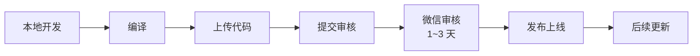

# 微信小程序编译与运行指南（零基础版）

| 属性 | 内容 |
|------|------|
| **文档编号** | CM-RUN-MP-001 |
| **文档名称** | 校园二手交易平台 · 微信小程序编译与运行指南（零基础版） |
| **版本** | v1.0 |
| **密级** | 内部公开 |
| **编制人** | 课程组（Trae IDE 协助） |
| **审核人** | 课程负责人 |
| **批准人** | 课程负责人 |
| **编制日期** | 2026-06-15 |
| **生效日期** | 2026-06-15 |
| **替代版本** | FF-RUN-MP-001 v1.0（家庭资产管理版本，已废止） |
| **适用代码** | `miniprogram/` |
| **配套后端** | `backend/`（Django + DRF） |
| **业务变更** | 从「家庭资产管理」转型为「校园二手交易（Campus Market）」 |

---

## 修订记录

| 版本 | 日期 | 修订说明 |
|------|------|----------|
| v1.0 | 2026-06-15 | 全新重写：业务从「家庭资产管理」改为「校园二手交易」，编号 FF-RUN-MP-001 → CM-RUN-MP-001；路径由 `code/miniprogram` + `code/family_finance` 改为根目录的 `miniprogram/` + `backend/`；5 tab 改为「首页 / 分类 / 发布 / 消息 / 我的」（原「记账 / 统计 / AI」改为商品业务页）；新增 AI 一键发布、自定义 tab-bar、5 tab 自定义导航、真机调试与发布上线等内容 |

---

## 目录

- [1. 你将完成什么](#1-你将完成什么)
- [2. 需要提前安装的软件](#2-需要提前安装的软件)
- [3. 先搞懂：小程序项目里有什么](#3-先搞懂小程序项目里有什么)
- [4. 第一步：启动后端 API（必做）](#4-第一步启动后端-api必做)
- [5. 第二步：安装微信开发者工具](#5-第二步安装微信开发者工具)
- [6. 第三步：导入本项目](#6-第三步导入本项目)
- [7. 第四步：本地设置（不勾会请求失败）](#7-第四步本地设置不勾会请求失败)
- [8. 第五步：编译与在模拟器运行](#8-第五步编译与在模拟器运行)
- [9. 第六步：登录并验证功能](#9-第六步登录并验证功能)
- [10. 开发者工具界面说明](#10-开发者工具界面说明)
- [11. 5 tab 自定义导航（Custom TabBar）](#11-5-tab-自定义导航custom-tabbar)
- [12. 真机预览 / 真机调试（可选）](#12-真机预览--真机调试可选)
- [13. 用调试器排查问题](#13-用调试器排查问题)
- [14. 修改代码后如何重新编译](#14-修改代码后如何重新编译)
- [15. 完整自检清单](#15-完整自检清单)
- [16. 常见问题与解决办法](#16-常见问题与解决办法)
- [17. 性能优化建议](#17-性能优化建议)
- [18. 真机调试与内网穿透](#18-真机调试与内网穿透)
- [19. 发布上线（提交审核）](#19-发布上线提交审核)
- [20. 关联文档](#20-关联文档)
- [附录 A：推荐日常开发流程（一句话版）](#附录-a推荐日常开发流程一句话版)
- [附录 B：project.config.json 关键字段说明](#附录-bprojectconfigjson-关键字段说明)
- [附录 C：常见错误速查表](#附录-c常见错误速查表)
- [附录 D：PowerShell 与 cmd 兼容命令速查](#附录-dpowershell-与-cmd-兼容命令速查)

---

## 1. 你将完成什么

按本指南操作后，你应能：

1. 在电脑上打开 **微信开发者工具**，导入根目录下的 `miniprogram/` 项目；
2. 点击 **编译**，在右侧 **模拟器** 里看到「**校园易物**」小程序的 5 tab 自定义导航界面（首页 / 分类 / 发布 / 消息 / 我的）；
3. 使用测试账号登录后，在首页看到 **瀑布流商品**、在发布页体验 **AI 一键发布**、在私聊页体验 **AI 议价话术**、在我的页看到 **信用分徽章**。

> **重要**：本小程序**不是单机版**，所有数据（商品、订单、消息、统计、AI 推理）都来自后端 `backend/` Django 接口。  
> **只开微信开发者工具、不启动后端**，登录会失败、首页会一直转圈、AI 按钮点击会报「服务暂不可用」。

> **业务变更提醒**：本项目已从「家庭资产管理（记账 / 预算 / 统计）」改造为「**校园二手交易平台（商品 / 订单 / 私聊 / 信用分 / AI 议价）**」，所有菜单与字段含义与旧版本不同，请以本指南为准。

---

## 2. 需要提前安装的软件

| 软件 | 用途 | 建议版本 / 说明 |
|------|------|-----------------|
| **Python** | 运行 Django 后端 | 3.11+（项目在 3.13 验证；安装时务必勾选 **Add Python to PATH**） |
| **MySQL** | 后端数据库 | 8.0+（课程默认 MySQL；不会配可改用 SQLite，见 §4.8） |
| **微信开发者工具** | 编辑、编译、模拟运行小程序 | 从 [微信开放文档 - 开发者工具](https://developers.weixin.qq.com/miniprogram/dev/devtools/download.html) 下载 **Windows 64 位稳定版** |
| **微信（手机端，可选）** | 真机预览扫码 | 仅模拟器调试可不装；真机预览必须装 |
| **Git（可选）** | 拉取项目最新代码 | 2.40+ |

> **本项目路径约定**（Windows 11 64 位）：
> - 项目根目录：`d:\文件\工作 作业\微信小程序实训\4次课程内容\综合实训\`
> - 后端代码：`d:\文件\工作 作业\微信小程序实训\4次课程内容\综合实训\backend\`
> - 小程序代码：`d:\文件\工作 作业\微信小程序实训\4次课程内容\综合实训\miniprogram\`
>
> 文档所有命令示例都基于此路径，**只需把 `d:\文件\工作 作业\微信小程序实训\4次课程内容\综合实训` 替换为你的实际项目根目录即可**，步骤不变。

**不需要**：公网服务器、域名备案、HTTPS 证书（本地课堂调试用本机 IP 即可）。

---

## 3. 先搞懂：小程序项目里有什么

### 3.1 项目根目录结构

```
D:\文件\工作 作业\微信小程序实训\4次课程内容\综合实训\
├── backend\            ← Django 后端（API + 数据库 + AI 能力）
├── miniprogram\        ← 微信小程序前端（导入工具时选这一层）
├── frontend-web\       ← 卖家 Web 工作台（端口 3000，Vue3 + TS）
├── frontend-admin\     ← 平台管理后台（端口 3001，Vue3 + JS）
├── docs\               ← 设计 / 评审 / 验收文档（14 份）
├── deploy\             ← 一键启停脚本（PowerShell）
└── scripts\            ← 初始化脚本（管理员账号 / 分类 / 演示数据）
```

### 3.2 miniprogram/ 内部结构

```
D:\...\miniprogram\
├── app.js              ← 全局入口，含 apiBase（后端地址）
├── app.json            ← 全局配置：页面列表、TabBar、窗口样式
├── app.wxss            ← 全局样式（含设计 Token：主色 #FF6B35 等）
├── project.config.json ← 微信工具项目配置（AppID 等）
├── sitemap.json
├── pages/              ← 各个页面
│   ├── login/          ← 登录（非 Tab）
│   ├── home/           ← 首页（Tab：瀑布流 + 搜索 + 轮播）
│   ├── category/       ← 分类（Tab：一级宫格 + 二级列表）
│   ├── publish/        ← 发布（Tab：表单 + AI 一键发布）
│   ├── messages/       ← 消息（Tab：会话列表 + 未读数）
│   ├── mine/           ← 我的（Tab：信用分 + 4 个子入口）
│   ├── detail/         ← 商品详情（9 图轮播 + 卖家卡 + 双 CTA）
│   ├── chat/           ← 会话列表（旧命名，保留兼容）
│   ├── chat-room/      ← 私聊页（文字 / 图片 / AI 议价）
│   ├── orders/         ← 订单（Tab 切换 + 状态机）
│   ├── stats/          ← 卖家统计（备用 / Web 端为主）
│   └── ai/             ← AI 助手（通用对话入口）
├── components/         ← 可复用组件
│   ├── product-card/   ← 商品卡（瀑布流项）
│   ├── credit-badge/   ← 信用分徽章（5 档配色）
│   ├── voice-input/    ← 语音输入（可选，依赖同声传译插件）
│   ├── skeleton-card/  ← 骨架屏
│   ├── empty-state/    ← 空状态
│   └── error-state/    ← 错误态
├── custom-tab-bar/     ← 5 tab 自定义导航（Custom TabBar）
├── utils/              ← 工具：request.js、api.js、sys.js
└── images/             ← 静态资源
```

### 3.3 四个文件一组（每个页面）

| 后缀 | 作用 | 类比 |
|------|------|------|
| `.wxml` | 页面结构 | HTML |
| `.wxss` | 页面样式 | CSS（支持 rpx 自适应单位） |
| `.js` | 页面逻辑 | JavaScript（Page 函数） |
| `.json` | 页面配置 | 单页小配置（标题 / 下拉刷新） |

### 3.4 与浏览器开发的核心区别

- 小程序运行在微信环境里，用 `wx.request` 发网络请求，不是 `fetch` / `axios`；
- 本地调试访问 `http://127.0.0.1` 必须在工具里 **关闭域名校验**（见 §7）；
- **5 tab 底部导航是自定义组件**（`custom-tab-bar/`），不是原生 `tabBar` —— 这样可以做：发布 tab 点击直接跳转 / 未读小红点 / 中心按钮突出等高级效果；
- 设计 Token 全部在 `app.wxss` 定义，**禁止**在页面 `.wxss` 中硬编码颜色或 rpx 值。

---

## 4. 第一步：启动后端 API（必做）

### 4.1 打开终端

1. 按 `Win + R`，输入 `powershell`，回车（Windows 11 默认 PowerShell 5.1+；不推荐 `cmd`）。
2. 进入后端目录（**注意 PowerShell 不支持 `&&`，分两行写**）：

```powershell
cd "d:\文件\工作 作业\微信小程序实训\4次课程内容\综合实训\backend"
```

> PowerShell 下进入带空格的路径必须用 **英文双引号** 包裹。

### 4.2 首次运行：创建虚拟环境并安装依赖

```powershell
python -m venv venv
.\venv\Scripts\Activate.ps1
python -m pip install --upgrade pip
pip install -r requirements.txt
```

> 看到命令行前缀出现 `(venv)` 即表示激活成功。  
> **若报红字「禁止运行脚本」**：用管理员打开 PowerShell，执行 `Set-ExecutionPolicy -Scope CurrentUser -ExecutionPolicy RemoteSigned`，再重新激活。

### 4.3 配置数据库（MySQL）

```powershell
copy .env.example .env
```

用记事本（或 VS Code）打开 `.env`，**至少** 修改以下几行：

```ini
DJANGO_SECRET_KEY=随便改一个长字符串-django-insecure-xxxxx
DJANGO_DEBUG=True
DB_ENGINE=mysql
DB_NAME=campus_market
DB_USER=root
DB_PASSWORD=你的MySQL密码
DB_HOST=127.0.0.1
DB_PORT=3306

# JWT 配置
JWT_ACCESS_TOKEN_LIFETIME_MINUTES=30
JWT_REFRESH_TOKEN_LIFETIME_DAYS=7

# AI 配置（无 Key 时全部走 mock 降级，不影响主流程）
LLM_API_KEY=
LLM_BASE_URL=https://api.openai.com/v1
LLM_MODEL=gpt-4o-mini
```

### 4.4 创建数据库并初始化表

**MySQL 8.0+ 默认 caching_sha2_password**，MySQL 客户端连接命令：

```powershell
# 进入 MySQL（路径以实际为准）
& "C:\Program Files\MySQL\MySQL Server 9.4\bin\mysql.exe" -u root -p
# 输入密码后，在 MySQL 提示符下：
CREATE DATABASE campus_market CHARACTER SET utf8mb4 COLLATE utf8mb4_unicode_ci;
CREATE USER 'campus'@'localhost' IDENTIFIED BY 'tyb1124';
GRANT ALL ON campus_market.* TO 'campus'@'localhost';
FLUSH PRIVILEGES;
EXIT;
```

或者直接用 root 账号（修改 `.env` 中 `DB_USER=root`、`DB_PASSWORD=tyb1124`），跳过新建用户步骤。

**执行迁移与初始化数据**：

```powershell
python manage.py makemigrations market
python manage.py migrate
python ..\scripts\init_data_market.py
```

> `init_data_market.py` 会创建：管理员账号 / 12 张表的演示数据 / 30+ 商品图 / 9 个一级分类与 12 个二级分类。  
> **执行完毕后默认账号**：
>
> | 角色 | 用户名 | 密码 | 说明 |
> |------|--------|------|------|
> | 平台管理员 | `admin` | `admin123` | 登录管理后台 |
> | 卖家测试 | `seller01` | `123456` | 登录卖家 Web 工作台 |
> | 卖家测试 | `seller02` | `123456` | 备用 |
> | 买家测试 | `buyer01` | `123456` | 登录小程序 |
> | 买家测试 | `buyer02` | `123456` | 备用 |

### 4.5 启动后端服务

```powershell
python manage.py runserver 0.0.0.0:8000
```

**保持此窗口不要关闭**。看到类似输出：

```text
Watching for file changes with StatReloader
Starting development server at http://0.0.0.0:8000/
Quit the server with CTRL-BREAK.
```

### 4.6 验证后端

打开浏览器，访问 [http://127.0.0.1:8000/api/health/](http://127.0.0.1:8000/api/health/)。

**期望返回**：

```json
{
  "code": 0,
  "message": "ok",
  "data": {
    "status": "healthy",
    "version": "1.0.0",
    "ai_enabled": false,
    "database": "ok"
  }
}
```

> `ai_enabled: false` 表示未配置 LLM Key，所有 AI 端点会走 mock 降级，**不会影响主流程**。

### 4.7 验证 AI mock 降级

打开浏览器，访问：

```
http://127.0.0.1:8000/api/ai/price-suggest/?category=教材书籍&condition=9成新&title=高等数学
```

**期望返回**（mock 降级数据）：

```json
{
  "code": 0,
  "message": "ok",
  "data": {
    "price_range": [10, 35],
    "median": 22,
    "reasoning": "基于 9 成新教材的同类商品历史成交价估算",
    "is_mock": true
  }
}
```

> `is_mock: true` 即「降级返回」，代表无 LLM Key；正式接入 Key 后此字段会变 `false`。

### 4.8 改用 SQLite（可选）

若本机未装 MySQL，修改 `.env`：

```ini
DB_ENGINE=sqlite
```

然后重新执行：

```powershell
python manage.py migrate
python ..\scripts\init_data_market.py
python manage.py runserver 0.0.0.0:8000
```

> **注意**：SQLite 不支持并发写，**仅适合本地开发**；联调 / 演示 / 答辩请用 MySQL。

### 4.9 一键脚本（推荐）

在 `deploy/` 下有封装好的 PowerShell 脚本，可直接调用：

```powershell
# 启动后端
.\deploy\start_backend.ps1
# 启动前端 Web 工作台（卖家）
.\deploy\start_frontend_web.ps1
# 启动管理后台
.\deploy\start_frontend_admin.ps1
# 全部启动
.\deploy\start_all.ps1
# 全部停止
.\deploy\stop_all.ps1
# 重启全部
.\deploy\restart_all.ps1
```

更多问题见 [《CM-API-SVC-001 后端服务功能说明书》](file:///d:/文件/工作 作业/微信小程序实训/4次课程内容/综合实训/docs/07_后端服务功能说明书.md)。

---

## 5. 第二步：安装微信开发者工具

### 5.1 下载与安装

1. 打开 [https://developers.weixin.qq.com/miniprogram/dev/devtools/download.html](https://developers.weixin.qq.com/miniprogram/dev/devtools/download.html)
2. 下载 **Windows 64 位 稳定版 Stable Build**（不要用预发布版）
3. 双击安装包，一路「下一步」完成安装

### 5.2 首次启动登录

1. 打开 **微信开发者工具**
2. 使用微信扫码登录（**需能登录微信的账号**）
3. 若提示同意协议，勾选并确认

### 5.3 关于 AppID

| 方式 | 操作 | 适用场景 |
|------|------|----------|
| **测试号** | 点「使用测试号」 | 课堂最快上手、不写正式 AppID |
| **游客模式** | 部分版本在测试号旁 | 功能受限，仅本地体验 |
| **正式 AppID** | 填你在公众平台注册的小小程序 ID | 需该 AppID 绑定当前登录微信；语音插件更完整 |

> 本项目 `project.config.json` 中**已留空 AppID**，导入时请用「测试号」即可，**绝大多数功能可正常调试**。

---

## 6. 第三步：导入本项目

### 6.1 打开导入界面

1. 启动微信开发者工具
2. 点击 **「+」** 或 **「导入项目」**

### 6.2 逐项填写

| 表单项 | 填写内容 | 说明 |
|--------|----------|------|
| **项目类型** | 小程序 | 左侧选「小程序」 |
| **项目名称** | `校园易物` 或 `miniprogram` | 仅显示名，随意 |
| **目录** | `d:\文件\工作 作业\微信小程序实训\4次课程内容\综合实训\miniprogram` | 必须选到含 `app.json` 的文件夹；点右侧文件夹图标浏览 |
| **AppID** | 「测试号」 | 三选一（见 §5.3） |
| **后端服务** | **不使用云服务** | 本项目用自建 Django，不用微信云开发 |
| **开发模式** | 小程序 | 默认即可 |

### 6.3 点击「创建」

成功后进入主界面：左侧文件树、中间编辑器、右侧模拟器、底部调试器。

### 6.4 确认 `apiBase`（模拟器默认）

打开 `miniprogram/app.js`，确认：

```javascript
apiBase: 'http://127.0.0.1:8000/api',
```

**注意**：
- 末尾 **不要** 多写一层路径错误；推荐 **无尾部斜杠**（与 `utils/request.js` 拼接 `/auth/login/` 一致）
- 若你改成了 `http://127.168.31.103:8443/api`（带斜杠），一般也能工作，但请保持与后端端口 `8000` 一致
- **真机调试**时必须改成电脑局域网 IP（见 §12）

保存文件：`Ctrl + S`。

---

## 7. 第四步：本地设置（不勾会请求失败）

本地后端是 `http://127.0.0.1`，微信默认会校验「合法域名」，**必须关闭校验才能联调**。

### 7.1 操作步骤

1. 点击工具右上角 **「详情」**（或工具栏「详情」按钮）
2. 切换到 **「本地设置」** 标签
3. **勾选**：
   - **不校验合法域名、web-view（业务域名）、TLS 版本以及 HTTPS 证书**
4. 若还有 **「不校验安全域名」** / **「启用调试」**，一并勾选
5. 关闭详情面板

### 7.2 建议同时开启

| 选项 | 建议 |
|------|------|
| 将 JS 编译成 ES5 | 可开（兼容旧基础库） |
| 增强编译 | 按默认即可 |
| 上传代码时样式自动补全 | 与本地运行无关 |

> `project.config.json` 中已有 `"urlCheck": false`，但**以界面勾选为准**。

---

## 8. 第五步：编译与在模拟器运行

### 8.1 什么是「编译」

微信开发者工具会把 `.wxml`、`.wxss`、`.js` 等编译成可在模拟器 / 真机运行的代码。  
**改代码后**需要重新编译（多数情况保存后自动编译）。

### 8.2 手动编译

1. 点击工具栏 **「编译」** 按钮（或快捷键 `Ctrl + B`）
2. 顶部编译模式下拉选 **「普通编译」** 即可
3. 观察右侧 **模拟器**：
   - 首次可能进入 **登录页**（若本地存有 token 可能直接进首页）
   - 底部 5 tab 自定义导航应出现「首页 / 分类 / 发布 / 消息 / 我的」

### 8.3 编译成功标志

- 模拟器出现蓝色导航栏标题 **「校园易物」** 或 Tab 页
- 底部 5 tab 自定义导航（**中间「发布」按钮是圆形凸起**，其他 4 个为文字 + 图标）
- 控制台 **无红色致命错误**（见 §13）

### 8.4 编译失败时

| 现象 | 处理 |
|------|------|
| 提示 AppID 无效 | 改用「测试号」或换绑定的微信登录 |
| 提示插件未授权 | 暂忽略语音功能，或换正式 AppID 并在公众平台添加插件 |
| 某页面路径不存在 | 检查 `app.json` 的 `pages` 列表与文件夹名是否一致 |

---

## 9. 第六步：登录并验证功能

### 9.1 进入登录页

若不在登录页：

1. 模拟器底部点 **「我的」** Tab
2. 若未登录，页面应有「请先登录」入口
3. **更简单**：清除缓存后重新编译（§15.3）

### 9.2 登录

1. 账号：`buyer01`
2. 密码：`123456`
3. 点击 **登录** 按钮
4. 成功后会自动跳到 **首页** Tab

### 9.3 5 tab 逐项点一点（验证联调）

| Tab | 期望结果 |
|-----|----------|
| **首页** | 看到 2 列瀑布流商品 + 顶部搜索框 + 顶部轮播 + 「我想要」按钮 |
| **分类** | 左侧一级宫格，右侧二级列表，点击进入对应分类商品 |
| **发布** | 表单页 + 「AI 一键发布」按钮 + 图片选择器 |
| **消息** | 会话列表 + 未读数小红点（首次登录可能为空） |
| **我的** | 顶部信用分徽章（buyer01 默认 80 分，绿色）+ 4 个子入口（我的发布 / 我买到的 / 我的收藏 / 校园认证） |

### 9.4 详情页 / 私聊 / 订单（验证跳转）

| 操作 | 期望结果 |
|------|----------|
| 点击首页商品卡 | 进入详情页，9 图轮播 + 卖家卡 + 「私聊」「我想要」双 CTA |
| 点击「私聊」 | 进入 chat-room 页，与卖家空白对话（首次） |
| 点击「我想要」 | 弹窗填写交易方式，下单成功跳到订单页 |
| 进入「我的」→ 我买到的 | 看到刚下的订单，状态为「待确认」 |
| 切到 seller01 账号（Web 工作台） | 看到这条订单，可点「确认」 |

> 任一页面出现 `request:fail` → 回到 §7、§4 检查后端与域名校验。

---

## 10. 开发者工具界面说明

```
┌─────────────────────────────────────────────────────────────┐
│  菜单栏  模拟器  编辑器  调试器  可视化  云开发  …  详情 上传  │
├──────────┬──────────────────────────────┬───────────────────┤
│          │                              │                   │
│  资源    │        代码编辑器             │    模拟器          │
│  管理器  │     （如 app.js）             │  （手机预览）      │
│  文件树  │                              │                   │
│          │                              │   5 tab 自定义    │
│          │                              │   导航在底部      │
│          ├──────────────────────────────┼───────────────────┤
│          │  调试器：Console | Network | Storage | AppData  │
└──────────┴──────────────────────────────┴───────────────────┘
```

| 区域 / 按钮 | 作用 |
|-------------|------|
| **资源管理器** | 浏览、双击打开 `pages`、`components`、`utils` 等文件 |
| **模拟器** | 用鼠标点击代替手机触摸；可切换机型（iPhone 14 / 华为 P40 等） |
| **编译** | 重新构建并刷新模拟器（`Ctrl + B`） |
| **预览** | 生成二维码，手机微信扫码真机预览 |
| **真机调试** | 手机运行并连上调试器（带 vConsole） |
| **清缓存** | 清除数据、文件、登录态等（**排错常用**） |
| **上传** | 上传代码到微信后台（发布用，课堂可不用） |
| **详情** | AppID、本地设置、域名、项目配置 |

---

## 11. 5 tab 自定义导航（Custom TabBar）

> **业务变更重点**：旧版本用微信原生 `tabBar`；本项目为支持「**中心发布按钮圆形凸起**」和「**未读小红点**」等高级效果，**改用自定义 tab-bar**（`miniprogram/custom-tab-bar/`），并配合 `app.json` 中的 `"custom": true` 配置。

### 11.1 启用方式

`app.json` 中：

```json
{
  "tabBar": {
    "custom": true,
    "color": "#999999",
    "selectedColor": "#FF6B35",
    "backgroundColor": "#FFFFFF",
    "borderStyle": "white",
    "list": [
      { "pagePath": "pages/index/index",     "text": "首页" },
      { "pagePath": "pages/category/category", "text": "分类" },
      { "pagePath": "pages/publish/publish",   "text": "发布" },
      { "pagePath": "pages/messages/messages", "text": "消息" },
      { "pagePath": "pages/mine/mine",     "text": "我的" }
    ]
  }
}
```

### 11.2 自定义组件结构

```
custom-tab-bar/
├── index.js     ← 组件逻辑
├── index.json   ← 组件配置
├── index.wxml   ← 模板
└── index.wxss   ← 样式（含中心凸起按钮）
```

### 11.3 未读数小红点

通过 `getApp().globalData.unreadCount` 全局变量 + 事件总线 `EventBus` 通信：

```javascript
// 在 chat-room 发消息成功后
const app = getApp()
app.globalData.unreadCount = (app.globalData.unreadCount || 0) + 1
wx.setStorageSync('unreadCount', app.globalData.unreadCount)
```

### 11.4 设计 Token

所有颜色 / 字号 / 圆角 / 阴影**必须**引用 `app.wxss` 中的设计 Token，**禁止硬编码**：

| Token | 值 | 用途 |
|-------|-----|------|
| `--color-primary` | `#FF6B35` | 选中色 |
| `--color-text-tertiary` | `#999999` | 未选中色 |
| `--color-bg-card` | `#FFFFFF` | 背景 |
| `--space-4` | `32rpx` | tab-bar 高度 |
| `--radius-full` | `9999rpx` | 中心按钮圆形 |
| `--shadow-lg` | `0 8rpx 24rpx rgba(0,0,0,0.12)` | 中心按钮阴影 |

---

## 12. 真机预览 / 真机调试（可选）

### 12.1 为什么模拟器能连、手机不能？

- 模拟器里的 `127.0.0.1` = **你的电脑**
- 手机上的 `127.0.0.1` = **手机自己**，访问不到电脑后端

真机必须把 `apiBase` 改成 **电脑的局域网 IP**。

### 12.2 查电脑 IP

```powershell
ipconfig
```

找到当前 WiFi 的 **IPv4 地址**，例如 `192.168.1.100`。

### 12.3 修改 app.js

```javascript
apiBase: 'http://192.168.1.100:8000/api',  // 改成你的 IPv4
```

保存后点击 **编译**。

### 12.4 手机与电脑同一 WiFi

1. 后端仍为：`python manage.py runserver 0.0.0.0:8000`
2. 开发者工具仍勾选 **不校验合法域名**
3. 点击 **预览** 或 **真机调试**，微信扫码
4. 若连不上，在 **Windows Defender 防火墙** 中允许 Python 或端口 **8000** 入站：
   ```powershell
   New-NetFirewallRule -DisplayName "Django 8000" -Direction Inbound -LocalPort 8000 -Protocol TCP -Action Allow
   ```

### 12.5 真机调试额外说明

- **预览**：只看界面效果，调试信息较少
- **真机调试**：可看 Console、Network、Storage，**适合查手机上的接口错误**

### 12.6 后端报 `DisallowedHost`

手机用 `http://192.168.20.40:8000/api/...` 访问时，Django 会校验请求头里的 `Host`。若未放行该 IP，终端出现：

```text
Invalid HTTP_HOST header: '192.168.20.40:8000'. You may need to add '192.168.20.40' to ALLOWED_HOSTS.
```

**常见误区**：`.env` 里写 `ALLOWED_HOSTS=...,192.168.0.0/16` **不起作用**（Django 不支持 CIDR，只当普通字符串）。

**处理**：保持 `DJANGO_DEBUG=True`，重启后端（项目已在 DEBUG 下使用 `ALLOWED_HOSTS=*`）；或把电脑 IP 写明：`ALLOWED_HOSTS=127.0.0.1,localhost,192.168.20.40`。

---

## 13. 用调试器排查问题

### 13.1 Console（控制台）

1. 点击底部 **「调试器」**
2. 选 **Console**
3. **红色报错**重点看：
   - `request:fail` → 网络 / 域名 / 后端未启动
   - `401` → 未登录或 token 过期，重新登录
   - `403` → 权限不足（校园认证 / 信用分低）
   - `500` → 后端异常，看 Terminal 栈信息

### 13.2 Network（网络）

1. 选 **Network**
2. 在模拟器里再操作一次「登录」
3. 应看到请求：`http://127.0.0.1:8000/api/auth/login/`
4. 点开查看 **Status**：
   - `200` 成功
   - `201` 创建成功
   - `400` 参数错误
   - `401` 未登录
   - `403` 权限不足
   - `500` 服务端异常

### 13.3 Storage（存储）

查看 `token`、`userInfo` 是否写入（登录成功后应有）。

> **小技巧**：登录后用 `wx.getStorageSync('token')` 应能取到一串长 JWT（**模拟器 Console 里直接 `wx.getStorageSync('token')` 就能看**）。

### 13.4 AppData

查看当前页面 `data` 变量，理解 WXML 绑定的数据从哪来。

### 13.5 Wxml

查看真实渲染的 WXML 结构，排查「数据有但页面没显示」类问题。

---

## 14. 修改代码后如何重新编译

| 你修改了 | 建议操作 |
|----------|----------|
| 任意 `.js` / `.wxml` / `.wxss` | 保存（`Ctrl + S`），一般自动编译；无反应则点 **编译** |
| `app.json`（增删页面、改 Tab） | 保存后点 **编译**；偶需 **清缓存 → 编译** |
| `app.js` 的 `apiBase` | 保存 → **编译**；真机需重新 **预览** 扫码 |
| `project.config.json` | 保存 → **重新编译** 或重启开发者工具 |
| `custom-tab-bar/` 下任何文件 | 保存 → 编译（**热更新可能不生效，必须手动编译**） |
| `utils/request.js`（拦截器） | 保存 → 编译；401 跳登录逻辑可能因缓存需清缓存 |

---

## 15. 完整自检清单

打印或复制到笔记，逐项打勾：

### 15.1 环境

- [ ] Python 3.11+ 已安装且加入 PATH
- [ ] MySQL 8.0+ 已安装（或选择 SQLite）
- [ ] 微信开发者工具已安装并扫码登录

### 15.2 后端

- [ ] `cd backend` 且 `(venv)` 已激活
- [ ] `.env` 数据库 / JWT / LLM 配置正确
- [ ] `makemigrations market` + `migrate` 已执行
- [ ] `..\scripts\init_data_market.py` 已执行（管理员 + 分类 + 演示商品）
- [ ] `runserver 0.0.0.0:8000` 正在运行
- [ ] 浏览器 [http://127.0.0.1:8000/api/health/](http://127.0.0.1:8000/api/health/) 返回 `code: 0`
- [ ] AI mock 端点（`/api/ai/price-suggest/`）返回 `is_mock: true`

### 15.3 小程序工具

- [ ] 导入目录为 `...\miniprogram`（含 `app.json`）
- [ ] 后端服务选 **不使用云服务**
- [ ] **详情 → 本地设置** 已勾选不校验合法域名
- [ ] `app.js` 中 `apiBase` 端口为 `8000`
- [ ] 模拟器底部出现 5 tab 自定义导航

### 15.4 运行

- [ ] 点击编译，模拟器正常显示
- [ ] `buyer01` / `123456` 登录成功
- [ ] 首页能看到瀑布流商品
- [ ] Network 中能看到 `/api/products/` 请求且状态 200
- [ ] 发布页点 AI 一键发布能弹出预填表单（mock 降级）
- [ ] 私聊页点 AI 议价能收到回复（mock 降级）

---

## 16. 常见问题与解决办法

### 16.1 request:fail / 网络请求失败

| 检查项 | 处理 |
|--------|------|
| 后端未启动 | 重新 `runserver 0.0.0.0:8000` |
| 域名校验 | §7 勾选不校验合法域名 |
| apiBase 错误 | 确认为 `http://127.0.0.1:8000/api`（模拟器） |
| 防火墙 | 真机时放行 8000 端口 |
| 端口被占用 | 换端口或关闭占用 8000 的程序 |

### 16.2 登录失败 / health 接口 401（Unauthorized）

**现象**：Console 反复出现 `GET http://127.0.0.1:8000/api/health/ 401`，登录也失败。

**原因**：本地 `Storage` 里存了**过期的 JWT**，`request.js` 会给每个请求带上 `Authorization: Bearer xxx`。后端校验失败即返回 401（即使 health 接口本身允许匿名）。

**处理**：

1. 开发者工具 → **清缓存** → 勾选 **清除数据缓存** → 编译
2. 或重新进入登录页（项目已在登录页 `onLoad` 时自动 `clearSession`）
3. 确认 `utils/request.js` 中 `health` / `login` / `register` 使用 `skipAuth: true`（仓库已修复）

**密码错误**时 401 的提示文案为「用户名或密码错误」，与上述「过期 token」不同。

- 确认用户名密码：`buyer01` / `123456`
- Token 约 30 分钟过期：重新登录即可

### 16.3 一直停在旧页面 / 登录态异常

1. 工具栏 **清缓存** → 勾选 **清除数据缓存**、**清除文件缓存**（按需全选）
2. 点击 **编译**
3. 重新登录

### 16.4 模拟器空白或 Tab 不显示

- 检查 `app.json` 是否被改坏（对比仓库原版）
- 看 Console 红色报错首行
- 尝试：清缓存 → 编译
- 检查 `custom-tab-bar/index.json` 是否正确注册

### 16.5 模拟器启动失败：插件未授权

**现象**：编译日志显示「编译所有文件完成」，但模拟器白屏：

```text
模拟器启动失败
Error: provider:wx069ba97219f66d99, version:0.3.5, 插件未授权使用
```

**原因**：`wx069ba97219f66d99` 是微信「同声传译」插件。在 `app.json` 里声明了 `plugins`，但当前 AppID 未在公众平台添加该插件，或登录开发者工具的微信不是该小程序开发者。

**处理（三选一）**：

| 方案 | 操作 |
|------|------|
| **A. 先跑通项目（推荐）** | 保持仓库默认：`app.json` **不含** `plugins` → 重新编译 |
| **B. 开通语音** | 在公众平台添加插件，恢复 `plugins` 字段 |
| **C. 换 AppID** | 导入时使用已在公众平台添加插件的正式小程序 AppID |

> **说明**：编译成功 ≠ 模拟器能启动；插件在校验阶段就会拦截启动。

### 16.6 底部调试器显示 2 errors、1 warning

1. 打开 **Console** 看具体报错文字
2. 若是插件或权限类警告，不影响业务时可暂时忽略
3. 若是 `pages/xxx` not found，检查路径与 `app.json` 是否一致

### 16.7 MySQL 连接失败（后端起不来）

**症状**：`django.db.utils.OperationalError: (2002, "Can't connect to MySQL server on '127.0.0.1' (10061)")`

| 检查 | 处理 |
|------|------|
| MySQL 服务启动 | `net start mysql` 或在服务管理器启动 |
| 端口 | MySQL 默认 3306，`.env` 中 `DB_PORT=3306` |
| 密码 | `.env` 中 `DB_PASSWORD` 与 MySQL root 密码一致 |
| 用户权限 | `GRANT ALL ON campus_market.* TO 'root'@'localhost';` |
| 字符集 | 库必须 `utf8mb4` |
| 替代 | 改用 SQLite 见 §4.8 |

### 16.8 Console 里 SharedArrayBuffer / HarmonyOS / 基础库灰度提示

均为**微信开发者工具或基础库的公告**，与业务代码无关，**可忽略**。

若伴随异常，可在 **详情 → 本地设置 → 调试基础库** 改为稳定版（如 `3.5.5` 或 `2.33.0`），勿用灰度中的 `3.16.0`。

### 16.9 `Error: timeout`（无 401、无 request:fail 详情）

| 情况 | 处理 |
|------|------|
| 登录页黄色提示「连接后端超时」 | 本机未启动 Django，或 MySQL 卡住；先浏览器打开 http://127.0.0.1:8000/api/health/ |
| 仅 Console 一行 `Error: timeout` 且无红色 request | 多为**工具内部**超时（热重载、基础库灰度），若登录成功可忽略 |
| Network 里 health 一直 pending 后失败 | 检查防火墙、确认 `apiBase` 为 `http://127.0.0.1:8000/api` |

### 16.10 改了代码模拟器没变化

- 确认已 **保存** 文件
- 点击 **编译**
- **清缓存** 后再编译

### 16.11 AI 端点返回「服务暂不可用」

| 检查 | 处理 |
|------|------|
| `.env` 中 `LLM_API_KEY` | 留空 = 走 mock，应正常返回 |
| `LLM_BASE_URL` | OpenAI 兼容协议默认 `https://api.openai.com/v1` |
| 后端 Terminal 日志 | 看 `ai_service.py` 是否抛异常 |
| 单元端点 | 单独测 `/api/ai/health/` 应返回 ok |

> 课堂演示建议**不配 Key**，全走 mock 即可，避免外网依赖。

### 16.12 自定义 tab-bar 不显示 / 点击无反应

| 检查 | 处理 |
|------|------|
| `app.json` 中 `"custom": true` | 缺此字段会回退到原生 tabBar |
| `custom-tab-bar/index.json` | 必须有 `"component": true` |
| `custom-tab-bar/index.js` | 必须在每个 tab 页 `onShow` 调用 `this.getTabBar().setData({ selected: N })` |
| 跳转逻辑 | `wx.switchTab` 只能跳 tabBar 页面；其他用 `wx.navigateTo` |

### 16.13 商品图 404 / 加载慢

**现象**：详情页图片不显示或加载很久。

**原因**：开发期 `media/products/*.jpg` 路径不对。

**处理**：
1. 确认 `backend/media/products/` 下有图片（`scripts/download_product_images.py` 自动下载）
2. 后端 `settings.py` 中 `MEDIA_URL='/media/'`、`MEDIA_ROOT=BASE_DIR/'media'`
3. 开发期 `urls.py` 已挂载 `static(MEDIA_URL, document_root=MEDIA_ROOT)`
4. 生产环境必须用 Nginx 转发 `/media/`

---

## 17. 性能优化建议

### 17.1 启动性能

- **首屏数据** 在 `onLoad` 中并行请求（`Promise.all`）
- **登录态** 在 `app.js` 的 `onLaunch` 同步恢复（`wx.getStorageSync` 同步）
- **分包加载**：把 `pages/stats/`、`pages/ai/` 等不常用页放入分包
  ```json
  // app.json
  "subPackages": [{
    "root": "packageAux",
    "pages": ["pages/stats/stats", "pages/ai/ai"]
  }]
  ```

### 17.2 渲染性能

- **长列表**（> 50 项）必须用 `recycle-view` 或「分页 + 虚拟列表」，不要直接 `wx:for` 渲染全部
- **setData** 单次数据 ≤ 256KB；分页请求后增量 `setData`
- **图片懒加载**：`<image lazy-load="true" />`
- **避免在 `onShow`** 做重活（每次切回都跑）

### 17.3 网络性能

- **请求合并**：多个 `wx.request` 改成 `Promise.all` 并发
- **缓存策略**：商品列表 / 分类树用 `wx.setStorageSync` 缓存 5 分钟
- **图片压缩**：上传前 `wx.compressImage` 压到 ≤ 500KB

### 17.4 包体积

- 主包 ≤ 2MB，总包 ≤ 20MB
- 图片放 CDN（`backend/media/`）而非本地
- 定期用「代码依赖分析」清理无用 npm 包（如有）

---

## 18. 真机调试与内网穿透

### 18.1 局域网方案（课堂首选）

- 手机和电脑连同一 WiFi
- `apiBase` 改为电脑局域网 IP（如 `192.168.1.100:8000`）
- Windows 防火墙放行 8000

### 18.2 内网穿透方案（不在同一局域网）

**场景**：演示 / 答辩时手机和电脑不在同一 WiFi，或需要给评委扫码看效果。

#### 18.2.1 ngrok（推荐）

```powershell
# 下载：https://ngrok.com/download
# 解压到任意目录，在该目录执行：
ngrok config add-authtoken 你的Token
ngrok http 8000
```

会得到一个公网地址，类似 `https://xxxx-xxx-xxx-xxx-xxx.ngrok-free.app`，把 `apiBase` 改成：

```javascript
apiBase: 'https://xxxx-xxx-xxx-xxx-xxx.ngrok-free.app/api',
```

**注意**：ngrok 免费版每次重启地址会变。

#### 18.2.2 cpolar / frp / 花生壳

类似方案，国内访问速度可能更好，免费版有带宽限制。

#### 18.2.3 微信小程序对内网穿透的限制

- 域名必须 HTTPS（ngrok / cpolar 默认提供）
- 后端 CORS / ALLOWED_HOSTS 需放行该域名
- **不校验合法域名** 仍需勾选

---

## 19. 发布上线（提交审核）

> **重要**：v1.0 课程交付**不需要**真正发布上线，但答辩评委可能问流程，故此节作为知识储备。

### 19.1 流程概览



### 19.2 详细步骤

1. **正式 AppID 注册**：[微信公众平台](https://mp.weixin.qq.com) 注册「小程序」账号，实名认证
2. **完善小程序信息**：名称、图标、简介、类目（选「工具 / 二手闲置」）
3. **后端部署到公网**：
   - 阿里云 / 腾讯云 ECS
   - 域名备案 + HTTPS 证书（Let's Encrypt 免费）
   - `waitress-serve` 或 `gunicorn` 启动后端
   - Nginx 反向代理 + 静态文件
4. **配置业务域名**：公众平台 → 开发管理 → 开发设置 → 添加「request 合法域名」（公网 HTTPS）
5. **关闭「不校验合法域名」**（生产环境**必须关闭**）
6. **上传代码**：开发者工具 → 上传 → 填版本号（如 `1.0.0`）→ 上传
7. **提交审核**：公众平台 → 版本管理 → 找到刚上传的版本 → 提交审核
8. **审核通过 → 发布**：可选「全量发布」或「灰度发布」

### 19.3 常见审核被拒原因

| 原因 | 解决方案 |
|------|----------|
| 类目不符 | 选「工具 → 二手闲置」或「电商 → 二手」 |
| 测试账号 | 审核期间提供可登录的测试账号 + 密码 |
| 功能不完整 | 确保审核员能走通核心流程（注册→发布→下单） |
| 涉及虚拟支付 | v1.0 仅「交易方式枚举 + 备注」，**不接真实支付** |
| 校园认证截图 | 提供「学号仅用于实名展示」说明 |

### 19.4 灰度发布

公众平台支持按「用户白名单」灰度，先给 10% 用户试运行，无重大问题再全量。

---

## 20. 关联文档

| 文档 | 路径 |
|------|------|
| 三端启动总览 | [README.md](file:///d:/文件/工作 作业/微信小程序实训/4次课程内容/综合实训/README.md) |
| 后端服务功能说明书 | [CM-API-SVC-001](file:///d:/文件/工作 作业/微信小程序实训/4次课程内容/综合实训/docs/07_后端服务功能说明书.md) |
| 接口设计说明书 | [CM-API-001](file:///d:/文件/工作 作业/微信小程序实训/4次课程内容/综合实训/docs/08_接口设计说明书.md) |
| 微信小程序功能说明书 | [CM-MP-001](file:///d:/文件/工作 作业/微信小程序实训/4次课程内容/综合实训/docs/05_微信小程序功能说明书.md) |
| 详细设计说明书（小程序章节） | [CM-LLD-001](file:///d:/文件/工作 作业/微信小程序实训/4次课程内容/综合实训/docs/03_详细设计说明书.md) |
| UI 与交互设计规范 | [CM-UI-001](file:///d:/文件/工作 作业/微信小程序实训/4次课程内容/综合实训/docs/10_UI与交互设计规范.md) |
| 设计 Token 文档 | [design-tokens.md](file:///d:/文件/工作 作业/微信小程序实训/4次课程内容/综合实训/docs/superpowers/specs/2026-06-06-design-tokens.md) |
| 部署说明 | [部署说明.md](file:///d:/文件/工作 作业/微信小程序实训/4次课程内容/综合实训/docs/部署说明.md) |
| 联调检查清单 | [联调检查清单.md](file:///d:/文件/工作 作业/微信小程序实训/4次课程内容/综合实训/docs/联调检查清单.md) |
| 实验指导书 | [实验指导书.md](file:///d:/文件/工作 作业/微信小程序实训/4次课程内容/综合实训/docs/实验指导书.md) |
| 需求追溯矩阵 | [CM-RTM-001](file:///d:/文件/工作 作业/微信小程序实训/4次课程内容/综合实训/docs/14_需求追溯矩阵.md) |

---

## 附录 A：推荐日常开发流程（一句话版）

```text
1. 开 PowerShell → cd backend → activate venv → runserver 0.0.0.0:8000
2. 开微信开发者工具 → 打开 miniprogram 项目
3. 确认已勾选「不校验合法域名」
4. 点「编译」→ 模拟器登录 buyer01 / 123456 → 开发调试
5. 改代码 → Ctrl+S → 自动/手动编译 → Console/Network 排错
6. 真机：改 apiBase 为电脑 IP → 编译 → 预览扫码
```

---

## 附录 B：project.config.json 关键字段说明

| 字段 | 含义 |
|------|------|
| `appid` | 小程序 AppID，与导入时一致（测试号时为 `touristappid`） |
| `compileType` | `miniprogram` 表示小程序（非小游戏 / 插件） |
| `setting.urlCheck` | `false` 表示不校验 URL（**仍须在界面勾选本地设置**） |
| `libVersion` | 基础库版本，建议 `3.5.5` 或 `2.33.0` 稳定版 |
| `miniprogramRoot` | 小程序代码根目录，默认 `./` |
| `es6` | 是否启用 ES6 转 ES5，建议 `true` |
| `enhance` | 是否启用增强编译（async/await 支持） |
| `postcss` | WXSS 兼容性处理 |
| `checkInvalidKey` | 检查无效 key（key 名拼错），建议 `true` |
| `checkSiteMap` | 检查 sitemap，建议 `true` |

**完整示例**（`miniprogram/project.config.json`）：

```json
{
  "miniprogramRoot": "./",
  "projectname": "miniprogram",
  "appid": "touristappid",
  "setting": {
    "urlCheck": false,
    "es6": true,
    "enhance": true,
    "postcss": true,
    "checkInvalidKey": true,
    "checkSiteMap": true,
    "minified": true
  },
  "compileType": "miniprogram",
  "libVersion": "3.5.5"
}
```

---

## 附录 C：常见错误速查表

| 错误现象 | 可能原因 | 解决方法 |
|----------|----------|----------|
| `request:fail` | 后端未启动 / 域名校验 / apiBase 错 | §7 §4 §16.1 |
| `401 Unauthorized` | token 过期 | §16.2 清缓存重登 |
| `403 Forbidden` | 未校园认证 / 信用分低 | 去「我的」完成认证 |
| `404 Not Found` | 路径错误 | 对照 `docs/08_接口设计说明书.md` |
| `500 Internal Server Error` | 后端异常 | 看后端 Terminal 栈 |
| 模拟器空白 | 插件未授权 / `app.json` 损坏 | §16.5 §16.4 |
| `DisallowedHost` | 后端 ALLOWED_HOSTS 没放行 IP | §12.6 |
| 自定义 tab-bar 不显示 | `"custom": true` 缺 | §11.1 |
| 商品图 404 | `media/products/` 缺失 | §16.13 |
| AI 返回「服务暂不可用」 | LLM 调用失败 + mock 也失败 | §16.11 |
| `Error: timeout` | 后端未启动 / 防火墙 | §16.9 |
| MySQL `10061` 连接失败 | MySQL 服务未启动 | §16.7 |
| MySQL `1045` 拒绝访问 | 密码错 | §16.7 |
| MySQL `1049` Unknown database | 库未建 | §4.4 |
| 真机扫码连不上 | 不在同一 WiFi | §12 / §18 |

---

## 附录 D：PowerShell 与 cmd 兼容命令速查

> 本文档所有命令示例均使用 PowerShell 语法（用户规则 6：Windows PowerShell 不支持 `&&`）。下表是常用对照：

| 操作 | PowerShell | cmd / 旧教程 |
|------|------------|--------------|
| 进入目录 | `cd "d:\path\to\dir"` | `cd /d "d:\path\to\dir"` |
| 链式执行 | `cmd1; cmd2`（分号） | `cmd1 && cmd2` |
| 列出文件 | `Get-ChildItem` 或 `ls` / `dir` | `dir` |
| 删除文件 | `Remove-Item file.txt` | `del file.txt` |
| 复制文件 | `Copy-Item src dst` | `copy src dst` |
| 激活 venv | `.\venv\Scripts\Activate.ps1` | `venv\Scripts\activate.bat` |
| 查 IP | `ipconfig`（同） | `ipconfig` |
| 终止进程 | `Stop-Process -Name python` | `taskkill /F /IM python.exe` |
| 放行端口 | `New-NetFirewallRule ...` | `netsh advfirewall firewall add rule ...` |

> **重要提示**：若某个命令在 PowerShell 报「不是内部命令」，**不要** 改用 `&&`，而是改用 PowerShell 等价命令（`;` 分号或管道 `|`）。

---

**文档结束 · CM-RUN-MP-001 v1.0 · 2026-06-15**

*若学校机房路径不是 `d:\文件\工作 作业\微信小程序实训\4次课程内容\综合实训\`，只需把所有路径替换成你本机解压后的实际目录即可，步骤不变。如遇本文档未覆盖的问题，请优先查看 [《联调检查清单》](file:///d:/文件/工作 作业/微信小程序实训/4次课程内容/综合实训/docs/联调检查清单.md) 与后端 `backend.log`。*
